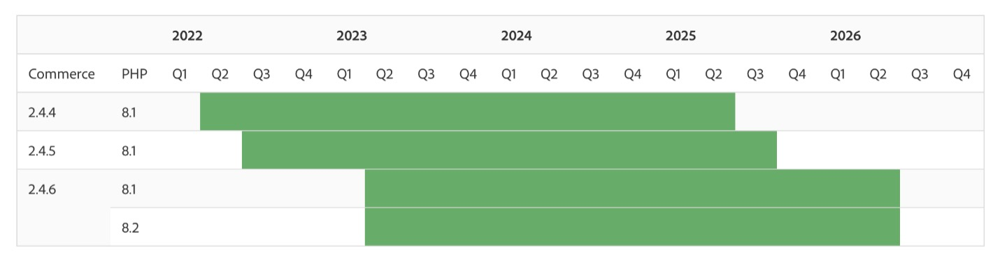

# 2024 및 2023년 Adobe Commerce 릴리스 전략 및 라이프사이클 정책에 대한 FAQ

## 2024년 및 2023년 릴리스 전략과 업데이트된 수명 주기 정책

### 2023년과 2024년에 Adobe Commerce 소프트웨어 라이프사이클 정책은 어떻게 변경됩니까?

Adobe Commerce 고객의 미션 크리티컬 요구 사항을 충족하기 위해 Adobe Commerce 2.4.4 이상 버전에 대한 지원 창구를 다음으로 확장하고 있습니다. **버전 후 3년 [!DNL GA] 날짜**. 지원에는 다음이 포함됩니다 **보안 및 품질 패치 모두**.

### 이러한 변경 사항은 고객에게 어떤 이점을 제공합니까?

지원 기간이 길수록 전 세계 여러 사이트를 운영하는 데 따르는 복잡성을 인식하고 각 배포에서 더 많은 가치를 얻을 수 있습니다. 고객은 더 오랜 기간 동안 릴리스를 유지할 수 있으므로 TCO를 절감하고 리소스를 확보하여 새로운 기능을 추가하거나 구매 경험을 맞춤화하여 더 빠른 성장을 도모할 수 있습니다.

### 고객이 현재 라이프사이클 정책을 찾을 수 있는 곳은 어디입니까?

다음 [Adobe Commerce 소프트웨어 수명 주기 정책](https://www.adobe.com/content/dam/cc/en/legal/terms/enterprise/pdfs/Adobe-Commerce-Software-Lifecycle-Policy.pdf) 온라인에서 사용할 수 있습니다.

### 2.4.4, 2.4.5 및 2.4.6의 고객은 언제 이 새로운 정책에 따라 지원을 종료할 수 있습니까?

Adobe Commerce 2.4.4+ 사용 고객은 해당 버전에서 3년 동안 보안 및 품질 수정 사항을 받게 됩니다 [!DNL GA] 아래 타임라인에 표시된 날짜. 다음을 참조하십시오. [릴리스된 버전](https://experienceleague.adobe.com/docs/commerce-operations/release/versions.html) 페이지 위치 [!DNL Experience League] 특정 지원 종료 날짜의 경우.

### Adobe Commerce 릴리스 일정은 어떻게 변경됩니까?

혁신을 가속화하고 TCO(총 소유 비용)를 절감하기 위해 매년 핵심 애플리케이션 패치 1개가 출시되며 새로운 기능은 컴포저블로 제공됩니다 [!DNL SaaS] 언제든지 추가할 수 있는 서비스입니다. 고객이 더욱 안전하게 생활할 수 있도록 올해 예정된 보안 패치 릴리스 물량도 3개에서 4개로 늘리고 있다. 추가 [!DNL beta] 파트너와 고객이 다음 릴리스를 준비하는 데 도움이 되는 2024 코어 애플리케이션 패치 릴리스(2.4.7) 릴리스도 올해 제공될 예정입니다.

### 새로운 릴리스 일정은 고객에게 어떤 이점을 제공합니까?

컴포저블로 새로운 기능 제공 [!DNL SaaS] 이 서비스는 고객에게 매출 증가에 도움이 되는 새로운 도구에 대한 빠른 액세스를 제공합니다. 핵심 Adobe Commerce 애플리케이션을 업그레이드하지 않고도 언제든지 기능을 채택할 수 있습니다. 또한 Adobe은 이러한 서비스를 지속적으로 업데이트하여 기능과 성능에 대한 최신 기술을 제공할 수 있습니다. 매년 하나의 핵심 애플리케이션 패치 릴리스를 확보하면 업그레이드 비용을 절감하고 업그레이드 계획을 더욱 손쉽게 할 수 있으며 상거래 환경을 사용자 정의하고 최적화할 수 있습니다. 경량 보안 패치를 추가하면 고객이 더욱 안전하게 보호됩니다.

### 프리릴리스 액세스란 무엇입니까?

2023년에는 고객이 Adobe Commerce 패치 릴리스를 약 2주 전에 액세스할 수 있습니다.

2024년부터 Adobe은 더 이상 패치에 대한 &quot;프리릴리스&quot; 액세스를 제공하지 않습니다. 대신 2.4.7 이상의 경우 고객은 [베타 릴리스](https://experienceleague.adobe.com/docs/commerce-operations/release/beta.html) 테스트 및 개발을 위해 사전 일반 가용성 코드에 액세스합니다. 다음 2023년 릴리스에 대한 프리릴리스 액세스가 계속 예약되어 있습니다.

* 2023년 8월 8일 프리릴리스 액세스는 2023년 7월 25일입니다
* 2023년 10월 10일 프리릴리스 액세스는 2023년 9월 26일입니다

### Adobe Commerce 릴리스 일정은 어디에 게시됩니까?

다음을 확인하십시오. [Adobe Commerce 릴리스 일정](https://experienceleague.adobe.com/docs/commerce-operations/release/planning/schedule.html) 날짜 [!DNL Experience League] 을 참조하십시오.

### 일정에 포함된 다양한 유형의 릴리스는 무엇입니까?

* **핵심 애플리케이션 패치 릴리스**: 보안, 성능 및 높은 우선 순위 품질 수정 사항이 포함된 핵심 애플리케이션 업그레이드.
* **[!DNL Beta]버전 패치 릴리스**: 비-[!DNL General Availability] 보안, 규정 준수, 성능 및 높은 우선 순위 품질 수정 사항이 포함된 핵심 Adobe Commerce 애플리케이션에 대한 코드 업데이트입니다. 패치 릴리스 전에 코드 및 영향을 받는 구성 요소를 검토할 수 있는 추가 시간이 제공됩니다 [!DNL GA].
* **확장성, 인프라 및 서비스 릴리스**: 패치 릴리스와 별도로 구성 가능한 서비스로 제공되는 새로운 기능 및 기능 업데이트 릴리스. 예를 들면 다음과 같은 서비스가 있습니다 [!DNL Product Recommendations] 및 [!DNL Live Search], 다음과 같은 독립 모듈 [!DNL PWA Studio] 및 [!DNL Inventory Management] (MSI) 및 클라우드 서비스 및 인프라에 대한 업데이트입니다.
* **보안 패치 릴리스**: 고객의 보안 및 규정 준수를 유지하기 위해 출시된 핵심 애플리케이션에 대한 보안 전용 업데이트입니다.

### 품질 패치를 받으러 어디로 이동합니까?

품질 패치는 개별 품질 문제에 대한 수정 사항을 배포하는 방법입니다. 고객은 Adobe 지원 센터에 문의하거나 [[!DNL Quality Patch Tool]](https://experienceleague.adobe.com/docs/commerce-knowledge-base/kb/announcements/commerce-announcements/magento-quality-patches-released-new-tool-to-self-serve-quality-patches.html) 품질 패치를 찾습니다.

### 일반적으로 계획 수립, 예산 편성 및 업그레이드에 도움이 되는 리소스는 무엇입니까?

사용 가능한 리소스에는 포괄적인 2.4 업그레이드 안내서, 기술 업그레이드 워크숍 기록 및 [!DNL Upgrade Compatibility Tool]. 포괄적인 리소스 목록은 [Experience League](https://experienceleague.adobe.com/docs/commerce-operations/upgrade-guide/resources/recommended-reading.html).

### Managed Services 고객의 경우 고객 엔지니어링 팀이 2.4.4로 업그레이드하는 데 어떻게 도움을 줄 수 있습니까+?

Managed Services 고객은 고객 엔지니어링 팀과 협력하여 분석, 클라우드 서비스 업그레이드, 품질 및 사용자 승인 테스트 등 업그레이드 프로세스의 여러 구성 요소에 대한 지원을 받을 수 있습니다. ([!DNL QA] 및 [!DNL UAT]) 및 프로덕션 론치를 참조하십시오.

## 확장 지원 옵션

### 버전 2.3.7 및 2.4.0-2.4.3의 고객에 대한 확장 지원 옵션이 있습니까?

고객은 가능한 한 빨리 업그레이드하는 것이 좋지만, 유료 확장 지원 플랜은 을 기반으로 하는 버전에 사용할 수 있습니다 [!DNL PHP] 7.4(2.3.7 및 또는 2.4.0-2.4.3의 고객) 이러한 계획에는 핵심 응용 프로그램에 대한 품질 및 보안 패치가 모두 포함됩니다. [!DNL PHP] 최대 1년.

* 2.3.7에 대한 확장 지원은 2022년 9월 8일에 시작되었으며, 2023년 9월 8일까지 받을 수 있습니다.
* 2.4.0-2.4.3에 대한 확장 지원은 2022년 11월 28일에 시작되었으며 2023년 11월 28일까지 받을 수 있습니다.

### 확장 지원을 통해 [!DNL PCI] 규정 준수 여부

고객 엔지니어링 팀은 확장 지원을 통해 범위 저하 없이 평소와 동일한 품질 및 보안 패치를 계속 제공할 예정입니다. 그러나 고객은 유지하기 위해 추가 조치를 취해야 합니다 [!DNL PCI]다음과 같은 기본 타사 기술이 [!DNL MySQL], 지원 종료 도달. Adobe은 지원 종료에 도달한 타사 기술에 대한 지원을 제공하지 않습니다 **를 제외하고 [!DNL PHP] 버전 지원 [!DNL PHP] 지원 서비스 또는 확장 지원에 적합한 Adobe Commerce 버전에서 사용됩니다**. Adobe은 고객에게 [PCI 평가](https://www.pcisecuritystandards.org/assessors_and_solutions/qualified_security_assessors) 규정 준수를 보장합니다. 을(를) 참조하십시오 [Adobe Commerce 시스템 요구 사항](https://experienceleague.adobe.com/docs/commerce-operations/installation-guide/system-requirements.html) 테스트되고 지원되는 타사 기술에 대한 전체 목록입니다.

