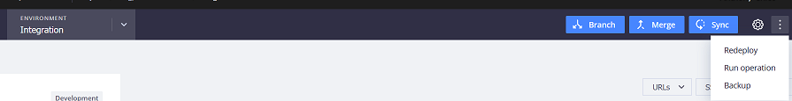

# 클라우드에서 백업(스냅샷): FAQ

이 문서에서는 클라우드 인프라의 Adobe Commerce에서 스냅샷을 사용하여 환경을 백업하는 방법에 대해 설명합니다.

## 영향을 받는 제품 및 버전

* 클라우드 인프라의 Adobe Commerce 2.4.x
* 아키텍처 계획: Starter, Pro Legacy, Pro

## 환경 스냅샷, Pro 플랜

### 스테이징 및 프로덕션 환경

* Pro 플랜의 스테이징 및 프로덕션 환경에서는 수동 스냅샷을 사용할 수 없습니다.
* 자동 스냅샷 생성 **라이브 상태에 상관없이** 를 추가합니다. 아직 시작되지 않은 사이트에 대해서도 스냅샷이 생성됩니다. 자동 백업은 별도의 시스템에 저장되므로 공개적으로 액세스할 수 없습니다. 다음을 수행할 수 있습니다. [Adobe Commerce 지원 티켓 제출](/docs/commerce-knowledge-base/kb/help-center-guide/magento-help-center-user-guide.html#submit-ticket) 티켓에 날짜, 시간 및 시간대를 제공하는 특정 백업에서 복원하거나 특수 백업을 요청하려면 다음을 수행하십시오. 또한 지원에서 데이터베이스의 롤백 또는 복원은 자동으로 수행되지 않습니다. 스냅샷을 검색하지만 데이터베이스를 직접 복원해야 합니다.
* 백업은 **암호화된 Amazon Web Services Elastic Block Store(AWS EBS) 스냅샷**.
* 환경 스냅샷에는 전체 시스템(파일 시스템 및 데이터베이스)이 포함됩니다.
* 자동 스냅샷 보존 시간 **다름** 및 팔로우 [일정](/docs/commerce-cloud-service/user-guide/architecture/pro-architecture.html?lang=en#backup-and-disaster-recovery).

>[!NOTE]
>클라우드 콘솔에는 항상 [!UICONTROL No backup] 스테이징 및 프로덕션 환경에서. 통합 환경에서 백업만 가져올 수 있습니다. 선택 **[!UICONTROL Backup]** 줄임표 드롭다운 메뉴에서 을 클릭합니다.
>

### 통합(개발) 환경

* 사용자 [통합 환경](/help/announcements/adobe-commerce-announcements/integration-environment-enhancement-request-pro-and-starter.md) 은(는) **자동으로 백업되지 않음**, 하지만 스냅샷을 생성할 수 있습니다 **수동**.
* 라이브 스토어가 아닌 스토어에서 통합 환경에 대한 수동 스냅샷을 생성할 수 있습니다.
* 다음을 수행할 수 있습니다. **여러 스냅샷** 수동으로 트리거되었습니다.
* 수동으로 트리거된 스냅샷은에 저장됩니다. **7일**.

**개발자 설명서의 관련 문서:**

* [백업 및 재해 복구](/docs/commerce-cloud-service/user-guide/architecture/pro-architecture.html#backup-and-disaster-recovery)
* [스냅샷 만들기](/docs/commerce-cloud-service/user-guide/develop/storage/snapshots.html)

## 환경 스냅샷, 시작 계획

* 모든 유형의 환경(통합, 스테이징, 프로덕션) **자동으로 백업되지 않음**&#x200B;스냅샷을 수동으로 생성할 수도 있습니다.
* 수동 스냅샷을 생성할 수 있습니다 **라이브 상태에 상관없이** 를 추가합니다. 아직 시작되지 않은 사이트에 대해서도 스냅샷이 생성됩니다.
* 수동으로 트리거된 스냅샷은에 저장됩니다. **7일**.

## 환경 스냅샷 복원

지원되는 환경(통합, 스테이징, 프로덕션의 프로덕션 계획 또는 프로의 통합 계획)에서 기존 스냅샷을 복원하려면 다음 단계를 수행합니다. [백업 관리: 수동 백업 복원](https://experienceleague.adobe.com/en/docs/commerce-cloud-service/user-guide/develop/storage/snapshots#restore-a-manual-backup) Commerce on Cloud Infrastructure Guide를 참조하십시오.

## 데이터베이스(DB) 백업

DB 백업은 클라우드 스냅샷의 일부입니다.

>>
스냅샷은 실행 중인 모든 서비스의 모든 영구 데이터를 포함하는 환경의 전체 백업입니다(예: **mySQL 데이터베이스**, Redis 등)와 마운트된 볼륨에 저장된 모든 파일.

>[!NOTE]
>
>마운트된 볼륨은 다음을 포함/참조합니다. [쓰기 가능 마운트](/docs/commerce-cloud-service/user-guide/configure/app/properties/properties.html?lang=en#mounts) 및 에는 /app 디렉터리가 모두 포함되지 않습니다. 다른 파일은 다음에 의해 생성/생성됩니다. [빌드 및 배포 프로세스](/docs/commerce-cloud-service/user-guide/architecture/pro-develop-deploy-workflow.html?lang=en#deployment-workflow)또한 Git 저장소에서 나머지 파일을 체크 아웃해야 합니다.

[스냅샷 및 백업 관리](/docs/commerce-cloud-service/user-guide/develop/storage/snapshots.html) 개발자 설명서에서 확인할 수 있습니다.

다음만 제출 [지원 요청](/docs/commerce-knowledge-base/kb/help-center-guide/magento-help-center-user-guide.html?lang=en#submit-ticket) 특정 시점의 DB가 필요한 경우 Pro Production and Staging의 DB 스냅샷. DB의 현재 백업만 필요한 경우(모든 환경에서) 기술 자료 문서를 참조하십시오. [클라우드에 데이터베이스 덤프 생성](/help/how-to/general/create-database-dump-on-cloud.md).
