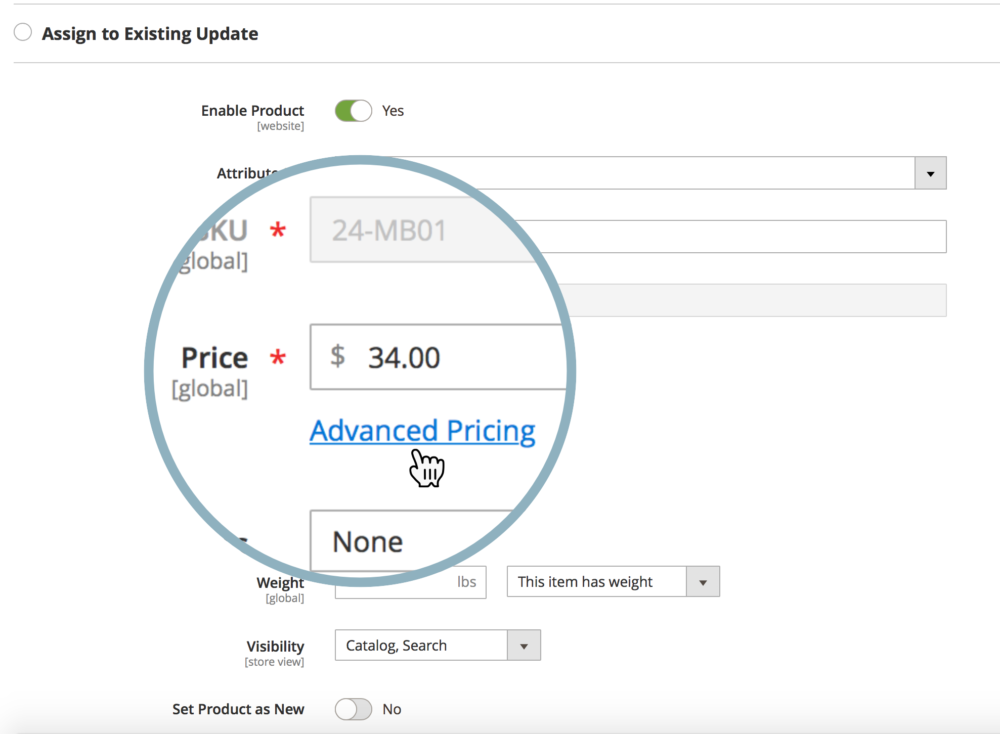
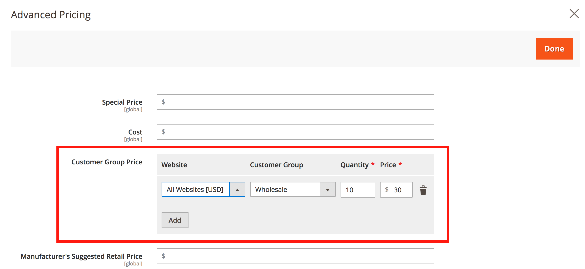

# 공유 카탈로그의 가격에 대한 콘텐츠 스테이징 업데이트를 예약할 수 있습니까?

Adobe Commerce은 가격 업데이트 예약 기능을 제공하지 않습니다([컨텐츠 스테이징](https://experienceleague.adobe.com/docs/commerce-admin/content-design/staging/content-staging.html))을 클릭하여 공유 카탈로그에 있는 하나 이상의 제품을 확인하십시오.

즉, 다음과 같은 가격 갱신을 직접 스케줄링할 수 없습니다. **가격 책정 및 구조 설정** Commerce 관리 패널의 메뉴(없음) **새 업데이트 예약** 단추(이 메뉴의)를 클릭합니다.

여전히 대체 방법을 사용하고 다음에 대한 가격 갱신을 스케줄링할 수 있습니다.

* 고객 그룹
* 제품의 기준 가격

## 고객 그룹에 대한 가격 갱신 예약

1. 시작 [새 제품 업데이트 예약](https://experienceleague.adobe.com/docs/commerce-admin/content-design/staging/content-staging-scheduled-update.html).
1. 아래로 스크롤하여 **가격** 필드 및 클릭 **고급 가격 책정**.

   {width="600"}

1. 다음에서 **고객 그룹 가격 섹션**&#x200B;필요한 고객 그룹을 선택하고 업데이트된 가격을 설정합니다.

   {width="700"}

1. 평소대로 업데이트 일정을 완료합니다.

이 워크플로우에서는 단일 제품에 대한 가격만 업데이트할 수 있습니다. 일괄 가격 업데이트는 사용할 수 없습니다.

공유 카탈로그는 고객 그룹 가격을 활용합니다.

**관련 설명서**

* [업데이트 예약(콘텐츠 스테이징)](https://experienceleague.adobe.com/docs/commerce-admin/content-design/staging/content-staging-scheduled-update.html) 사용 안내서에서 참조하십시오.
* [고급 가격 책정](https://experienceleague.adobe.com/docs/commerce-admin/catalog/products/pricing/pricing-advanced.html) 사용 안내서에서 참조하십시오.

## 기본 가격에 대한 가격 업데이트 예약

관련 문서를 참조하십시오. [기본 가격 변경이 공유된 카탈로그 가격에 어떤 영향을 줍니까?](/help/faq/general/base-price-change-affect-on-shared-catalog-price.md) 을 참조하십시오.
