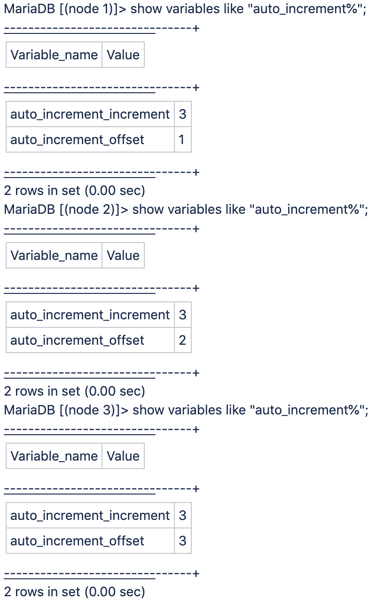

# Cloud pro 아키텍처에서 데이터베이스 auto_increment 변수가 &quot;3&quot; Adobe Commerce으로 설정됨

이는 3노드 아키텍처로 인해 Adobe Commerce on cloud infrastructure Pro 플랜 아키텍처 솔루션에 예상되는 동작으로, 수정할 수 없습니다.

Galera 데이터베이스 클러스터가 사용됩니다. Galera 데이터베이스 클러스터는 노드당 MariaDB MySQL 데이터베이스가 하나씩 있으며, 모든 데이터베이스에서 고유 ID에 대해 3의 자동 증가 설정이 있는 데이터베이스 클러스터입니다.

<u>Pro 클러스터에 사용된 증분 ID가 항상 3씩 구분/증가하지 않는 이유는 무엇입니까?</u>

클러스터에 사용된 증분 ID는 Galera가 작동하는 방식으로 인해 항상 3씩 구분/증가하지 않습니다.

세 서버는 각각 자체 ID 공간을 관리하며, 사용 증가분은 MySQL 주 데이터베이스 서버(상대 로드에 따라 다름)에 따라 다릅니다. 따라서 다양한 간격이 있습니다.
각 노드에 SSH를 연결하고 포트 3307(표준 포트 3306의 &quot;주&quot;로 프록시되지 않음)을 사용하여 해당 노드에서 실행 중인 로컬 MySQL 인스턴스에 연결하면 다음 그림이 표시됩니다.

예를 들어 선택된 메인이 노드 1인 경우 `auto_increment_offset = 1`를 입력하면 ID가 1씩 증가합니다. 그러면 새 주 노드가 나중에 선택되면(예: 노드 3) `auto_increment_offset = 3`, 대신 3씩 증가합니다.

## 유용한 링크

개발자 설명서에서 를 참조하십시오.

* [Cloud for Adobe Commerce > Pro 아키텍처 > 백업 및 재해 복구](https://devdocs.magento.com/cloud/architecture/pro-architecture.html#backup-and-disaster-recovery)
* [Adobe Commerce용 클라우드 > 사전 요구 사항 설치: 데이터베이스](https://devdocs.magento.com/cloud/before/before-workspace-magento-prereqs.html#database)
