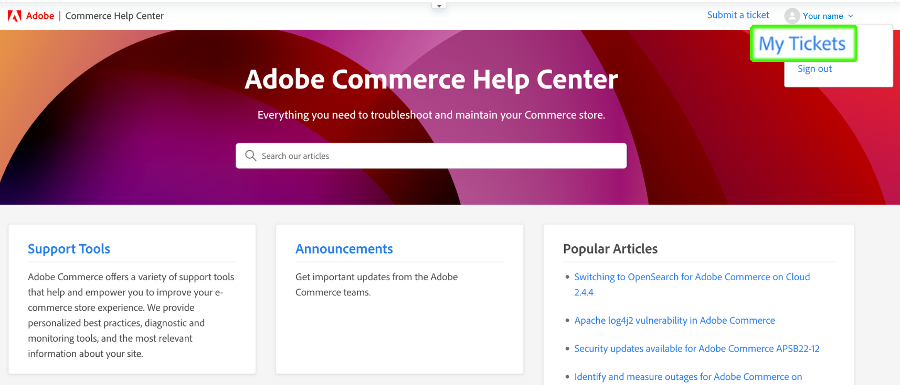

# Adobe Commerce 도움말 센터 사용 안내서

이 안내서에서 지원 티켓을 로 제출하는 방법을 알아봅니다. [Adobe Commerce 도움말 센터](https://support.magento.com/hc/en-us) Magento 계정에 대한 공유 액세스 권한을 제공합니다.

>[!NOTE]
>
>Adobe Commerce 도움말 센터의 기술 자료 부분이 Adobe Experience League 포털로 마이그레이션되었습니다. 지원 티켓을 만들면 Adobe Experience League의 기타 관련 Adobe Commerce 설명서와 함께 관련 기술 자료 문서가 제안됩니다.

**주요 업데이트:** 2022년 10월 14일

**[Adobe Commerce 도움말 센터란 무엇입니까?](#what-is)**

**[지원 티켓](#support-tickets)**

* [도움말 센터에 로그인](#login)
* [지원 티켓 제출](#submit-ticket)

   * [도움말 센터 시작 페이지](#submit-ticket-help-center-start-page)
   * [Magento 계정 페이지](#submit-ticket-magento-account-page)
   * [클라우드 콘솔](#submit-ticket-magento-cloud-account-page)
   * [지원 티켓의 정보](#info-in-support-ticket)
   * [Adobe Commerce 도움말 센터 시작 페이지에 &quot;티켓 제출&quot; 링크가 표시되지 않음](#no-submit-link)
   * [*&quot;이메일 주소를 확인해 주십시오.&quot;*](#verify-email-address)
   * [티켓 제출 양식: 판매자가 조직 드롭다운에 표시되지 않음](#merchant-not-displayed)

* [티켓 추적](#track-tickets)
* [Adobe Commerce P1 핫라인(로그인 필요)](#P1-hotline)
* [Adobe Commerce 공유 책임 운영 모델(로그인 필요)](#shared-responsibility-operational-model)
* [지원 티켓 필드 설명](#ticket-fields-explained)
* [티켓 상태: 요청 처리 방법](#ticket-status)
* [티켓의 대화](#conversation-in-ticket)
* [티켓 확인](#resolve-ticket)
* [후속 티켓 열기](#follow-up)

**[공유 액세스: 다른 사용자가 귀하의 계정에 액세스할 수 있는 권한을 부여합니다](#shared-access)**

* [공유 액세스 권한을 제공할 수 있는 사람](#who-can-provide-shared-access)
* [공유 액세스 권한 제공](#provide-shared-access)
* [공유 액세스 취소(삭제)](#revoke-shared-access)

   * [Cloud 프로젝트를 통해 공유 액세스 권한이 부여된 사용자를 삭제하는 방법](#remove-cloud-shared-access-users)

* [공유 계정 액세스(계정 전환)](#switch-accounts)
* [공유 액세스 문제 해결](#troubleshooting-shared-access)

**[Adobe Commerce에 대한 청구 FAQ](#billing-faq)**

**[MAGENTO U는 이제 ADOBE 디지털 학습 서비스의 일부입니다](#magento-u)**

## Adobe Commerce 도움말 센터란 무엇입니까? {#what-is}

다음 [Adobe Commerce 도움말 센터](https://support.magento.com/hc/en-us) 는 적격 고객이 지원 티켓을 제출하고 관리할 수 있는 Adobe Commerce의 지원 포털입니다. 또한 문제 해결 문서를 검토할 수 있습니다.

## 지원 티켓 {#support-tickets}

Adobe Commerce 티켓 시스템을 사용하면 모든 Adobe Commerce 제품에 대해 Adobe Commerce 작업 중에 발생하는 특정 문제를 해결하기 위해 지원 티켓 작업을 할 수 있습니다.

## 도움말 센터에 로그인 {#login}

로그인하면 지원 티켓에 대한 에이전트의 질문을 제출, 업데이트 및 응답할 수 있습니다.

Adobe Commerce 도움말 센터에 로그인하려면 다음 단계를 따르십시오.

1. 다음 도움말 센터에 액세스 <https://support.magento.com>.
1. 클릭 **로그인** 오른쪽 상단 모서리입니다.

Magento 계정 자격 증명을 사용하여 로그인하십시오. 자세한 내용은 [Magento 계정](https://experienceleague.adobe.com/docs/commerce-admin/start/commerce-account/commerce-account-create.html) 사용 안내서에서 참조하십시오.

### <strong>지원 티켓 제출</strong> {#submit-ticket}

성공적으로 로그인되면 도움말 센터 시작 페이지, Magento 계정 페이지 및 Magento 클라우드 계정 페이지를 사용하여 지원 티켓을 제출할 수 있습니다.

* 다음과 같은 경우 **계정 소유자** 아래 단계를 수행합니다.
* 다음과 같은 경우 **공유 액세스 사용자입니다. 먼저 계정을 전환해야 합니다.** [공유 계정 액세스(계정 전환)](#switch-accounts)을 선택한 다음 아래 단계를 진행할 수 있습니다.

#### 도움말 센터 시작 페이지 {#submit-ticket-help-center-start-page}

Adobe Commerce 도움말 센터의 시작 페이지를 사용하여 새 지원 티켓을 제출하려면 다음 단계를 따르십시오.

1. 다음으로 이동 [Adobe Commerce 도움말 센터](https://support.magento.com/hc/en-us).
1. 클릭 **티켓 제출** 오른쪽 상단 모서리입니다.

   {width="800"}

1. 필드를 채웁니다.
1. 클릭 **제출**.

본인 **로그인해야 함** 지원 티켓을 제출하기 위해 Magento 계정을 사용하여 도움말 센터로 이동합니다. 로그인하기 전까지는 [다음 **티켓 제출** 단추가 표시되지 않습니다.](#no-submit-link).

#### Magento 계정 페이지 {#submit-ticket-magento-account-page}

계정 Magento 페이지를 사용하여 새 지원 티켓을 제출하려면 다음 단계를 따르십시오.

1. Magento 계정에 로그인합니다. 다음을 참조하십시오 [자세한 지침](https://experienceleague.adobe.com/docs/commerce-admin/start/commerce-account/commerce-account-create.html?lang=en#create-a-commerce-account) 사용 안내서에서 참조하십시오.
1. 다음을 클릭합니다. **지원** 탭.

   {width="800"}

1. 도움말 센터 시작 페이지가 로드됩니다.
1. 클릭 **티켓 제출** 오른쪽 상단 모서리입니다.
1. 필드를 채웁니다.
1. 클릭 **제출**.

#### 클라우드 콘솔 {#submit-ticket-magento-cloud-account-page}

Cloud Console을 사용하여 새 지원 티켓을 제출하려면 다음 단계를 따르십시오.

1. 에 로그인합니다 [클라우드 콘솔](https://console.adobecommerce.com).
1. 선택 **[!UICONTROL Support]** 을 클릭합니다.
1. 다음 **[!UICONTROL My Tickets]** 페이지가 로드됩니다.
1. 클릭 **[!UICONTROL Submit a ticket]** 오른쪽 상단 모서리입니다.
1. 필드를 채웁니다.
1. 클릭 **제출**.
1. 클릭 **[!UICONTROL Submit]**.

#### 지원 티켓의 정보 {#info-in-support-ticket}

빨간색 별표( **\*** ), 필수는 필수 항목이며 입력해야 합니다. 이러한 필드를 비워 두면 티켓을 제출할 수 없습니다.

다음을 참조하십시오 [티켓 필드 설명](#ticket-fields-explained) 자세한 내용은 아래를 참조하십시오.

### Adobe Commerce 도움말 센터 시작 페이지에 &quot;티켓 제출&quot; 링크가 표시되지 않음 {#no-submit-link}

#### 문제

Adobe Commerce 도움말 센터에 액세스하여 지원 요청을 제출하려고 하지만 **티켓 제출** 도움말 센터 시작 페이지에 링크가 표시되지 않습니다.

#### 원인

다음 중 하나가 원인일 수 있습니다.

* 도움말 센터에 로그인하지 않았습니다.
* 공유 액세스를 처음 사용하는 경우 Magento.com에서 SSO 호출을 통해 Adobe Commerce 도움말 센터가 제대로 구성되어 있는지 확인하는 데 필요한 단계를 수행하지 않았습니다.
* 귀하의 계정은 Adobe Commerce 지원 대상이 아닙니다(예: 유료 Commerce 고객이 아니거나 오픈 소스 고객).

#### 솔루션

[도움말 센터에 로그인](/help/help-center-guide/help-center/magento-help-center-user-guide.md#provide-shared-access).

다음 **티켓 제출** 링크는 유효한 지원 계약에 연결된 이메일이 있는 고객에게만 표시됩니다.

#### 공유 액세스 계정 사용

공유 액세스 계정을 사용하여 지원 티켓을 제출하려면 다음을 수행해야 합니다(이 작업은 한 번만 수행해야 함).

1. 수신 후 [공유 액세스](https://support.magento.com/hc/en-us/articles/360052444712#who-can-provide-shared-access)에 로그인합니다. [magento.com 웹 사이트의 Magento 계정](https://account.magento.com/).
1. 다음에서 **계정 전환** 오른쪽 상단의 드롭다운 필드에서 공유 액세스 계정을 선택합니다.
1. 을(를) 클릭합니다 **지원** 왼쪽 패널의 탭입니다. 이렇게 하면 Magento.com에서 Adobe Commerce 도움말 센터로의 SSO 호출을 통해 Adobe Commerce 도움말 센터가 제대로 구성되게 됩니다.

#### 여전히 을(를) 보지 못함 **티켓 제출** 링크

없으시면 **공유 계정** 다음 아래에 **계정 전환** 드롭다운 목록이지만 Adobe Commerce 라이선스가 있는 고객에 대해 작업 중입니다. 공유 액세스 권한을 부여하도록 요청하십시오. 자세한 내용은 [Magento 계정에 대한 공유 액세스 권한 제공](/help/help-center-guide/help-center/magento-help-center-user-guide.md#provide-shared-access).

Adobe Commerce 라이선스 소유자인 경우 (이)가 포함된 송장이 없는지 확인하십시오. **보류 중인 결제** 상태. 지원 권한은 송장 결제 상태에 따라 자동으로 부여되거나 해지됩니다.

결제 상태를 확인하는 방법:

1. 에 로그인 [magento.com](https://support.magento.com/).
1. 클릭 **청구 내역** 왼쪽이요
1. 다음을 수행하는 경우 **할 일** 다음으로 청구서 보관 **보류 중인 결제** 상태, **Adobe 계정 팀에 문의하십시오.** 결제 문제가 해결되도록 합니다.

Adobe Commerce 라이선스가 있는 계정에 대한 공유 액세스 권한이 있는 Adobe Commerce 라이선스 소유자 및 계정에만 지원을 제공합니다. Magento Open Source 에디션에 대한 지원이 필요한 경우 다음과 같은 자가 진단 기술 리소스를 활용하십시오.

* [Adobe Commerce 도움말 센터](https://support.magento.com/)
* [Adobe Commerce 개발자 설명서](https://developer.adobe.com/commerce/docs/)
* [Adobe Commerce 설명서 리소스](https://experienceleague.adobe.com/docs/commerce.html)
* [Magento 포럼](https://community.magento.com/?_ga=2.99592990.1084044056.1559046120-720752292.1551793747)

계정에 로그인하는 데 문제가 있거나 공유 액세스가 올바르게 설정되었다고 생각되지만 을 볼 수는 없는 경우 **티켓 제출** 단추, 이메일을 보내주십시오. [도움말 센터 로그인 문제](mailto:grp-magento-helpcenterloginissues@adobe.com), 그리고 귀하의 계정 설정 및 지원 권한을 기꺼이 검토하겠습니다.

>[!NOTE]
>
>티켓을 제출할 수 있지만 클라우드 프로젝트 액세스에 문제가 있는 경우 이메일을 보내지 마십시오. 이 문제에 대한 티켓을 일반 채널로 제출 바랍니다.

### Magento 계정 페이지에서 &quot;이메일 주소를 확인하십시오.&quot; 오류 {#verify-email-address}

다음을 받으면 지원 티켓을 제출할 수 없습니다. *이메일 주소를 확인하십시오.* 에서 아래 오류와 유사한 오류 [Magento 계정 페이지](https://account.magento.com/).

{width="800"}

솔루션은 이메일 주소를 확인하는 것입니다.

1. 을(를) 클릭합니다 **이메일 유효성 확인** 의 이메일 필드 아래에 있는 버튼 [계정 정보 편집](https://account.magento.com/customer/account/edit/) 아래 페이지와 비슷한 페이지입니다.

   {width="800"}

1. 클릭 **이메일 유효성 확인** 버튼은 이 Magento 계정에 등록된 이메일 주소로 이메일을 보내며 이메일 주소의 유효성을 확인하기 위한 링크가 있습니다.
1. 전자 메일의 유효성을 검사하고 이 문제를 해결하려면 전자 메일 유효성 검사 링크를 클릭하십시오.
1. 이메일 유효성 검사 링크가 포함된 이메일을 받지 못한 경우 이메일을 보내주십시오. [도움말 센터 로그인 문제](mailto:grp-magento-helpcenterloginissues@adobe.com) 이메일 주소를 확인할 수 없음을 나타냅니다.

>[!NOTE]
>
>이 설정은 https://account.magento.com (Magento 계정 페이지)의 이메일 유효성 검사 링크에만 적용됩니다.

### 티켓 제출 양식: 판매자가 조직 드롭다운에 표시되지 않음 {#merchant-not-displayed}

#### 문제

전제 조건: 판매자가 부여한 공유 액세스 계정이 있습니다.

재현 단계:

1. 공유 계정을 사용하여 도움말 센터에 로그인합니다.
1. 다음을 클릭합니다. **티켓 제출** 링크를 클릭합니다. 티켓 제출 양식이 열립니다.
1. 확장 **조직** 판매자를 선택하기 위한 드롭다운 필드.

예상 결과:

공유 계정에 해당하는 판매자는 **조직** 옵션.

실제 결과:

사용된 공유 계정에 해당하는 판매자는 **조직** 옵션.

#### 솔루션

판매자로부터 공유 액세스 권한을 부여 받은 후 다음 단계를 수행해야 합니다(한 번만).

1. 에 로그인 [magento.com 웹 사이트의 Magento 계정](https://account.magento.com/).
1. 다음에서 **계정 전환** 오른쪽 상단의 드롭다운 필드에서 공유 액세스 계정을 선택합니다.
1. 을(를) 클릭합니다 **지원** 왼쪽 패널의 탭입니다. 이렇게 하면 Magento.com에서 Adobe Commerce 도움말 센터로의 SSO 호출을 통해 Adobe Commerce 도움말 센터가 제대로 구성되게 됩니다.

이 작업을 이미 수행한 경우 권한이 부여되었는지 확인합니다. *두 명 이상의 판매자로부터 액세스 공유* 을(를) 클릭하여 [[!UICONTROL Shared with me] 계정의 탭](https://account.magento.com/grantor/manage/shared/):
* 하나만 [!UICONTROL Share Name] 목록에 있습니다. 즉, 한 상인에게만 부여됩니다. *이(가) 표시되지 않습니다. [!UICONTROL Organization] 드롭다운*.
* 여러 개 있는 경우 [!UICONTROL Share Names], 판매자의 지원 권한은 지불 문제로 인해 이전에 라이선스가 취소되어 만료되었을 수 있습니다.

### 티켓 추적 {#track-tickets}

티켓은 다음과 같습니다.

* 개인적으로 제출함
* cc (carbon copy)를 통해 감시자로서에 추가되었습니다.

#### 티켓 보기

모든 티켓을 나열하려면 도움말 센터 시작 페이지에서 프로필 메뉴(오른쪽 상단)를 클릭하고 을 선택합니다 **내 티켓**.

{width-&quot;800&quot;}

티켓과 참조한 티켓 간에 전환하려면 해당 탭을 클릭합니다.

* **내 티켓**
* **제가 참조해야 할 티켓**
* **조직 티켓** (계정이 여러 조직과 연결되어 있는 경우 사용 가능)

티켓을 정렬하려면 다음을 클릭하십시오. **생성됨** 또는 **마지막 활동** 열 머리글입니다.

#### 티켓 검색

티켓을 찾으려면 검색 쿼리를 **티켓 검색** 필드 및 누르기 *입력* 키보드에서. 선택 [a 상태](#ticket-status) 추가 필터링에 사용됩니다.

#### 조직 티켓 팔로우

조직의 멤버가 제출한 지원 티켓을 따를 수 있습니다.

조직 티켓을 팔로우할 때 다음을 수행합니다.

* 다음 내에서 티켓을 볼 수 있음: **조직 티켓** 탭
* 새 티켓이 제출되거나 기존 티켓이 변경되면 이메일 알림을 받습니다

조직의 티켓을 팔로우하거나 팔로우하지 않으려면 다음을 수행합니다.

1. 다음으로 이동 **내 티켓** > **조직 티켓** 탭.
1. 메뉴에서 조직을 선택하고 **팔로우/언팔로우**.

### Adobe Commerce 핫라인 {#P1-hotline}

**로그인 필요** 에 액세스하려면 [Adobe Commerce 핫라인](https://experienceleague.adobe.com/docs/commerce-knowledge-base/kb/how-to/adobe-commerce-p1-notification-hotline.html) P1 문제 중에 도움을 요청할 때 Adobe Commerce에 대한 P1 핫라인 번호를 제공하고 제공할 정보를 설명하는 문서입니다.

### Adobe Commerce 공유 책임 운영 모델 {#shared-responsibility-operational-model}

**로그인 필요** 에 액세스하려면 [Adobe Commerce 공유 책임 운영 모델](https://support.magento.com/hc/en-us/articles/4407700678669) dell의 pro 인프라 서비스에만 적용되는 Adobe Commerce에 대한 운영 책임을 명확히 하기 위한 문서입니다.

### 지원 티켓 필드 설명 {#ticket-fields-explained}

#### 영향을 받는 URL

Adobe Commerce 지원 팀에서 문제를 확인할 수 있는 환경에 연결합니다. URL은 &quot;http://&quot; 또는 &quot;https://&quot;로 시작해야 합니다.

#### 첨부 파일

로그, 스크린샷, 비디오 녹화 또는 문제를 더 잘 나타낼 수 있는 기타 모든 미디어를 첨부합니다.

#### 백오피스 URL(MOM만 해당)

URL은 &quot;https://&quot;로 시작해야 합니다. 일반적으로 형식은 판매자 이름 +&quot;.mcom.magento.com/admin/login&quot;, 예: &quot;https://luma.mcom.magento.com/admin/login&quot;입니다.

문제와 관련된 직접 링크를 추가할 수도 있습니다.

#### 참조

티켓을 팔로우하려는 사람의 이메일(예: *first@e.mail*).

Magento 계정 또는 Zendesk 계정이 없는 사람의 이메일을 추가할 수 있습니다. 이러한 사람은 여전히 티켓에서 대화에 참여할 수 있습니다.

CC에 여러 개의 이메일을 추가하려면:

>[!NOTE]
>
>참조: 의 사용자는 https://account.magento.com에 기존 계정이 있어야 합니다. 그렇지 않은 경우 먼저 https://account.adobe.com에서 계정을 만든 다음 해당 계정으로 https://account.magento.com에 로그인해야 합니다.

1. 이메일을 입력합니다.
1. 누르기 *공간* 키보드에서 입력한 이메일을 저장합니다. 이메일이 회색 프레임으로 표시됩니다.\
   
1. 다음 이메일을 입력하십시오.
1. 을 눌러 다른 모든 이메일 저장 *공간*.

참조에서 전자 메일을 삭제하려면 다음을 클릭하십시오. **x** 편지로 된 이메일.

#### 제품

작업 중인 Adobe Commerce 제품의 유형을 선택합니다.

* Adobe Commerce: **[!UICONTROL Implementation Type]** 이 옵션을 선택하면 필드가 표시됩니다(자세한 내용은 아래 참조).
* Magento Order Management
* Adobe Commerce 보고: 다음을 포함하지 않음 [고급 보고](https://experienceleague.adobe.com/docs/commerce-admin/config/general/advanced-reporting.html)
* Adobe Commerce [결제 서비스](https://experienceleague.adobe.com/docs/commerce-merchant-services/payment-services/overview.html)
* Adobe Commerce 서비스: [채널 관리자](https://experienceleague.adobe.com/docs/commerce-channels/channel-manager/guide-overview.html) 전용

#### 구현 유형

이 필드는 을(를) 선택한 후에만 나타납니다. **[!UICONTROL Product]** = *Adobe Commerce*

배포 방법을 지정하십시오.

* 클라우드: 클라우드 인프라에서 Adobe Commerce을 사용하는 경우에만 이 옵션을 선택하십시오.
* 온-프레미스: *모든 자체 호스팅 인스턴스뿐만 아니라 [AWS] 클라우드 기반 호스팅* (클라우드의 Adobe Commerce 제외)

#### 클라우드 프로젝트 URL

Cloud Console 프로젝트의 URL을 제공하십시오. 예: `https://console.adobecommerce.com/<owner-user-name>/<project-ID>`.

프로젝트 URL을 가져오는 다른 방법은 다음과 같습니다.

1. 에 로그인합니다 [클라우드 콘솔](https://console.adobecommerce.com).
1. 해당 프로젝트를 클릭합니다.
1. URL을 복사합니다.

#### 연락처 사유

연락처는 제품에 따라 다릅니다. 현재 발생한 증상에 가장 적합한 접촉 이유를 선택하십시오. 다음을 참조하십시오. [지원 티켓 연락처 사유 설명](/help/faq/general/support-ticket-contact-reason-descriptions.md) 선택해야 하는 연락처 이유에 대해 자세히 알아보려면 문서 를 참조하십시오.

#### Adobe Commerce 환경 ID

이 필드는 을(를) 선택한 후에만 나타납니다. **[!UICONTROL Contact Reason]** = *Adobe Commerce Cloud 애플리케이션*, 그 다음 **Adobe Commerce 애플리케이션 연락처 사유** = *[!DNL Live Search]*.
다음으로 이동 **[!UICONTROL System]** > **[!UICONTROL Services]** > **[!UICONTROL Commerce Services Connector]** > **[!UICONTROL SaaS Identifier]**, 및 다음을 제공합니다. *[!UICONTROL Data Space ID]*.

#### (데이터) 통합 유형(Adobe Commerce 보고만 해당)

Adobe Commerce 보고 내에서 보유하고 있는 통합 유형을 선택합니다. 이렇게 하면 엔지니어가 문제를 보다 효율적으로 해결하는 데 도움이 됩니다.

#### 설명

합리적으로 가능한 한 많은 세부 정보로 문제에 대한 개요를 포함하십시오.

정확한 세부 정보와 재현 단계를 제공하십시오(Adobe Commerce 온프레미스 및 클라우드 인프라가 별도로 있는 경우 제외). [재현 단계](#steps) 필드)와 문제 또는 요청의 증상입니다. 영향을 받는 SKU, 관련 데이터 포인트 및 기타 관련 링크를 포함해야 합니다.

#### 환경(Adobe Commerce on cloud infrastructure, Adobe Commerce 온프레미스, Adobe Commerce Reporting and Shipping만 해당)

다음 항목 선택 **환경 유형** 이 경우 다음과 같은 문제가 발생합니다.

* 개발 (**통합 분기**)
* 스테이징
* 프로덕션

에서 클라우드 인프라 환경에 대한 Adobe Commerce에 대해 자세히 알아보십시오. [Pro 아키텍처](https://experienceleague.adobe.com/docs/commerce-cloud-service/user-guide/architecture/pro-architecture.html) 사용 안내서의 문서입니다.

#### 영향을 받는 주문 수(MOM만 해당)

영향을 받는 주문 범위를 선택합니다.

이 드롭다운은 Order Management 제품에만 적용할 수 있습니다.

#### 조직

여러 조직과 작업하는 경우 티켓을 연결할 조직을 지정하십시오.

이 필드는 계정이 둘 이상의 조직과 연결되어 있을 때 나타납니다.

>[!WARNING]
>
>올바른 조직을 선택했는지 확인해야 합니다. 조직과 관련이 없는 서드파티는 잘못된 조직을 선택하는 경우 잠재적으로 민감하고 독점적인 정보를 볼 수 있습니다.

>[!NOTE]
>
>티켓을 제출한 후 조직을 변경할 수 있습니다. 조직을 변경하려면 다음 단계를 따르십시오.
>
>1. 표 오른쪽 칸으로 가시면 됩니다.
>1. 사용 가능한 조직의 드롭다운을 찾습니다.
>1. 적절한 조직을 선택합니다.
>
>

또한, 이를 통해 과거에 이 조직에 대해 제출된 유사/중복/관련 티켓을 신속하게 상호 참조하고 현재 티켓을 조사하고 해결하는 데 도움이 될 수 있는 단서를 파악할 수 있습니다.

여러 조직에 대한 공유 액세스 권한이 있지만 이 필드를 사용할 수 없는 경우 다음을 참조하십시오. [티켓 제출 양식: 판매자가 조직 드롭다운에 표시되지 않음](https://experienceleague.adobe.com/docs/commerce-knowledge-base/kb/help-center-guide/magento-help-center-user-guide.html#merchant-not-displayed)

#### 파트너 이름(판매자 이름)

판매자의 경우: **파트너 이름** 는 개발 조직의 이름입니다(Adobe Commerce). [기술 파트너](https://partners.magento.com/portal/directory/?&amp;partner_type=6) 또는 [솔루션 파트너](https://partners.magento.com/portal/directory/?&amp;partner_type=1))를 클릭하여 Adobe Commerce 스토어를 개발할 수 있습니다.

파트너의 경우: **판매자 이름** 는 고객의 이름입니다.

#### 프로젝트 URL(Commerce Cloud 전용)

링크 대상: [클라우드 콘솔](https://experienceleague.adobe.com/docs/commerce-cloud-service/user-guide/project/overview.html).

#### 재현 단계(Adobe Commerce 온프레미스 및 Adobe Commerce 온클라우드 인프라만 해당)

다음을 포함하여 문제를 재현하기 위한 정확한 단계별 지침을 제공합니다.

* 복제 단계
* 예상 결과
* 실제 결과

*권장 사항:* 다음 단계를 아는 사람을 위해 작성한다고 가정해 보십시오. **nothing** Adobe Commerce 정보:

* 간단하고 명백해 보이더라도 모든 단계를 언급하십시오.
* 당신의 독자가 당신이 무엇을 의미하는지 알고 있다는 가정에 의존하지 마세요

짧은 문장으로 간단한 언어로 글을 써라.

#### 제목

문제에 대한 간단한 개요 포함(예: *모든 페이지에서 오류 404* ).

**추천 문서:** 검색어를 입력하면 문제와 관련된 Adobe Commerce 설명서 문서 목록이 표시됩니다. 목록에서 문서를 클릭하여 엽니다.

*권장 사항:* 제안된 문서를 신중하게 고려하십시오. 문서에 Adobe Commerce 지원 팀으로부터 받을 것으로 예상되는 솔루션이 포함되어 있을 수 있습니다.

#### 버전(Adobe Commerce 온-프레미스, Adobe Commerce 온 클라우드 인프라 및 배송만 해당)

도움을 요청하는 Adobe Commerce 버전을 선택하십시오. Adobe Commerce의 지원되는 모든 버전이 맨 위에 나열됩니다. 지원되지 않는 버전은 맨 아래에 괄호로 묶여 나열됩니다. 마이그레이션을 진행 중인 경우 최신 버전을 선택하여 지원을 받으십시오.

Adobe Commerce(클라우드 인프라)의 버전을 찾으려면 아래로 스크롤합니다. [클라우드 콘솔](https://experienceleague.adobe.com/docs/commerce-cloud-service/user-guide/project/overview.html) 페이지를 표시하고 창의 중간 하단을 확인합니다.

을 사용하는 경우 [Elasticsearch](https://experienceleague.adobe.com/docs/commerce-operations/installation-guide/prerequisites/search-engine/overview.html) 또는 [OpenSearch](https://experienceleague.adobe.com/docs/commerce-operations/installation-guide/prerequisites/search-engine/aws-opensearch.html), 이 옵션을 선택하지 마십시오.

이 정보를 얻으려면 Adobe Commerce 관리에서 **마케팅** > **라이브 검색** > **GraphQL 플레이그라운드**&#x200B;페이지 아래쪽으로 스크롤한 다음 를 클릭합니다. **HTTP 헤더**.

### 티켓 상태: 티켓 처리 방법 {#ticket-status}

티켓은 다음 세 가지 상태 중 하나를 가질 수 있습니다.

#### **1. 열기**

티켓이 해결되지 않았으며 Adobe Commerce 지원 팀에서 처리 중입니다. 대화의 특정 단계에서 예상되는 모든 정보를 제공했으며 다음 단계를 Adobe Commerce 지원에서 수행해야 하는 경우 티켓에 다음이 포함됩니다. **열기** 상태.

#### **2. 답변 대기 중**

Adobe Commerce 지원에는 사용자의 정보가 필요합니다.

답변에서는 문제에 대한 추가 기술 세부 정보를 지정하거나, 에스컬레이션 세부 정보를 제공하거나, Adobe Commerce 지원 팀에서 제공한 솔루션이 문제에 도움이 되는 것으로 판명된 경우 해당 상태를 제공할 수 있습니다. Adobe Commerce 지원에서 티켓 처리를 진행 할 수 없으므로 가능한 한 빨리 답장을 제출하십시오. **답변 대기 중** 상태.

참조 [Adobe Commerce 지원 티켓 라이프사이클 정책 업데이트](/help/help-center-guide/help-center/magento-support-ticket-lifecycle-policy-update.md) 시기 및 통지 정책에 대한 세부 사항은 문서 를 참조하십시오.

#### **3. 해결됨**

Adobe Commerce 지원에서 귀하의 문제에 대한 솔루션을 제공했으며 도움이 되었다는 데 동의하셨습니다. 티켓을 다음으로 표시한 사람은 당신입니다. **해결됨**. 고정 문제가 다시 발생하면 티켓을 다시 열고 상태를 (으)로 설정할 수 있습니다. **열기**.

### 티켓의 대화 {#conversation-in-ticket}

티켓의 대화는 사용자 또는 Adobe Commerce 지원 팀에서 작성한 모든 댓글을 통합합니다. 설명은 최신(위)부터 가장 이른(아래)까지 표시됩니다.

대화에 주석을 추가하려면 다음 단계를 수행합니다.

1. 티켓 하단으로 스크롤합니다.
1. 다음을 클릭합니다. **대화에 추가** 작성을 시작할 필드입니다.

   

1. 댓글에 사용자를 추가하려면 다음 위치에 전자 메일을 지정하십시오. **참조** 댓글 필드의 필드입니다.
   >[!NOTE]
   >
   >참조: 의 사용자는 https://account.magento.com에 기존 계정이 있어야 합니다. 그렇지 않은 경우 먼저 https://account.adobe.com에서 계정을 만든 다음 해당 계정으로 https://account.magento.com에 로그인해야 합니다.

   

1. 댓글이 끝나면 **제출**.

### 티켓 확인 {#resolve-ticket}

티켓을 해결하려면 다음을 클릭하십시오. **해결됨으로 표시** 표 맨 아래에 있습니다.

### 후속 티켓 열기 {#follow-up}

후속 티켓을 열면 원래 문제가 연속성을 위해 후속 티켓과 연결됩니다.

후속 티켓을 열려면 &quot;*후속 작업 만들기*&#x200B;추가 작업을 만들려는 티켓 하단의 링크

## 공유 액세스: 다른 사용자가 귀하의 계정에 액세스할 수 있는 권한을 부여합니다 {#shared-access}

다른 Magento 계정 소유자의 계정에 대해 제한된 액세스 권한을 부여할 수 있습니다. 특히, **공유 액세스** 이 기능을 사용하면 신뢰할 수 있는 직원 및 서비스 공급자가 지원 티켓을 사용하여 작업할 수 있도록 도움말 센터 계정을 사용할 수 있는 권한을 제공할 수 있습니다.

다음 위치에서 계정 Magento 페이지를 사용하여 공유 액세스를 제공하고 관리할 수 있습니다. [https://account.magento.com](https://account.magento.com/).

### 공유 액세스 권한을 제공할 수 있는 사람 {#who-can-provide-shared-access}

해당 권한이 있는 계정 소유자(기본 계정 소유자)만 다른 사용자에게 공유 액세스를 제공할 수 있습니다.

특히 공유 액세스 관점에서 사용자와 사용자의 액세스를 관리하는 것은 고객의 책임입니다. 따라서 Adobe Commerce 지원 팀은 고객을 대신하여 Magento 계정에 대한 공유 액세스 권한을 제공할 수 없습니다. 고객은 다음을 사용하여 직접 공유 액세스 권한이 있는 사용자를 추가하는 것이 좋습니다. [Magento 계정 페이지](https://account.magento.com/).

공유 액세스 권한을 제공받은 사용자는 다른 사용자에게 이러한 액세스 권한을 전송하거나 부여할 수 없습니다.

### 공유 액세스 권한 제공 {#provide-shared-access}

다음을 참조하십시오. [계정 공유](https://experienceleague.adobe.com/docs/commerce-admin/start/commerce-account/commerce-account-share.html) 공유 계정 설정에 대한 자세한 단계는 Adobe Commerce 사용 안내서의 섹션 을 참조하십시오.

새 사용자에게 공유 액세스를 제공한 후에서 관련 정보를 사용할 수 있습니다. **공유 액세스** > **권한 관리** Magento 계정 페이지

{width="800"}

### 공유 액세스 취소(삭제) {#revoke-shared-access}

1. 다음 위치에서 Magento 계정에 로그인합니다. [https://account.magento.com](https://account.magento.com/).
1. 왼쪽의 공유 액세스 패널에서 을 선택합니다 **권한 관리.**
1. 에서 공유 액세스를 취소할 사용자를 찾아서 클릭합니다. {width="25"} 사용자 행(**작업** 열).
1. 클릭 **사용자 삭제** 을 눌러 액세스를 취소하거나 상단 모서리의 X를 눌러 취소를 취소합니다.

   {width="800"}

   다음을 사용하여 공유 액세스를 취소할 수도 있습니다. **편집** 메뉴:

1. 다음 위치에서 Magento 계정에 로그인합니다. [https://account.magento.com](https://account.magento.com/).
1. 왼쪽의 공유 액세스 패널에서 을 선택합니다 **권한 관리.**
1. 에서 공유 액세스를 취소할 사용자를 찾아서 클릭합니다. **편집** 사용자 행(**작업** 열).
1. 클릭 **이 사용자 삭제** 페이지 하단에 있습니다.
1. 확인 팝업에서 **사용자 삭제** 을 눌러 액세스를 취소하거나 상단 모서리의 X를 눌러 취소를 취소합니다.

### Cloud 프로젝트를 통해 공유 액세스 권한이 부여된 사용자를 삭제하는 방법 {#remove-cloud-shared-access-users}

<u>영향을 받는 제품 및 버전</u>

* Adobe Commerce Cloud (모든 버전)

<u>원인</u>

Adobe Commerce Cloud 프로젝트를 보유하고 있거나 보유하고 있고 사용자를 프로젝트에 추가한 경우 프로젝트 소유자의 MAGE ID에 대한 공유 액세스 권한이 자동으로 부여되었을 것입니다. 이는 일반적으로 다음에 표시됩니다. **[!UICONTROL Share Name]** 열, 표시 *MAG의 클라우드 공유 액세스[XYZ]*.

DELETE 링크가 누락된 경우 이는 공유 액세스가 Commerce Cloud을 통해 자동으로 부여되었음을 의미합니다.

<u>솔루션</u>

공유 이름이 인 공유 액세스 사용자 목록을 삭제할 수 없습니다. *MAG의 클라우드 공유 액세스[XYZ]* 공유 액세스가 이 페이지에 추가/제공되지 않은 경우. 이러한 파일은 정보/감사 목적으로 유지됩니다.

그러나 이러한 공유 액세스 사용자에 대한 권한을 취소하면 해당 사용자는 더 이상 해당 액세스 권한을 보유하지 않습니다.

1. 다음 위치에서 Magento 계정에 로그인합니다. [https://account.magento.com](https://account.magento.com/).
1. 왼쪽 패널에서 *[!UICONTROL Shared Access]*, 선택 **[!UICONTROL Manage Permissions]**.
1. 에서 공유 액세스를 취소할 사용자를 찾아서 클릭합니다. **[!UICONTROL Edit]** 사용자 행(*[!UICONTROL Actions]* 열).
1. 아래의 모든 리소스 선택 취소 *[!UICONTROL Grant Account Permissions]*.

{width="800"}

자세한 내용은 다음을 참조하십시오. [사용자 액세스 관리](https://experienceleague.adobe.com/docs/commerce-cloud-service/user-guide/project/user-access.html#manage-users-from-the-project-web-interface) Commerce on Cloud Infrastructure 안내서에 대한 설명서입니다.

### 공유 계정 액세스(계정 전환) {#switch-accounts}

제공된 공유 액세스를 사용하려면 다음 단계를 따르십시오.

1. 다음 위치에서 Magento 계정에 로그인합니다. [https://account.magento.com](https://account.magento.com/).
1. 다음을 클릭합니다. **계정 전환** 메뉴를 클릭하고 계정을 선택합니다.

   {width="800"}

현재 사용 중인 계정(고유 기본 계정 또는 공유 액세스)을 확인하려면 다음을 참조하십시오. **계정 전환** 메뉴: 활성 계정을 표시합니다.

### 공유 액세스 문제 해결 {#troubleshooting-shared-access}

다음을 참조하십시오. [공유 액세스 문제 해결 문서](/help/troubleshooting/miscellaneous/shared-access-troubleshooting.md) 을 참조하십시오.

## Adobe Commerce에 대한 청구 FAQ {#billing-faq}

일반적으로 상인은 신용 카드(CC) 거래로 서비스 비용을 지불하며, [Adobe Commerce에 대한 청구 FAQ](/help/faq/general/billing-faq-for-adobe-commerce.md) 은(는) 청구서 지불 시 도움이 되는 리소스입니다.

## MAGENTO U는 이제 ADOBE 디지털 학습 서비스의 일부입니다 {#magento-u}

Magento U가 과(와) 병합되었습니다. [Adobe ADLS(디지털 학습 서비스)](https://learning.adobe.com/).

Magento U Zendesk는 단계적으로 폐지될 예정입니다.
