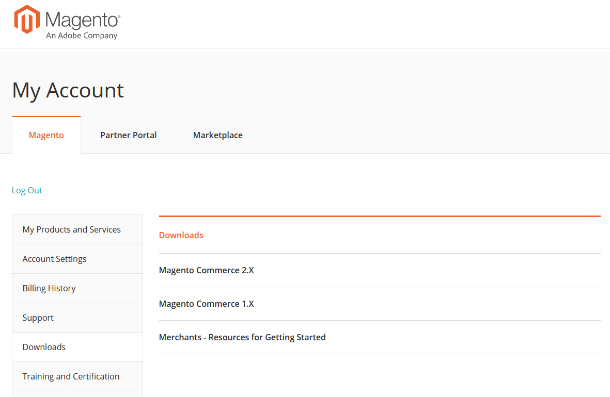

# Adobe Commerce 고객 지원 안내서 액세스

Adobe Commerce 고객 지원 안내서에서는 고객 지원 서비스 및 활용 방법을 설명합니다. 여기에는 지원 관계에 대한 모범 사례, 진단에 필요한 정보 수집, 고객 지원 우선 순위, 지원 요청 제출 및 리소스 링크가 포함되어 있습니다. 이 안내서는 Magento 계정 페이지의 다운로드 섹션에서 액세스할 수 있습니다. 액세스하려면:

1. Magento으로 이동 [계정 로그인 페이지입니다.](https://account.magento.com/customer/account/login)
1. Magento 사용자 이름과 암호로 로그인합니다.
1. 왼쪽 탐색 모음에서 를 클릭합니다. **다운로드**.
1. 오른쪽 창에서 **판매자 - 시작하기 위한 리소스**.  
