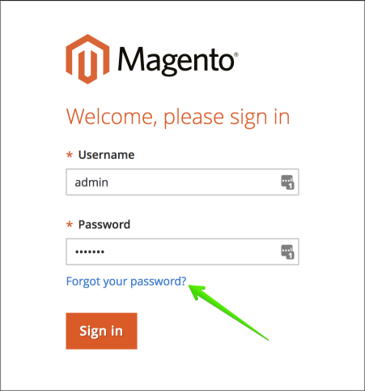

# 클라우드 인프라에서 Adobe Commerce의 관리자 암호 변경

## 방법 1: 암호를 잊으셨습니까? (이메일을 통해 재설정)

의 단계를 읽어 보십시오. [관리자 로그인의 암호 섹션 재설정](https://experienceleague.adobe.com/docs/commerce-admin/start/admin/admin-signin.html#admin-sign-in) 사용 안내서에서 참조하십시오.

다음은 중요한 사용 노트입니다.

### 발신 이메일 활성화

를 사용하기 전에 **암호를 잊으셨습니까?** 양식, [발신 이메일 활성화](https://experienceleague.adobe.com/docs/commerce-cloud-service/user-guide/project/outgoing-emails.html) 사용 [클라우드 콘솔](https://experienceleague.adobe.com/docs/commerce-cloud-service/user-guide/project/overview.html).

### 정크 메일 폴더 확인

암호 재설정 링크가 있는 메시지를 찾을 수 없는 경우 다음을 확인하십시오. *정크 메일* 폴더를 삭제합니다. 이메일의 이름은 입니다. *관리자 사용자 이름에 대한 암호 재설정 확인*.

## 방법 2: 새 관리자 추가

기존 사용자의 암호를 복원하거나 재설정할 수 없는 경우에는 새 관리 사용자를 만들고 이 사용자의 암호를 설정할 수 있습니다. 이렇게 하려면 다음 단계를 수행합니다.

1. 사용 [SSH를 사용하여 원격 환경에 로그인](https://experienceleague.adobe.com/docs/commerce-cloud-service/user-guide/develop/secure-connections.html).
1. 다음 명령을 실행합니다. `bin/magento admin:user:create   --admin-user=%user_name% --admin-password=%your_password% --admin-email=%your_email% --admin-firstname=%admin_user_first_name% --admin-lastname=%admin_user_last_name%`
