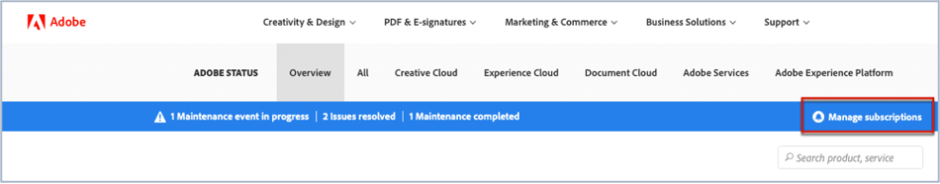

# Adobe Commerce 상태 업데이트에 가입하는 방법

## Adobe Magento 상태 업데이트에 가입하는 방법

1. 다음으로 이동 [Adobe 상태](https://status.adobe.com).
1. 클릭 **로그인**.
1. Adobe 자격 증명으로 로그인합니다.
1. 선택 **회사 또는 학교 계정** 옵션이 있는 경우.
1. 클릭 **구독 관리** 나열된 클라우드 위에 있는 오른쪽 상단입니다.

   
1. 클릭 **구독 만들기**.

   
1. 제품에 대한 알림을 선택할 수 있는 창이 표시됩니다. 일부 구독은 프로필을 기반으로 미리 선택되거나 일부 구독을 이미 설정했기 때문에 다음 스크린샷과 다를 수 있습니다. 클릭 **Adobe Magento** Experience Cloud 아래에 있습니다. 모든 Adobe Magento 서비스에 대한 알림을 받으려면 Adobe Magento 확인란을 선택합니다. 이렇게 하면 Adobe Magento 섹션이 확장될 때 볼 수 있는 모든 Adobe Magento 서비스가 자동으로 선택됩니다(스크린샷 참조).

   

   또는 하나의 Adobe Magento 서비스를 선택하려면 다른 Adobe Magento 서비스의 확인란을 선택 취소합니다. 따라서 예를 들어 Order Management(MOM)에 대한 알림만 수신하려는 경우 다른 서비스의 선택을 취소하여 Adobe Magento 확인란과 Order Management(MOM) 확인란만 선택합니다(스크린샷 참조).

   
1. 선택한 지역 및 이벤트에 대한 제품에 대한 알림을 선택할 수 있는 창이 표시됩니다. 모든 제품에 대해 동일한 지역 및 이벤트 유형에 대한 알림을 받으려면 **모든 제품에 대한 지역 및 이벤트 유형 선택** 확인란(스크린샷 참조)

   

   또는 여러 제품(Adobe Magento 뿐만 아니라)을 구독했으며 각 제품에 다른 지역 및 이벤트 유형에 대한 알림이 제공되도록 하려면 다음을 확인하십시오. **제품별 지역 및 이벤트 유형 사용자 정의** 확인란(스크린샷 참조)

   
1. 클릭 **계속**.
1. 다음 **구독 환경 설정 확인** 창이 표시됩니다. 알림이 원하는 내용을 반영하는지 확인합니다. 클릭 **완료**.

을(를) 클릭한 후 **완료** 제품 구독 및 이벤트 구독에 대한 요약이 표시되고 Adobe에서 &quot;상태 이메일 알림에 대한 구독&quot;이라는 이메일이 전송됩니다. 구독을 취소하거나 알림 설정을 변경하려면 1~9단계를 반복합니다.
