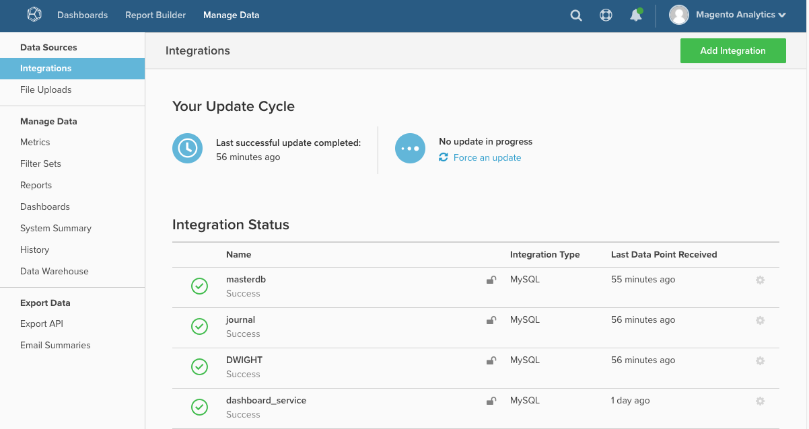

# MBI: 통합 재인증

이 문서에서는 타사 서비스에서 데이터를 가져오는 데 필요한 권한을 Magento Business Intelligence(MBI)에 부여하기 위해 통합을 다시 승인하는 솔루션을 제공합니다. 이러한 권한이 해지되면 재인증이 필요합니다.

## 데이터베이스 및 SaaS 통합

데이터베이스 및 SaaS 통합 목록은 다음을 참조하십시오. [통합을 사용하여 외부 데이터 연결](https://docs.magento.com/mbi/data-analyst/importing-data/integrations/integrations.html) 개발자 설명서에서 확인할 수 있습니다. 페이지를 열 때는 탐색을 위해 왼쪽의 목차를 사용하십시오.

## 연결 문제가 있습니까?

통합을 인증하면 MBI에 서드파티 서비스에서 데이터를 가져오는 데 필요한 권한을 부여합니다. 이러한 권한이 해지되면 재인증이 필요합니다.

이 문제는 다음과 같은 여러 가지 이유로 발생할 수 있습니다.

* 서드파티 서비스의 문제
* 인증 토큰 만료
* 관리 계정에 대한 변경 사항
* 또는 MBI 내 내부 문제

모든 통합의 상태는 통합 페이지 ( )에 있습니다. **데이터 관리 > 통합** ):

다시 인증하려면 계정 자격 증명을 다시 입력해야 할 수 있습니다. 경우에 따라 문제 통합을 위해 새 API 키를 생성해야 할 수 있습니다. 재인증 프로세스를 시작하려면 문제 통합의 이름을 클릭합니다.

문제가 지속되면 [지원 티켓 제출](/help/help-center-guide/help-center/magento-help-center-user-guide.md#submit-ticket).
