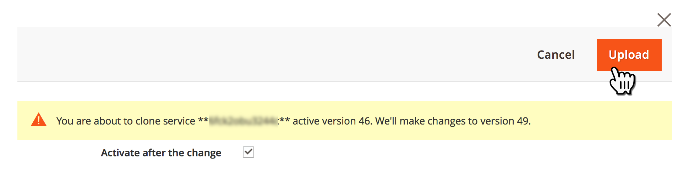

# 클라우드 인프라의 Adobe Commerce에 있는 모든 페이지에 대해 HTTP를 HTTPS로 리디렉션(TLS 적용)

Fastly 활성화 **TLS 강제 실행** cloud infrastructure store의 Adobe Commerce에 있는 모든 페이지에 대해 전역 HTTP에서 HTTPS로 리디렉션을 활성화하는 Commerce 관리 기능입니다.

이 문서에서는 자세한 내용을 제공합니다. [단계](#steps)TLS 강제 적용 기능, 영향을 받는 버전에 대한 빠른 개요 및 관련 문서에 대한 링크입니다.

## 단계 {#steps}

### 1단계: 보안 URL 구성 {#step-1-configure-secure-urls}

이 단계에서는 저장소의 보안 URL을 정의합니다. 이미 완료된 경우 다음으로 이동 [2단계: 강제 TLS 활성화](#step-2-enable-force-tls).

1. Commerce 관리자에 로그인합니다.
1. 다음으로 이동 **스토어** > **구성** > **일반** > **웹**.
1. 확장 **기본 URL(보안)** 섹션.    
1. 다음에서 **Secure Base URL** 필드에서 스토어의 HTTPS URL을 지정합니다.
1. 설정 **Storefront에서 보안 URL 사용** 및 **책임자에 대한 보안 URL 사용** 설정 대상 **예**.    
1. 클릭 **구성 저장** 오른쪽 상단에서 변경 사항을 적용합니다.

**사용 안내서의 관련 설명서:**   [URL 저장](https://docs.magento.com/m2/ee/user_guide/stores/store-urls.html).

### 2단계: 강제 TLS 활성화 {#step-2-enable-force-tls}

1. Commerce 관리에서 다음 위치로 이동합니다. **스토어** > **구성** > **고급** > **시스템**.
1. 확장 **전체 페이지 캐시** 섹션, 그런 다음 **Fastly 구성**, 그런 다음 **고급 구성**.
1. 다음을 클릭합니다. **TLS 강제 실행** 단추를 클릭합니다.    
1. 표시되는 대화 상자에서 **업로드**.    
1. 대화 상자가 닫히면 Force TLS의 현재 상태가 **활성화됨**.    

**관련 Fastly 설명서:**   [TLS 강제 실행 안내서](https://github.com/fastly/fastly-magento2/blob/master/Documentation/Guides/FORCE-TLS.md) Adobe Commerce 2용

## 강제 TLS 정보

TLS(Transport Layer Security)는 보안 수준이 낮은 전임 SSL(Secure Socket Layer) 프로토콜을 대체하는 보안 HTTP 연결을 위한 프로토콜입니다.

Fastly의 TLS 강제 실행 기능을 사용하면 사이트 페이지에 대해 암호화되지 않은 모든 수신 요청을 TLS에 강제 적용할 수 있습니다.

>>
를 반환하면 작동합니다. *301 영구적으로 이동됨* 암호화되지 않은 요청에 대한 응답으로, 그에 상응하는 TLS로 리디렉션됩니다. 예를 들어 다음을 요청합니다. *http://www.example.com/foo.jpeg* 로 리디렉션됨 *https://www.example.com/foo.jpeg*.

[통신 보안](https://docs.fastly.com/guides/securing-communications/) (Fastly 설명서)

## 영향을 받는 버전

* **클라우드 인프라의 Adobe Commerce:**
   * 버전: 2.1.4 이상
   * 계획: 클라우드 인프라의 Adobe Commerce 스타터 계획 아키텍처 및 클라우드 인프라의 Adobe Commerce 계획 아키텍처(Pro 레거시 포함)
* **Fastly:** 1.2.4

## routes.yaml에 변경 사항이 필요하지 않습니다.

HTTP에서 HTTPS로의 리디렉션을 활성화하려면 **모두** 페이지의 경우 스토어에 페이지를 추가할 필요가 없습니다. `routes.yaml` 구성 파일 - 전체 저장소에 대해 전역 TLS 강제 적용 을 활성화하면 됩니다(Commerce 관리 사용).

## 관련 Fastly 설명서

* [Adobe Commerce 2에 TLS 강제 적용](https://github.com/fastly/fastly-magento2/blob/master/Documentation/Guides/FORCE-TLS.md)
* [TLS 리디렉션 강제 실행](https://docs.fastly.com/guides/securing-communications/forcing-a-tls-redirect)
* [통신 보안](https://docs.fastly.com/guides/securing-communications/)
