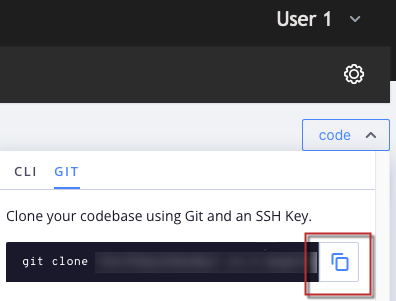
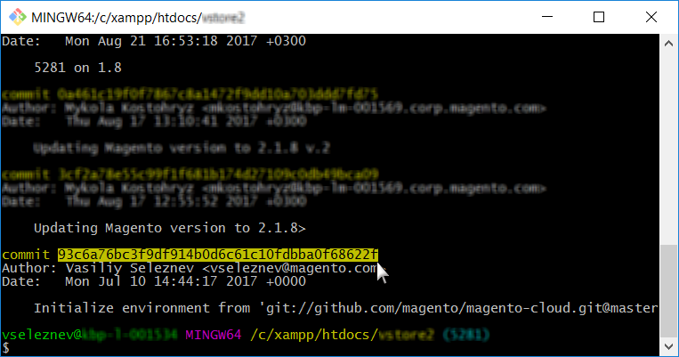

# 클라우드 스냅숏을 사용하지 않고 환경 롤백

이 문서에서는 클라우드 인프라의 Adobe Commerce에서 환경 스냅숏을 만들지 않고 환경을 롤백하는 두 가지 솔루션을 보여 줍니다.

## 영향을 받는 제품 및 버전

* 클라우드 인프라의 Adobe Commerce, [지원되는 모든 버전](https://magento.com/sites/default/files/magento-software-lifecycle-policy.pdf)

사용 사례에 가장 적합한 항목 선택:

* 안정적인 빌드가 있지만 유효한 스냅샷이 없는 경우 - [시나리오 1: 스냅샷 없음, 안정적인 빌드(SSH 연결 사용 가능)](#scen2).
* 빌드가 손상되고 유효한 스냅숏이 없는 경우 - [시나리오 2: 스냅숏 없음, 빌드가 끊김(SSH 연결 없음)](#scen3).

## 시나리오 1: 스냅샷 없음, 안정적인 빌드(SSH 연결 사용 가능) {#scen2}

이 섹션에서는 스냅샷을 만들지 않았지만 SSH를 통해 환경에 액세스할 수 있는 경우 환경을 롤백하는 방법을 보여줍니다.

단계는 다음과 같습니다.

1. 구성 관리를 비활성화합니다.
1. Adobe Commerce 소프트웨어를 제거합니다.
1. git 분기를 재설정합니다.

다음 단계를 수행한 후:

* Adobe Commerce 설치가 바닐라 상태로 돌아갑니다(데이터베이스 복원됨, 배포 구성이 제거됨, 디렉터리 `var` 지워짐)
* git 분기가 과거의 원하는 상태로 재설정됩니다

아래의 자세한 단계를 읽어 보십시오.

### 0단계 (전제 조건): 구성 관리를 비활성화하려면 config.php를 제거 {#disable_config_management}

배포 중에 이전 구성 설정을 자동으로 적용하지 않도록 구성 관리를 비활성화해야 합니다.

구성 관리를 비활성화하려면 `/app/etc/` 디렉터리에 다음 항목이 없습니다. `config.php` (Adobe Commerce 2.2.x용) 또는 `config.local.php` (Adobe Commerce 2.1.x의 경우) 파일.

구성 파일을 제거하려면 다음 단계를 수행하십시오.

1. [환경에 SSH 추가](https://experienceleague.adobe.com/docs/commerce-cloud-service/user-guide/develop/secure-connections.html).
1. 구성 파일을 제거합니다.
   * Adobe Commerce 2.2의 경우:

   ```php
    rm app/etc/config.php
   ```

   * Adobe Commerce 2.1의 경우:

   ```php
     rm app/etc/config.local.php
   ```

다음을 검토하여 구성 관리에 대해 자세히 알아보십시오.

* [클라우드 인프라에서 Adobe Commerce의 배포 중단 시간 감소](/help/how-to/general/magento-cloud-reduce-deployment-downtime-with-configuration-management.md) 을 참조하십시오.
* [저장소 설정에 대한 구성 관리](https://experienceleague.adobe.com/docs/commerce-cloud-service/user-guide/configure-store/store-settings.html) 개발자 설명서에서 확인할 수 있습니다.

### 1단계: setup:uninstall 명령을 사용하여 Adobe Commerce 소프트웨어 제거 {#setup-uninstall}


Adobe Commerce 소프트웨어를 제거하면 데이터베이스가 삭제 및 복원되고, 배포 구성이 제거되며, 아래의 디렉토리가 지워집니다. `var`.

리뷰 [Adobe Commerce 소프트웨어 제거](https://experienceleague.adobe.com/docs/commerce-operations/installation-guide/tutorials/uninstall.html) 개발자 설명서에서 확인할 수 있습니다.

Adobe Commerce 소프트웨어를 제거하려면 다음 단계를 따르십시오.

1. [환경에 SSH 추가](https://experienceleague.adobe.com/docs/commerce-cloud-service/user-guide/develop/secure-connections.html).
1. 실행 `setup:uninstall`:

   ```php
     php bin/magento setup:uninstall
   ```

1. 제거를 확인합니다.

성공적으로 제거되었음을 확인하는 메시지가 표시됩니다.

```php
[SUCCESS]: Magento uninstallation complete.
```

즉, Adobe Commerce 설치(DB 포함)를 실제(바닐라) 상태로 되돌렸습니다.

### 2단계: git 분기 재설정 {#reset-git-branch}

git 재설정을 사용하면 코드를 이전의 원하는 상태로 되돌립니다.

1. 환경을 로컬 개발 환경에 복제합니다. 클라우드 콘솔에서 명령을 복사할 수 있습니다.    
1. 커밋 내역에 액세스합니다. 사용 `--reverse` 더 많은 편의를 위해 내역을 역순으로 표시하려면

   ```git
     git log --reverse
   ```

1. 정상적으로 작업한 커밋 해시를 선택합니다. 코드를 실제 상태(바닐라)로 재설정하려면 분기(환경)를 만든 첫 번째 커밋을 찾습니다.    
1. 하드 Git 재설정 적용:

   ```git
     git reset --h <commit_hash>
   ```

1. 변경 사항을 서버에 푸시:

   ```git
     git push --force <origin> <branch>
   ```

이 단계를 수행하면 git 분기가 재설정되고 전체 git 변경 로그가 지워집니다. 마지막 git 푸시는 재배포를 트리거하여 모든 변경 사항을 적용하고 Adobe Commerce을 다시 설치합니다.

## 시나리오 2: 스냅숏 없음, 빌드가 끊김(SSH 연결 없음) {#scen3}

이 섹션에서는 중요한 상태일 때 환경을 롤백하는 방법을 보여줍니다. 배포 프로시저가 작업 응용 프로그램을 빌드할 수 없으므로 SSH 연결을 사용할 수 없습니다.

이 시나리오에서는 먼저 git reset을 사용하여 Adobe Commerce 애플리케이션의 작업 상태를 복원한 다음 Adobe Commerce 소프트웨어를 제거해야 합니다(데이터베이스를 삭제하고 복원하려면 배포 구성을 제거하는 등). 시나리오에는 시나리오 1과 동일한 단계가 포함되지만 단계 순서가 다르고 추가 단계인 강제 재배포가 있습니다. 단계는 다음과 같습니다.

[1. git 분기를 재설정합니다.](/help/how-to/general/reset-environment-on-cloud.md#reset-git-branch)

[2. 구성 관리를 비활성화합니다.](/help/how-to/general/reset-environment-on-cloud.md#disable_config_management)

[3. Adobe Commerce 소프트웨어를 제거합니다.](/help/how-to/general/reset-environment-on-cloud.md#setup-uninstall)

4&amp;period; 강제 재배포.

이 단계를 수행하면 시나리오 1과 동일한 결과가 나옵니다.

### 4단계: 강제 재배포

커밋을 만들고(권장하지는 않지만 빈 커밋일 수 있음) 서버에 푸시하여 재배포를 트리거합니다.

```git
git commit --allow-empty -m "<message>" && git push <origin> <branch>
```

## 설치:제거가 실패하면 데이터베이스를 수동으로 재설정하십시오.

를 실행하는 경우 `setup:uninstall` 명령이 오류와 함께 실패하고 완료할 수 없습니다. 다음 단계를 수행하여 수동으로 DB를 지울 수 있습니다.

1. [환경에 SSH 추가](https://experienceleague.adobe.com/docs/commerce-cloud-service/user-guide/develop/secure-connections.html).
1. MySQL DB에 연결:

   ```sql
   mysql -h database.internal
   ```

1. 드롭하기 `main` 데이터베이스:

   ```sql
   drop database main;
   ```

1. 빈 항목 만들기 `main` 데이터베이스:

   ```sql
   create database main;
   ```

1. 다음 구성 파일을 삭제합니다. `config.php`, `config.php` `.bak`, `env.php`, 및 `env.php.bak`.

DB를 재설정한 후 [환경에 git 푸시를 만들어 재배포 트리거](https://experienceleague.adobe.com/docs/commerce-cloud-service/user-guide/dev-tools/cloud-cli.html#git-commands) 새로 만든 DB에 Adobe Commerce을 설치합니다. 또는 [redeploy 명령 실행](https://experienceleague.adobe.com/docs/commerce-cloud-service/user-guide/dev-tools/cloud-cli.html#environment-commands).

## 관련 읽기

개발자 설명서에서:

* [클라우드에서 스냅샷 복원](https://experienceleague.adobe.com/en/docs/commerce-cloud-service/user-guide/develop/storage/snapshots#restore-a-manual-backup)
* [스냅샷 만들기](https://experienceleague.adobe.com/en/docs/commerce-cloud-service/user-guide/develop/storage/snapshots#create-a-manual-backup)
* [스냅샷 및 백업 관리](https://experienceleague.adobe.com/en/docs/commerce-cloud-service/user-guide/develop/storage/snapshots)
* [Cloud Console로 분기 관리 - 로그 보기](https://experienceleague.adobe.com/docs/commerce-cloud-service/user-guide/project/console-branches.html?lang=en#view-logs)
* [구성 요소 배포 실패](https://experienceleague.adobe.com/docs/commerce-cloud-service/user-guide/develop/deploy/recover-failed-deployment.html)
* [프로젝트 관리](https://experienceleague.adobe.com/docs/commerce-cloud-service/user-guide/project/overview.html#configure-the-project)
