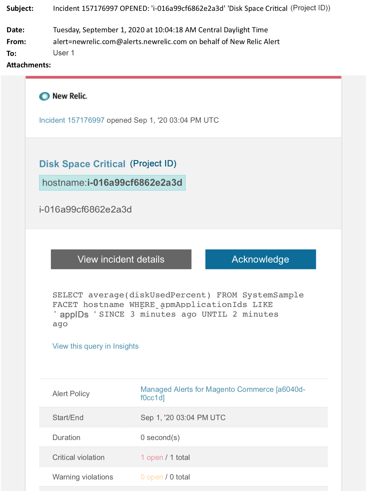

# Adobe Commerce에 대한 관리 경고: 디스크 위험 경고

이 문서에서는 New Relic에서 Adobe Commerce에 대한 중요 디스크 경고를 받았을 때의 문제 해결 단계를 제공합니다. 문제를 해결하기 위해 즉각적인 조치가 필요합니다. 선택한 경고 알림 채널에 따라 경고는 다음과 같이 표시됩니다.

{width="500"}

## 영향을 받는 제품 및 버전

Pro 플랜 아키텍처의 Adobe Commerce 클라우드 인프라

## 문제

에 등록한 경우 New Relic에서 알림을 받게 됩니다. [Adobe Commerce에 대한 관리 경고](/help/support-tools/managed-alerts-for-adobe-commerce/managed-alerts-for-magento-commerce.md) 하나 이상의 경고 임계값이 초과되었습니다. 이러한 경고는 지원 및 엔지니어링의 인사이트를 사용하여 고객에게 표준 세트를 제공하기 위해 Adobe에서 개발했습니다.

<u> **해!** </u>

* 이 경고가 지워질 때까지 예약된 배포를 중단합니다.
* 사이트가 응답하지 않거나 완전히 응답하지 않는 경우 즉시 사이트를 유지 관리 모드로 전환합니다. 단계는 를 참조하십시오. [설치 안내서 > 유지 관리 모드 활성화 또는 비활성화](https://devdocs.magento.com/guides/v2.4/install-gde/install/cli/install-cli-subcommands-maint.html?itm_source=devdocs&amp;itm_medium=search_page&amp;itm_campaign=federated_search&amp;itm_term=mainten) . 문제 해결을 위해 사이트에 계속 액세스할 수 있도록 제외 IP 주소 목록에 IP를 추가해야 합니다. 단계는 를 참조하십시오. [제외 IP 주소 목록 유지](https://devdocs.magento.com/guides/v2.4/install-gde/install/cli/install-cli-subcommands-maint.html?itm_source=devdocs&amp;itm_medium=search_page&amp;itm_campaign=federated_search&amp;itm_term=mainten#instgde-cli-maint-exempt).

**안 돼!**

* 사이트에 추가 페이지 보기를 가져올 수 있는 추가 마케팅 캠페인을 시작합니다.
* 인덱서 또는 추가 크론을 실행하여 CPU 또는 디스크에 추가 스트레스를 발생시킬 수 있습니다.
* 주요 관리 작업(예: Commerce 관리, 데이터 가져오기/내보내기)을 수행합니다.
* 캐시를 지웁니다.

경고 원인을 조사하고 해결하기 전에 &quot;안 함&quot; 작업을 수행하면 사이트가 응답하지 않을 수 있습니다(아직 사이트 중단이 발생하지 않은 경우).

## 솔루션

다음 단계에 따라 원인을 식별하고 해결하십시오.

>[!WARNING]
>
>이는 위험 경고이므로 완료하는 것이 좋습니다. **1단계** 문제를 해결하기 전에(2단계 이상).

1. Adobe Commerce 지원 티켓이 있는지 확인합니다. 단계는 를 참조하십시오. [지원 티켓 추적](/help/help-center-guide/help-center/magento-help-center-user-guide.md#track-tickets) 을 참조하십시오. 지원이 New Relic 임계값 경고를 받고 티켓을 생성한 후 문제 해결을 시작했을 수 있습니다. 티켓이 없으면 만듭니다. 티켓에는 다음 정보가 있어야 합니다.
   * 연락처 이유: &quot;New Relic CRITICAL 경고 수신됨&quot;을 선택합니다.
   * 경고에 대한 설명.
   * [New Relic 문제 링크](https://docs.newrelic.com/docs/alerts-applied-intelligence/new-relic-alerts/alert-incidents/view-violation-event-details-incidents). 여기에 포함되어 있습니다. [Adobe Commerce에 대한 관리 경고](/help/support-tools/managed-alerts-for-adobe-commerce/managed-alerts-for-magento-commerce.md).
1. New Relic에서 디스크 사용을 가장 많이 검토하십시오. 단계는 New Relic의 스토리지 탭을 참조하십시오. [기반 구조 모니터링 호스트 페이지:](https://docs.newrelic.com/docs/infrastructure/infrastructure-ui-pages/infra-hosts-ui-page/#storage)
   * New Relic에서 디스크 사용량이 느리게 증가하는 경우 다음 옵션을 시도하십시오.
   * 공간 할당을 조정하여 디스크 공간을 최적화합니다. 단계는 를 참조하십시오. [디스크 공간 관리](https://experienceleague.adobe.com/docs/commerce-cloud-service/user-guide/develop/storage/manage-disk-space.html) 개발자 설명서에서 확인할 수 있습니다. 추가 디스크 공간을 요청해야 할 수도 있습니다(Adobe 계정 팀에 문의).
   * MySQL의 디스크 공간을 정리합니다. 을(를) 참조하십시오 [MySQL 디스크 공간이 부족합니다.](/help/troubleshooting/database/mysql-disk-space-is-low-on-magento-commerce-cloud.md) 지원 기술 자료에서 단계에 대해 설명합니다.
   * New Relic에서 디스크 사용량이 급격히 증가하는 경우 디렉터리에서 파일이 매우 빠르게 증가하는 문제가 있음을 나타낼 수 있습니다. 다음 사항을 확인하십시오.
1. CLI/Terminal에서 다음 명령을 실행하여 전체 디스크 공간을 점검하여 문제를 파악하십시오. `df -h`
1. 예기치 않게 용량이 크고 디스크 사용량이 증가하는 디렉토리를 식별한 후 영향을 받는 파일 시스템을 확인해야 합니다. 다음 예제에서는 파일 디렉터리를 확인하는 방법을 보여 줍니다 `pub/media/`. Commerce이 로그 및 대용량 미디어 파일을 저장하는 데 사용하는 디렉터리입니다. 그러나 예기치 않은 디스크 사용을 표시하는 모든 디렉터리에 대해 이 명령을 실행해야 합니다. `du -sch ~/pub/media/*`

터미널의 출력에서 디스크 사용량이 급격히 증가하는 이러한 디렉토리 중 하나에 있는 파일을 표시하는 경우 파일의 콘텐츠가 필요하지 않은 것을 알고 있다면 파일을 제거하는 것이 좋습니다. 이 조치를 취하기가 불편하시다면, [Adobe Commerce 지원 티켓 제출](/help/help-center-guide/help-center/magento-help-center-user-guide.md#submit-ticket).
