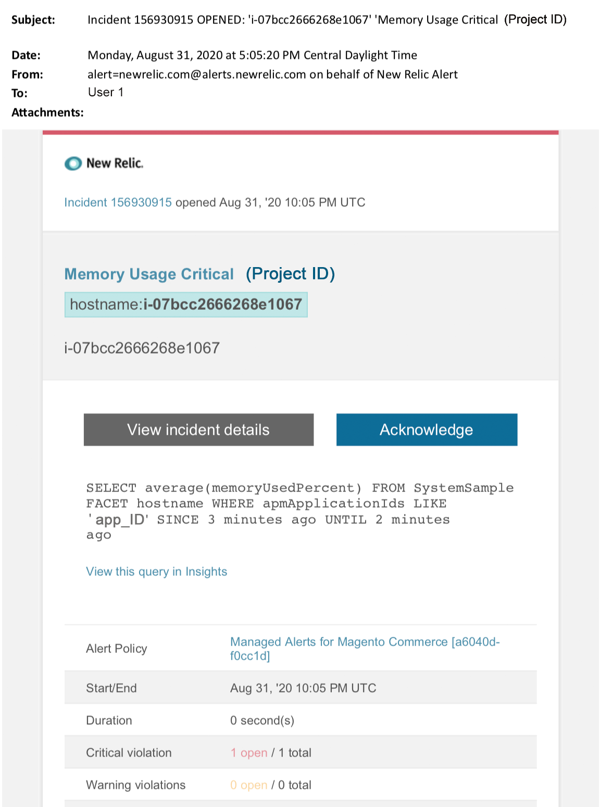

# Adobe Commerce에서 관리되는 경고: 메모리 위험 경고

이 문서에서는 New Relic에서 Adobe Commerce에 대한 메모리 위험 알림을 받을 때의 문제 해결 단계를 제공합니다. 문제를 해결하기 위해 즉각적인 조치가 필요합니다. 선택한 경고 알림 채널에 따라 경고는 다음과 같이 표시됩니다.

{width="500"}

## 영향을 받는 제품 및 버전

클라우드 인프라의 모든 Adobe Commerce 버전 Pro 플랜 아키텍처.

## 문제

에 등록한 경우 New Relic에서 관리 경고를 받게 됩니다. [Adobe Commerce에 대한 관리 경고](/help/support-tools/managed-alerts-for-adobe-commerce/managed-alerts-for-magento-commerce.md) 하나 이상의 경고 임계값이 초과되었습니다. 이러한 경고는 지원 및 엔지니어링의 인사이트를 사용하여 고객에게 표준 세트를 제공하기 위해 Adobe에서 개발했습니다.

<u> **해!** </u>

* 이 경고가 지워질 때까지 예약된 배포 중단
* 사이트가 응답하지 않거나 완전히 응답하지 않는 경우 즉시 사이트를 유지 관리 모드로 전환합니다. 단계는 를 참조하십시오. [설치 안내서 > 유지 관리 모드 활성화 또는 비활성화](https://devdocs.magento.com/guides/v2.4/install-gde/install/cli/install-cli-subcommands-maint.html?itm_source=devdocs&amp;itm_medium=search_page&amp;itm_campaign=federated_search&amp;itm_term=mainten) 개발자 설명서에서 확인할 수 있습니다. 문제 해결을 위해 사이트에 계속 액세스할 수 있도록 제외 IP 주소 목록에 IP를 추가해야 합니다. 단계는 를 참조하십시오. [제외 IP 주소 목록 유지](https://devdocs.magento.com/guides/v2.4/install-gde/install/cli/install-cli-subcommands-maint.html?itm_source=devdocs&amp;itm_medium=search_page&amp;itm_campaign=federated_search&amp;itm_term=mainten#instgde-cli-maint-exempt) 개발자 설명서에서 확인할 수 있습니다.

<u>**안 돼!**</u>

* 사이트에 추가 페이지 보기를 가져올 수 있는 추가 마케팅 캠페인을 시작합니다.
* 인덱서 또는 추가 크론을 실행하여 CPU 또는 디스크에 추가 스트레스를 발생시킬 수 있습니다.
* 주요 관리 작업(예: Commerce 관리, 데이터 가져오기/내보내기)을 수행합니다.
* 캐시를 지웁니다.

경고 원인을 조사하고 해결하기 전에 &quot;안 함&quot; 작업을 수행하면 사이트가 응답하지 않을 수 있습니다(아직 사이트 중단이 발생하지 않은 경우).

## 솔루션

다음 단계에 따라 원인을 식별하고 해결하십시오.

>[!WARNING]
>
>이는 위험 경고이므로 완료하는 것이 좋습니다. **1단계** 문제를 해결하기 전에(2단계 이상).

1. Adobe Commerce 지원 티켓이 있는지 확인합니다. 단계는 를 참조하십시오. [지원 티켓 추적](/help/help-center-guide/help-center/magento-help-center-user-guide.md#track-tickets) 을 참조하십시오. 지원이 이미 New Relic 임계값 경고를 받고 티켓을 생성한 후 문제 해결을 시작했을 수 있습니다. 티켓이 없으면 만듭니다. 티켓에는 다음 정보가 있어야 합니다.
   * 연락처 이유: &quot;New Relic CRITICAL 경고 수신됨&quot; 선택
   * 경고 설명
   * [New Relic 문제 링크](https://docs.newrelic.com/docs/alerts-applied-intelligence/new-relic-alerts/alert-incidents/view-violation-event-details-incidents). 여기에 포함되어 있습니다. [Adobe Commerce에 대한 관리 경고](/help/support-tools/managed-alerts-for-adobe-commerce/managed-alerts-for-magento-commerce.md).

1. 사용 [New Relic APM의 인프라 페이지](https://docs.newrelic.com/docs/infrastructure/infrastructure-ui-pages/infra-hosts-ui-page/) 메모리 사용량이 가장 많은 프로세스를 파악합니다. 단계는 New Relic 를 참조하십시오. [기반 구조 모니터링 호스트 페이지 > 프로세스 탭](https://docs.newrelic.com/docs/infrastructure/infrastructure-ui-pages/infra-hosts-ui-page/#processes):
   * Redis, MySQL 또는 PHP와 같은 서비스가 메모리 사용의 주요 원인인 경우 다음을 시도해 보십시오.
1. 최신 버전을 사용하고 있는지 확인하십시오. 최신 버전은 경우에 따라 메모리 누수를 해결할 수 있습니다. 최신 버전을 사용하고 있지 않다면 업그레이드를 고려해 보십시오. 단계는 를 참조하십시오. [클라우드 인프라의 Adobe Commerce > 서비스 > 서비스 변경](https://experienceleague.adobe.com/docs/commerce-cloud-service/user-guide/configure/service/services-yaml.html) 개발자 설명서에서 확인할 수 있습니다.
1. 서비스 관련 문제가 버전과 관련이 없는 경우 다음을 시도해 보십시오.
1. **MySQL**: 오래 실행되는 쿼리, 기본 키가 정의되지 않음 및 중복 인덱스와 같은 문제가 있는지 확인합니다. 단계는 를 참조하십시오. [클라우드 인프라에서 Adobe Commerce의 가장 일반적인 데이터베이스 문제](https://experienceleague.adobe.com/docs/commerce-operations/implementation-playbook/best-practices/maintenance/resolve-database-performance-issues.html) 을 참조하십시오.
1. **레디스**: Redis가 메모리 사용량의 최상위 소스인 경우 [지원 티켓 제출](/help/help-center-guide/help-center/magento-help-center-user-guide.md#submit-ticket).
1. **PHP**: PHP가 메모리 사용의 최상위 소스인 경우 를 실행하여 실행 중인 프로세스를 검토하십시오. `ps aufx` CLI/터미널에서. 터미널 출력에는 현재 실행 중인 cron job 및 process가 표시됩니다. 프로세스의 실행 시간에 대한 출력을 확인합니다. 실행 시간이 긴 크론이 있는 경우 크론이 걸려있을 수 있습니다. 문제 해결 단계는 를 참조하십시오. [성능 저하, 느리고 오래 실행되는 크론](/help/troubleshooting/miscellaneous/slow-performance-slow-and-long-running-crons.md) 및 [Cron 작업이 &quot;실행 중&quot; 상태에서 중단됨](https://support.magento.com/hc/en-us/articles/360033099451) 을 참조하십시오.
1. 여전히 문제의 원인을 파악하기 어려운 경우 [New Relic APM의 트랜잭션 페이지](https://docs.newrelic.com/docs/apm/applications-menu/monitoring/transactions-page-find-specific-performance-problems) 성능 문제가 있는 트랜잭션을 식별하려면
   * 오름차순 Apdex 점수를 기준으로 트랜잭션을 정렬합니다. [Apdex](https://docs.newrelic.com/docs/apm/new-relic-apm/apdex/apdex-measure-user-satisfaction) 는 웹 애플리케이션 및 서비스의 응답 시간에 대한 사용자 만족도를 나타냅니다. A [낮은 Apdex 점수](/help/support-tools/managed-alerts-for-adobe-commerce/managed-alerts-for-magento-commerce-apdex-warning-alert.md) 병목 현상(응답 시간이 더 긴 트랜잭션)을 나타낼 수 있습니다. 일반적으로 데이터베이스, Redis 또는 PHP입니다. 단계는 New Relic 를 참조하십시오. [Apdex 불만족이 가장 높은 트랜잭션 보기](https://docs.newrelic.com/docs/apm/new-relic-apm/apdex/view-your-apdex-score#apdex-dissat).
   * 가장 높은 처리량, 가장 느린 평균 응답 시간, 가장 많은 시간이 소요되는 임계값 및 기타 임계값별로 트랜잭션을 정렬합니다. 단계는 New Relic 를 참조하십시오. [구체적인 성능 문제 찾기](https://docs.newrelic.com/docs/apm/applications-menu/monitoring/transactions-page-find-specific-performance-problems). 여전히 문제를 식별하기 어려운 경우 New Relic APM의 인프라 페이지를 사용하십시오.
1. 메모리 사용량 증가의 원인을 파악할 수 없는 경우 최근 트렌드를 검토하여 최근 코드 배포 또는 구성 변경과 관련된 문제(예: 새로운 고객 그룹 및 카탈로그에 대한 대규모 변경)를 파악하십시오. 코드 배포 또는 변경 시 상관 관계에 대해 지난 7일 간의 활동을 검토하는 것이 좋습니다.
1. 위의 방법이 적절한 시간 내에 원인 및/또는 해결책을 찾는 데 도움이 되지 않는 경우 아직 설치하지 않았다면 업사이즈 또는 설치 사이트를 유지 관리 모드로 요청하십시오. 단계는 를 참조하십시오. [임시 크기 조정 요청 방법](/help/how-to/general/how-to-request-temporary-magento-upsize.md) 지원 기술 자료에서 [설치 안내서 > 유지 관리 모드 활성화 또는 비활성화](https://devdocs.magento.com/guides/v2.4/install-gde/install/cli/install-cli-subcommands-maint.html?itm_source=devdocs&amp;itm_medium=search_page&amp;itm_campaign=federated_search&amp;itm_term=mainten) 개발자 설명서에서 확인할 수 있습니다.
1. 업사이징이 사이트를 정상 작업으로 되돌리는 경우 영구적인 업사이징을 요청하거나(Adobe 계정 팀에 문의), 로드 테스트를 실행하고 쿼리 또는 서비스 압력을 줄이는 코드를 최적화하여 전용 스테이징에서 문제를 재현해 보십시오. 다음을 참조하십시오 [Adobe Commerce on cloud infrastructure > 테스트 배포 > 부하 및 스트레스 테스트](https://devdocs.magento.com/cloud/live/stage-prod-test.html#loadtest) 개발자 설명서에서 확인할 수 있습니다.
