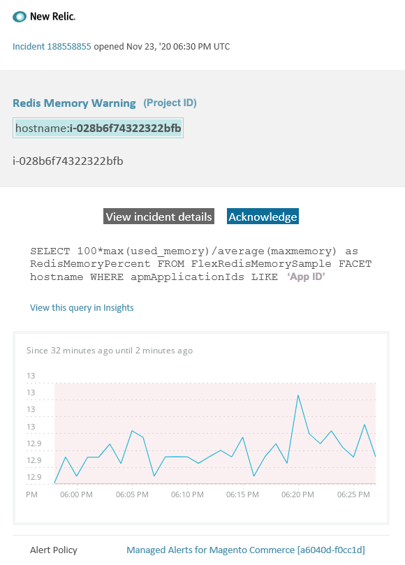

# Adobe Commerce에 대한 관리 경고: Redis 메모리 경고 경고

이 문서에서는 New Relic에서 Adobe Commerce에 대한 Redis 경고 알림을 받을 때의 문제 해결 단계를 제공합니다. 문제를 해결하려면 즉각적인 조치가 필요합니다. 선택한 경고 알림 채널에 따라 경고는 다음과 같이 표시됩니다.



## 영향을 받는 제품 및 버전

클라우드 인프라의 모든 Adobe Commerce 버전 Pro 플랜 아키텍처.

## 문제

에 등록한 경우 New Relic에서 알림을 받게 됩니다. [Adobe Commerce에 대한 관리 경고](/help/support-tools/managed-alerts-for-adobe-commerce/managed-alerts-for-magento-commerce.md) 하나 이상의 경고 임계값이 초과되었습니다. 이러한 경고는 Adobe이 지원 및 엔지니어링의 인사이트를 사용하여 판매자에게 표준 경고 세트를 제공하기 위해 개발했습니다.

**<u>해!</u>**

* 이 경고가 지워질 때까지 예약된 배포를 중단하는 것이 좋습니다.
* 사이트가 반응하지 않거나 완전히 반응하지 않는 경우 즉시 사이트를 유지 관리 모드로 전환합니다. 단계는 를 참조하십시오. [설치 안내서 > 유지 관리 모드 활성화 또는 비활성화](/docs/commerce-operations/installation-guide/tutorials/maintenance-mode.html#enable-or-disable-maintenance-mode-1) 설치 안내서에서 확인할 수 있습니다.
* 문제 해결을 위해 사이트에 계속 액세스할 수 있도록 제외 IP 주소 목록에 IP를 추가해야 합니다. 단계는 를 참조하십시오. [제외 IP 주소 목록 유지](/docs/commerce-operations/installation-guide/tutorials/maintenance-mode.html#maintain-the-list-of-exempt-ip-addresses) 설치 안내서에서 확인할 수 있습니다.

**<u>안 돼!</u>**

* 사이트에 추가 페이지 보기를 가져올 수 있는 추가 마케팅 캠페인을 시작합니다.
* 인덱서 또는 추가 크론을 실행하여 CPU 또는 디스크에 추가 스트레스를 발생시킬 수 있습니다.
* 주요 관리 작업(즉, 데이터 가져오기/내보내기, 미디어 플러시, 많은 수의 지정된 제품이 있는 범주 저장, 대량 업데이트 등 Commerce 관리자의 주요 작업)을 수행합니다.
* 캐시를 지웁니다.

## 솔루션

다음 단계에 따라 원인을 식별하고 해결하십시오.

1. Redis Used Memory가 [one.newrelic.com](https://login.newrelic.com/login) > **인프라** > **타사 서비스** 페이지에서 Redis 대시보드를 선택합니다. 안정적이거나 증가하는 경우, [지원 티켓 제출](/help/help-center-guide/help-center/magento-help-center-user-guide.md#submit-ticket) 클러스터의 크기를 늘리거나 `maxmemory` 다음 수준으로 제한합니다.
1. Redis 메모리 사용량 증가의 원인을 파악할 수 없는 경우 최근 트렌드를 검토하여 최근 코드 배포 또는 구성 변경(예: 새로운 고객 그룹 및 카탈로그에 대한 대규모 변경)과 관련된 문제를 파악합니다. 코드 배포 또는 변경 시 상관 관계에 대한 지난 7일간의 활동을 검토하는 것이 좋습니다.
1. 타사 확장의 잘못된 동작 확인:
   * 최근에 설치된 타사 확장 프로그램 및 문제가 시작된 시간과의 상관 관계를 찾으십시오.
   * Adobe Commerce 캐시에 영향을 줄 수 있고 캐시가 빠르게 증가하는 확장을 검토하십시오. 예를 들어 사용자 지정 레이아웃 블록, 캐시 기능 오버라이드 및 캐시에 대용량 데이터 저장 등이 있습니다.
1. 확장을 잘못 사용했다는 증거가 없다면 [최신 패치를 설치하여 클라우드 인프라의 Adobe Commerce에 대한 Redis 문제 해결](/help/troubleshooting/miscellaneous/install-latest-patches-to-fix-magento-redis-issues.md). 위의 단계가 문제의 원인을 식별하거나 해결하는 데 도움이 되지 않는 경우 L2 캐시를 활성화하여 앱과 Redis 간의 네트워크 트래픽을 줄이는 것이 좋습니다. L2 캐시에 대한 일반적인 정보는 다음을 참조하십시오. [Adobe Commerce 애플리케이션에서 L2 캐싱](/docs/commerce-operations/configuration-guide/cache/level-two-cache.html) 구성 안내서에서 확인할 수 있습니다. 클라우드 인프라용 L2 캐시를 활성화하려면 다음을 시도해 보십시오.
   * 2002.1.2 버전 미만인 경우 ECE 도구를 업그레이드하십시오.
   * 다음을 사용하여 L2 캐시 구성 [REDIS\_BACKEND 변수 사용](/docs/commerce-cloud-service/user-guide/configure/env/stage/variables-deploy.html#redis_backend) 및 업데이트 `.magento.env.yaml` 파일:

   ```yaml
   stage:
      deploy:
          REDIS_BACKEND: '\Magento\Framework\Cache\Backend\RemoteSynchronizedCache'
   ```
