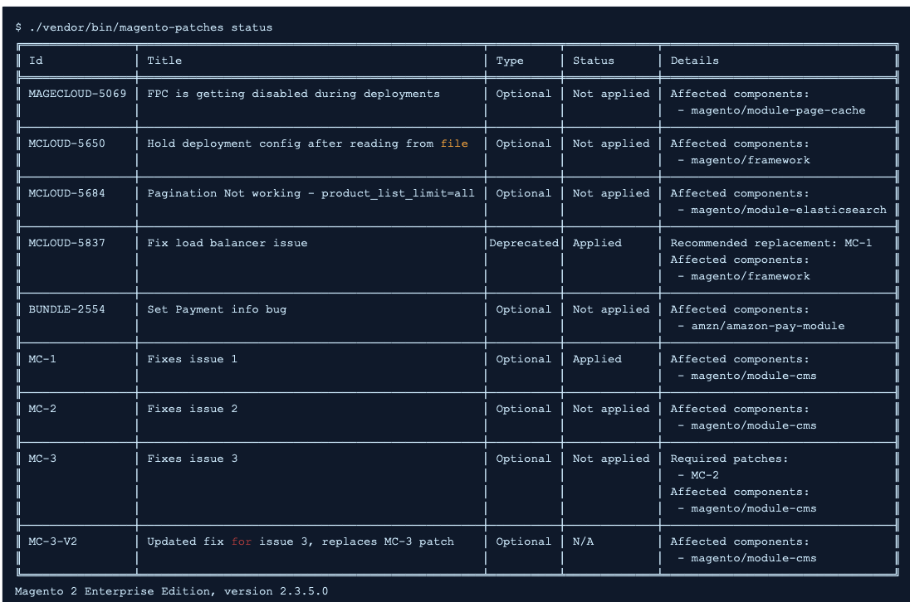

# 품질 패치 도구로 Adobe Commerce 패치 문제 확인

이 문서에서는 QPT(Quality Patches Tool)에 대한 개요와 사용 방법을 설명하는 리소스 링크를 제공합니다.

## 영향을 받는 제품 및 버전

* Adobe Commerce 온-프레미스, 모두 [지원되는 버전](https://magento.com/sites/default/files/magento-software-lifecycle-policy.pdf)
* 클라우드 인프라의 Adobe Commerce, 모두 [지원되는 버전](https://magento.com/sites/default/files/magento-software-lifecycle-policy.pdf)

## 품질 패치 도구란 무엇입니까?

다음 [품질 패치 도구](https://github.com/magento/quality-patches) (QPT)는 Adobe 및 Magento Open Source 커뮤니티에서 개발한 개별 패치입니다.

이를 통해 다음을 수행할 수 있습니다.

* 패키지에 포함된 품질 패치 적용
* 이전에 적용된 패치 되돌리기
* 설치된 버전의 Adobe Commerce에 사용할 수 있는 품질 패치에 대한 일반 정보를 봅니다.

다음은 사용 가능한 패치를 보기 위해 얻을 수 있는 상태 테이블의 예입니다.

이 도구는 Adobe Commerce에서 발생할 수 있는 문제에 대한 패치를 자체 서비스하거나 Adobe Commerce 지원에서 제안한 패치를 쉽게 적용할 수 있도록 하기 위한 것입니다.

>[!NOTE]
>
>QPT는 품질 패치용으로만 사용됩니다. 보안 패치는 [Magento 보안 센터](https://magento.com/security/patches).

## 품질 패치 도구에서 사용할 수 있는 패치

다음을 참조하십시오. [품질 패치 도구](https://devdocs.magento.com/quality-patches/tool.html#patch-grid) 사용 가능한 패치 목록은 개발자 설명서에서 참조하십시오.

## 품질 패치 도구 설치 및 사용 방법

Adobe Commerce 온프레미스 및 Adobe Commerce 온클라우드 인프라의 경우 ece-tools 패키지에 QPT 패키지가 포함되므로 설치 및 사용 명령이 다릅니다.

### Adobe Commerce 온프레미스용 QPT를 설치하고 사용하는 방법

다음을 참조하십시오. [소프트웨어 업데이트 안내서 > 패치](https://devdocs.magento.com/guides/v2.4/comp-mgr/patching/mqp.html) 패치를 적용하고 되돌리기 위해 QPT를 설치하고 사용하는 방법에 대한 자세한 내용은 개발자 설명서에서 확인할 수 있습니다.

### 클라우드 인프라에서 Adobe Commerce용 QPT를 설치하고 사용하는 방법

다음을 참조하십시오. [Cloud for Adobe Commerce > 패치 적용](https://devdocs.magento.com/cloud/project/project-patch.html) 클라우드 인프라에서 Adobe Commerce에 패치를 적용하고 되돌리기 위해 QPT를 설치하고 사용하는 방법에 대한 자세한 내용은 개발자 설명서에서 확인할 수 있습니다.

## 관련 읽기

* [품질 패치 도구 릴리스 노트](https://devdocs.magento.com/quality-patches/release-notes.html) 개발자 설명서에서 확인할 수 있습니다.
* [Adobe에서 제공하는 작성기 패치 적용 방법](/help/how-to/general/how-to-apply-a-composer-patch-provided-by-magento.md) 을 참조하십시오.
