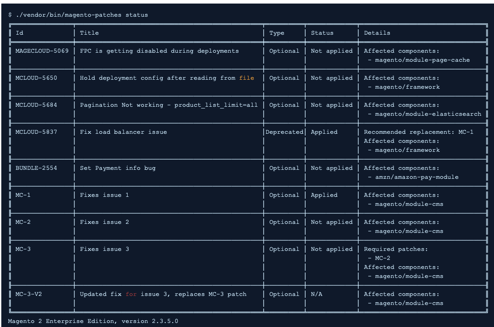

# QPT 도구 개요에서 사용할 수 있는 패치

이 문서에서는 다음에 대한 개요를 제공합니다. [!DNL Quality Patches Tool] (QPT) 및 사용 방법을 설명하는 리소스 링크입니다.

## 영향을 받는 제품 및 버전

* Adobe Commerce 온-프레미스, 모두 [지원되는 버전](https://www.adobe.com/content/dam/cc/en/legal/terms/enterprise/pdfs/Adobe-Commerce-Software-Lifecycle-Policy.pdf)
* 클라우드 인프라의 Adobe Commerce, 모두 [지원되는 버전](https://www.adobe.com/content/dam/cc/en/legal/terms/enterprise/pdfs/Adobe-Commerce-Software-Lifecycle-Policy.pdf)

## 품질 패치 도구란 무엇입니까?

다음 [[!DNL Quality Patches Tool]](https://github.com/magento/quality-patches) (QPT)는 Adobe 및 Magento Open Source 커뮤니티에서 개발한 개별 품질 패치를 적용할 수 있는 도구입니다.

이를 통해 다음을 수행할 수 있습니다.

* 패키지에 포함된 품질 패치 적용
* 이전에 적용된 패치 되돌리기
* 설치된 버전의 Adobe Commerce에 사용할 수 있는 품질 패치에 대한 일반 정보를 봅니다.

다음은 사용 가능한 패치를 보기 위해 얻을 수 있는 상태 테이블의 예입니다.

이 도구는 Adobe Commerce에서 발생할 수 있는 문제에 대한 패치를 자체 서비스하거나 Adobe Commerce 지원에서 제안한 패치를 쉽게 적용할 수 있도록 하기 위한 것입니다.

>[!NOTE]
>
>QPT는 품질 패치용으로만 사용됩니다. 보안 패치는 [Adobe Commerce 및 Magento Open Source 릴리스 정보](https://experienceleague.adobe.com/docs/commerce-operations/release/notes/overview.html).

## 에서 사용할 수 있는 패치 [!DNL Quality Patches Tool]

Adobe Commerce 지원 기술 자료의 이 섹션에서는 QPT 릴리스 버전별로 그룹화된 QPT 패치로 해결된 문제에 대한 자세한 설명을 확인할 수 있습니다.
또한 사용 가능한 QPT 패치 목록을 확인하고 다음에 동적으로 생성된 테이블을 사용하여 구성 요소별로 을 필터링할 수 있습니다. [[!DNL Quality Patches Tool]: 패치 검색 페이지](https://experienceleague.adobe.com/tools/commerce-quality-patches/index.html) 을 참조하십시오.

## 설치 및 사용 방법 [!DNL Quality Patches Tool]

Adobe Commerce 온프레미스 및 Adobe Commerce 온클라우드 인프라의 경우 ece-tools 패키지에 QPT 패키지가 포함되므로 설치 및 사용 명령이 다릅니다.

### Adobe Commerce 온프레미스용 QPT를 설치하고 사용하는 방법

다음을 참조하십시오. [Commerce > 도구 > 사용](https://experienceleague.adobe.com/docs/commerce-operations/tools/quality-patches-tool/usage.html) 패치를 적용하고 되돌리기 위해 QPT를 설치하고 사용하는 방법에 대한 자세한 내용은 개발자 설명서에서 확인할 수 있습니다.

### 클라우드 인프라에서 Adobe Commerce용 QPT를 설치하고 사용하는 방법

다음을 참조하십시오. [Commerce on Cloud Infrastructure 안내서 > 패치 적용](https://experienceleague.adobe.com/docs/commerce-cloud-service/user-guide/develop/upgrade/apply-patches.html) 클라우드 인프라에서 Adobe Commerce에 패치를 적용하고 되돌리기 위해 QPT를 설치하고 사용하는 방법에 대한 자세한 내용은 개발자 설명서에서 확인할 수 있습니다.

## 관련 읽기

* [[!DNL Quality Patches Tool] 릴리스 정보](https://experienceleague.adobe.com/docs/commerce-operations/tools/quality-patches-tool/release-notes.html) 개발자 설명서에서 확인할 수 있습니다.
