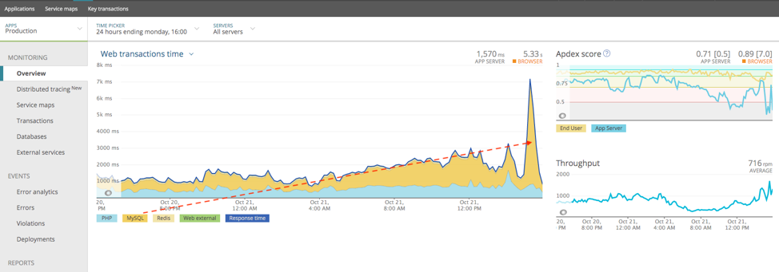
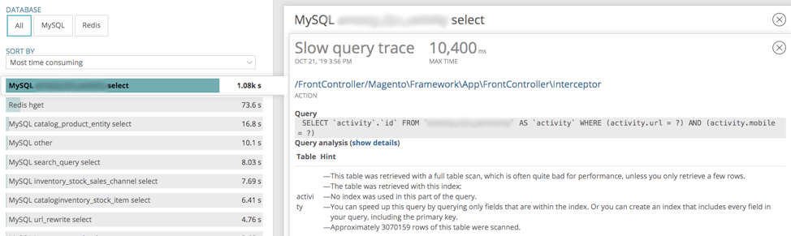
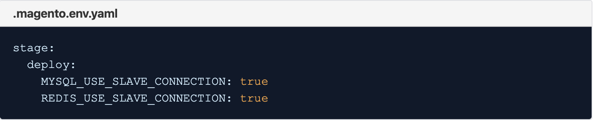

# 클라우드 인프라에서 Adobe Commerce의 MySQL 고부하 병목 현상

이 항목에서는 MySQL에서 로드가 높으면 클라우드 인프라의 Adobe Commerce에서 성능 병목 문제가 발생하는 경우의 솔루션에 대해 설명합니다.

## 영향을 받는 제품 및 버전

* Adobe Commerce on cloud infrastructure 2.x.x, Pro 계정.

### 전제 조건

* ECE Tools 버전 2002.0.16 이상
* New Relic APM 서비스 (**Adobe Commerce on cloud infrastructure 계정에는 New Relic APM 서비스용 소프트웨어가 포함되어 있습니다** 라이센스 키와 함께 제공)

New Relic APM 서비스 및 Adobe Commerce on cloud infrastructure 계정 설정에 대한 자세한 내용은 [New Relic 서비스](https://devdocs.magento.com/guides/v2.3/cloud/project/new-relic.html) 및 [New Relic APM 소개](https://docs.newrelic.com/docs/apm/new-relic-apm/getting-started/introduction-apm/).

## 문제

<u>문제가 사용자에게 영향을 미치는지 확인하는 단계</u>

1. New Relic APM 개요 차트에서 MySQL이 병목 현상이 되었음을 나타내는 첫 번째 표시를 확인합니다. 아래 예제 그림에서 MySQL이 병목 현상이 되어 웹 트랜잭션 시간이 대부분 소요되는 위치를 확인할 수 있습니다.

   

   이미지의 빨간색 파선이 MySQL 웹 트랜잭션 시간에 식별 가능한 증가 트렌드를 표시한 다음 더 높은 수준에서 최고점을 이루는 방법을 확인합니다.
1. 여기에서 다음 위치로 이동할 수 있습니다. **데이터베이스** 높은 처리량 또는 느린 속도의 두 번째 표시를 볼 수 있는 화면 `SELECT` MySQL의 쿼리와 아래 샘플 이미지에서 정렬 기준 **가장 많은 시간 소요**, 이 예에서 스토어의 속도가 느림 `SELECT` MySQL 쿼리

   

New Relic APM에서 느린 트랜잭션을 분석합니다. MySQL 데이터베이스에 많은 쿼리가 있거나 많은 압력이 있는 경우 을 활성화하여 로드를 여러 노드에 분산시킬 수 있습니다 `SLAVE` 연결.

## 원인

클라우드 인프라 저장소의 Adobe Commerce은 처리량이 많거나 속도가 느립니다. `SELECT` MySQL 쿼리

## 솔루션

>[!WARNING]
>
>크기 조정 아키텍처(분할 아키텍처)의 경우 Redis 슬레이브 연결 **하지 말아야 함** 활성화되었습니다. 프로젝트 URL로 이동하여 크기 조정된 아키텍처가 있는지 확인할 수 있습니다. 예: `https://console.adobecommerce.com/<owner-user-name>/<project-ID>/<environment-name>`. 클릭 **[!UICONTROL SSH]**. 노드가 세 개 이상인 경우 확장 아키텍처를 사용합니다. 크기 조정된 아키텍처에서 Redis 슬레이브 읽기 를 활성화하면 고객이 연결할 수 없는 Redis 연결에 대해 오류를 받게 됩니다. 이는 클러스터가 Redis 연결을 처리하도록 구성되는 방식과 관련이 있습니다. Redis Slaves는 여전히 활성 상태이지만 Redis Reads에는 사용되지 않습니다. 크기가 조정된 아키텍처에서 Adobe Commerce 2.3.5 이상을 사용하고 새로운 Redis 백엔드 구성을 구현하며 Redis용 L2 캐싱을 구현하는 것이 좋습니다.

이 두 가지 표시가 나타나면 `SLAVE` mySQL 데이터베이스 및 Redis에 대한 연결을 통해 다른 노드에 로드를 분산할 수 있습니다.

Adobe Commerce은 여러 데이터베이스 또는 Redis를 비동기식으로 읽을 수 있습니다. 업데이트 중 `.magento.env.yaml` 을 로 설정하여 파일 `true` 값 `MYSQL_USE_SLAVE_CONNECTION` 및 `REDIS_USE_SLAVE_CONNECTION` 을(를) 사용하려면 **읽기 전용** 비마스터 노드에서 읽기 전용 트래픽을 수신하기 위해 데이터베이스에 연결합니다. 이렇게 하면 한 노드만 읽기/쓰기 트래픽을 처리해야 하므로 로드 밸런싱을 통해 성능이 향상됩니다. 다음으로 설정 `false` 에서 기존 읽기 전용 연결 배열을 제거하려면 `env.php` 파일.

### 단계

1. 편집 `.magento.env.yaml` 파일을 참조하고 다음 컨텐츠를 추가합니다.

   

   자세한 내용은에서 찾을 수 있습니다. [DevDocs에서 변수 배포](https://devdocs.magento.com/cloud/env/variables-deploy.html#mysql_use_slave_connection).

1. 변경 사항을 커밋하고 변경 사항을 푸시합니다.
1. 변경 사항을 푸시하면 새 배포 프로세스가 시작됩니다. 배포가 성공적으로 완료되면 이제 Adobe Commerce on cloud infrastructure 인스턴스가 슬레이브 연결을 사용하도록 구성되어야 합니다.

## 일반적인 질문

다음은 Adobe Commerce on cloud infrastructure store에 대한 슬레이브 연결 기능 사용을 고려할 때 물을 수 있는 일반적인 질문입니다.

* 슬레이브 연결을 사용하는 데 알려진 문제나 제한이 있습니까? **슬레이브 연결 사용에 대한 알려진 문제가 없습니다. 가장 최근에 업데이트된 ece-tools 패키지를 사용 중인지 확인하기만 하면 됩니다. 지침은 여기에 있습니다. [ece-tools 패키지를 업데이트하는 방법](https://devdocs.magento.com/cloud/project/ece-tools-update.html).**
* 슬레이브 연결을 사용하여 추가적인 지연 시간이 있습니까? *예. 교차 AZ(Cross-Availability Zones) 지연은 인스턴스가 오버로드되지 않고 전체 로드를 처리할 수 있는 경우 클라우드 인프라 인스턴스에서 Adobe Commerce의 성능을 더 높이며 줄입니다. 그러나 인스턴스가 오버로드되면 마스터 슬레이브는 MySQL 데이터베이스나 Redis의 로드를 다른 노드에 분산시켜 성능을 향상시킵니다.*

  **오버로드되지 않은 클러스터** -  **슬레이브 연결은 성능을 10~15% 느리게 합니다.**, 이는 기본값이 아닌 이유 중 하나입니다.

  *그러나 과부하된 클러스터에서는 트래픽에 의한 부하를 줄여 이러한 10~15%가 완화되므로 성능이 향상됩니다.*
* 스토어에 대해 이러한 설정을 활성화해야 합니까? *MySQL 데이터베이스나 Redis에서 로드가 높거나 로드가 높을 것으로 예상되면 반드시 슬레이브 연결을 활성화해야 합니다. 평균 트래픽이 있는 일반 고객의 경우&#x200B;**아님**활성화할 최적의 설정입니다.*

## 관련 읽기

개발자 설명서에서:

* [변수 배포](https://devdocs.magento.com/cloud/env/variables-deploy.html).
* [선택적 데이터베이스 복제 설정](https://devdocs.magento.com/guides/v2.3/config-guide/multi-master/multi-master_slavedb.html).
* [ece-tools 패키지](https://devdocs.magento.com/cloud/reference/ece-tools-reference.html).

>[!NOTE]
>
>이 문서에는 일부 사람들이 인종차별주의자, 성차별주의자 또는 억압적이라고 생각할 수 있고 독자로 하여금 상처받거나, 트라우마를 받거나, 환영받지 못하게 만들 수 있는 업계 표준 소프트웨어 용어가 여전히 포함되어 있을 수 있다는 것을 알고 있습니다. Adobe이 코드, 설명서 및 사용자 경험에서 이러한 용어를 제거하고 있습니다.
