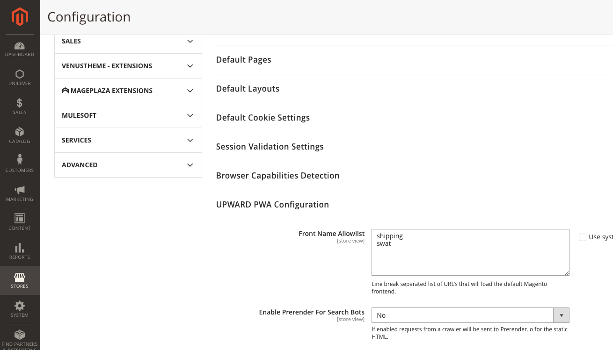

# Adobe Commerce에서 사이트 전체 분석 도구에 액세스할 때 403 오류 발생

이 문서에서는 Adobe Commerce에서 사이트 전체 분석 도구에 액세스하려고 할 때 403 오류가 발생하는 경우에 대한 해결 방법을 제공합니다.

## 영향을 받는 제품 및 버전

Adobe Commerce on cloud infrastructure 2.4.1 이상

## 문제

사이트 전체 분석 도구에 액세스하려고 하면 403 오류가 발생합니다.

<u>재현 단계:</u>

Commerce 관리 패널에 로그인하고 를 클릭합니다. **보고서** > *시스템 통찰력* > **사이트 전체 분석 도구**.

<u>예상 결과:</u>

사이트 전체 분석 도구가 표시됩니다.

<u>실제 결과:</u>

다음을 볼 수 있습니다. *오류 403.*


## 솔루션

사이트 전체 분석 도구가 애플리케이션에 올바르게 액세스할 수 있도록 하려면 CLI에서 다음 명령을 실행합니다. 바꾸기 `<store URL>` 스토어 URL을 사용하여:

```cURL
curl -sIL -X GET <store URL>/swat/key/index | grep HTTP
HTTP/2 403
```

받은 응답 코드에 따라 단계를 수행합니다.

### 403 금지된 응답 코드

응답 코드가 403이면 사이트 전체 분석 도구를 차단하는 Cloudflare 보트가 보호될 수 있습니다. 도구에 액세스하려면 해당 IP를 화이트리스트에 추가:

* 107.23.33.174
* 3.225.9.244
* 3.88.83.85

### 200 응답 코드 및 JSON 출력 수정

응답이 올바른 200 코드 및 JSON 출력인 경우 [지원 티켓 제출](/help/help-center-guide/help-center/magento-help-center-user-guide.md#submit-ticket) 사이트 전체 분석 도구 액세스를 통해 문제를 에스컬레이션합니다.


### 500(치명적인 오류) 응답 코드

응답 코드가 500(치명적인 오류)이면 MDVA-38526 패치를 설치하십시오. 원하는 패치 유형에 따라 다음 링크 중 하나를 사용하여 패치를 다운로드합니다.

* Adobe Commerce on cloud infrastructure 패치: [MDVA-38526_EE_2.4.1-p1_v3.patch.zip](assets/MDVA-38526_EE_2.4.1-p1_v3.patch.zip)
* Adobe Commerce on cloud infrastructure composer 패치: [MDVA-38526_EE_2.4.1-p1_COMPOSER_v3.patch.zip](assets/MDVA-38526_EE_2.4.1-p1_COMPOSER_v3.patch.zip)

이 패치는 Adobe Commerce on cloud infrastructure 버전 2.4.1 이상에 적용됩니다.

### JSON이 아닌 응답

응답 출력이 JSON이 아닌 경우 PWA/Headless 구현 때문일 수 있습니다. Headless 구현을 사용 중인 경우 Adobe Commerce Origin에 대한 요청을 무시하도록 UPPER 구성을 업데이트합니다. 이렇게 하려면 Adobe Commerce 관리자의 **스토어** > **구성** > **일반** > **웹** > **상향 PWA 구성** > **전방 이름 허용 목록**, 추가 *강타*.



여전히 사이트 전체 분석 도구에 액세스할 수 없는 경우 다음에 Commerce 관리 패널에 로그인하고 로 이동합니다. **보고서** > *시스템 통찰력* > **사이트 전체 분석 도구**, [지원 티켓 제출](/help/help-center-guide/help-center/magento-help-center-user-guide.md#submit-ticket).

## 관련 읽기

* [사이트 전체 분석 도구 안내서](https://experienceleague.adobe.com/docs/commerce-operations/tools/site-wide-analysis-tool/intro.html)
