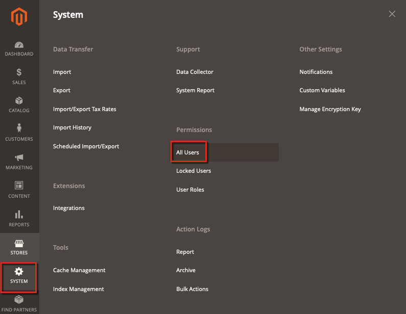

# 관리자 암호가 작업 로그에 일반 텍스트로 저장되었습니다.

이 문서에서는 Commerce 관리자가 관리자 권한을 가진 새 사용자를 만들 때 암호를 의 일반 텍스트로 저장할 때 발생하는 문제를 해결합니다 `magento_logging_event_changes` 데이터베이스 테이블.

이 보안 문제를 해결하려면 Adobe Commerce 2.0.16 및 2.1.9 보안 업데이트를 설치합니다. 보안 업데이트를 적용하면 암호가 암호화되며 일반 텍스트로 표시되지 않습니다.

## 영향을 받는 버전 {#Adminpasswordsaresavedasplaintexttoactionslog('magento_logging_event_changes'table)-Affectedversions}

* Adobe Commerce 온-프레미스 2.X.X
* 클라우드 인프라의 Adobe Commerce 2.X.X

## 문제 {#Adminpasswordsaresavedasplaintexttoactionslog('magento_logging_event_changes'table)-Issue}

기존 Commerce 관리자가 를 통해 관리자 권한을 가진 새 사용자를 만들 때 **시스템** > **권한** > **모든 사용자** > **새 사용자 추가**, 암호(확인으로 입력됨)는 의 일반 텍스트로 저장됩니다. `magento_logging_event_changes` 데이터베이스 테이블.

### 재현 단계: {#Adminpasswordsaresavedasplaintexttoactionslog('magento_logging_event_changes'table)-Stepstoreproduce}

1. 관리자로 로그인하고 다음 경로로 이동하여 새 사용자를 만듭니다. **시스템** > 권한 > **모든 사용자**.

   

1. 그런 다음 **새 사용자 추가** 페이지를 가리키도록 업데이트하는 중입니다. 메시지가 표시되면 현재 관리자의 암호를 입력합니다.
1. 로 이동 **시스템** > **작업 로그** > **보고서** 페이지를 만들고 마지막 로그 항목을 찾습니다.
1. 암호화되거나 해시되지 않은 현재 암호를 볼 수 있습니다.

## 솔루션 {#Adminpasswordsaresavedasplaintexttoactionslog('magento_logging_event_changes'table)-Solution}

설치 [Adobe Commerce 2.0.16 및 2.1.9 보안 업데이트](https://magento.com/security/patches/magento-2016-and-219-security-update) 이 문제를 수정합니다.

Security Update를 설치한 후 암호가 암호화되고에서 일반 텍스트로 표시되지 않습니다. `magento_logging_event_changes` 테이블.

## 추가 정보 {#Adminpasswordsaresavedasplaintexttoactionslog('magento_logging_event_changes'table)-Moreinformation}

[Adobe Commerce 2.0.16 및 2.1.9 보안 업데이트 페이지](https://magento.com/security/patches/magento-2016-and-219-security-update) 저희 보안 센터에서.

[Adobe Commerce 애플리케이션 및 구성 요소 업그레이드](https://experienceleague.adobe.com/docs/commerce-operations/upgrade-guide/overview.html) 개발자 설명서에서 확인할 수 있습니다.
