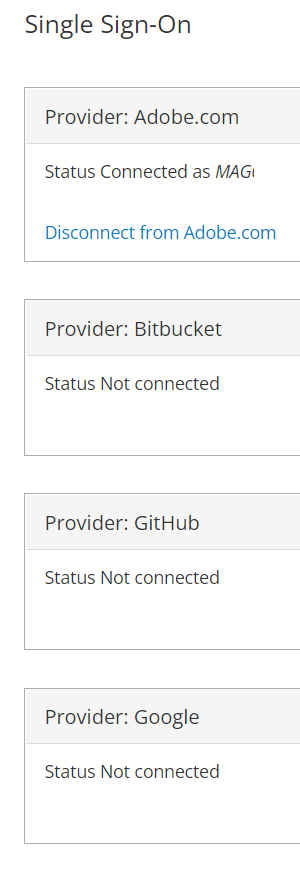
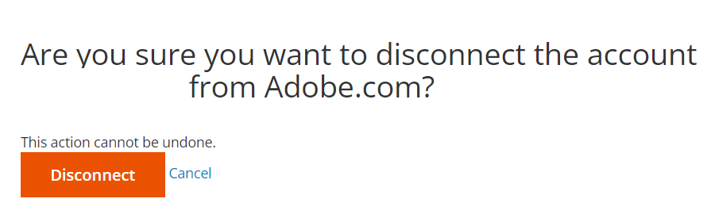
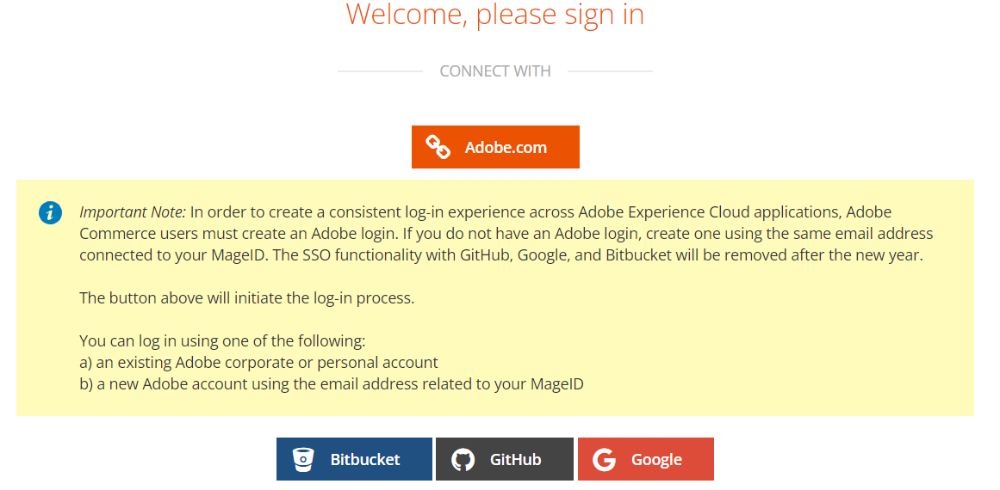

# 올바른 클라우드 계정/프로젝트에 액세스할 수 없거나 프로젝트가 계정에 없습니다.

이 문서에서는 계정 소유권 또는 연결된 이메일 주소가 변경된 후 다음 문제를 해결했습니다.

1. 올바른 클라우드 Adobe Commerce 프로젝트에 액세스할 수 없습니다.
1. 다음 위치의 계정에 클라우드 Adobe Commerce 프로젝트가 표시되지 않습니다. [accounts.magento.cloud/user](https://accounts.magento.cloud/user).
1. 에서 다른 계정(즉, 이전 계정 소유자)에 대한 세부 정보를 보고 있습니다. [accounts.magento.cloud/user](https://accounts.magento.cloud/user).

## 문제

소유권이 변경되거나 이메일 주소가 변경된 경우 올바른 클라우드 Adobe Commerce 프로젝트에 액세스할 수 없습니다.

## 영향을 받는 제품 및 버전

* 클라우드 인프라의 Adobe Commerce, [지원되는 모든 버전](https://www.adobe.com/content/dam/cc/en/legal/terms/enterprise/pdfs/Adobe-Commerce-Software-Lifecycle-Policy.pdf)

## 원인

이 문제는 일반적으로 이전 프로젝트 소유자의 SSO(Single Sign-On)가 다음 이후에 Adobe.com에 여전히 통합될 때 발생합니다.

1. 클라우드 프로젝트 소유권이 사용자(사용자)에게 이전되었으며 원래 프로젝트 소유자의 계정이 표시됩니다. 다음을 보려면 여기를 클릭하십시오. [솔루션](#solution-for-cause-one-and-two).

   또는

1. 귀하(사용자)는 이메일 주소 및 액세스 권한이 있는 프로젝트의 변경과 함께 다른 회사로 이동했습니다. 이전 역할/회사에서 액세스 권한이 부여된 프로젝트가 표시됩니다. 다음을 보려면 여기를 클릭하십시오. [솔루션](#solution-for-cause-one-and-two).

   또는

1. https://account.adobe.com에서 이메일 주소를 현재 클라우드 프로젝트와 관련이 없는 다른 이메일 주소로 변경했습니다. 다음을 보려면 여기를 클릭하십시오. [솔루션](#solution-for-cause-three).

## 원인 1 및 2에 대한 솔루션 {#solution-for-cause-one-and-two}

1과 2로 인해 문제가 발생하는 경우 해결 방법은 Adobe.com과의 SSO(Single Sign-On) 통합을 차단하는 것입니다. 연결을 해제하려면 아래 단계를 따르십시오.

1. https://accounts.magento.cloud/user에서 **[!UICONTROL Single Sign-On]** 섹션. 클릭 **[!UICONTROL Disconnect from Adobe.com]**&#x200B;을 클릭하여 연결을 끊습니다.

   

1. 클릭 **[!UICONTROL Disconnect]**.

   

1. 로그아웃.
1. 을(를) 클릭합니다 **[!UICONTROL Adobe.com]** 단추를 클릭합니다.

   

1. 이제 올바른 계정을 보고 올바른 클라우드 프로젝트에 액세스할 수 있습니다.

## 원인 3에 대한 솔루션 {#solution-for-cause-three}

원인 3으로 인해 문제가 발생한 경우 프로젝트의 기존 슈퍼 사용자에게 프로젝트에 새 이메일 주소를 추가하도록 요청하십시오. 자세한 내용은 다음을 참조하십시오. [사용자 액세스 관리](https://experienceleague.adobe.com/docs/commerce-cloud-service/user-guide/project/user-access.html).
