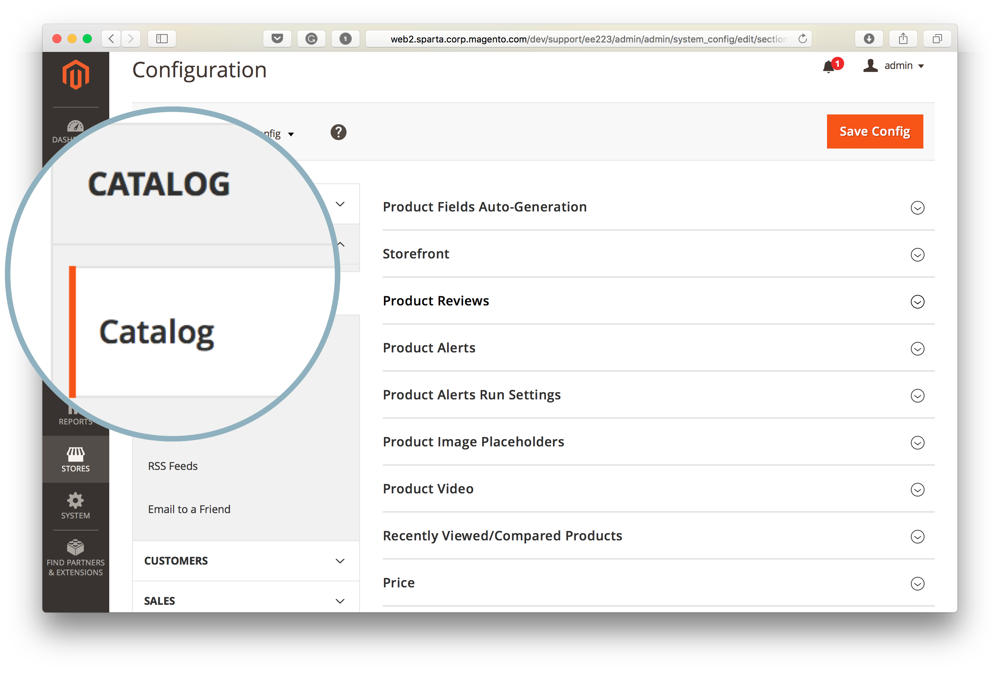
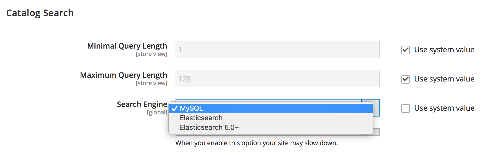
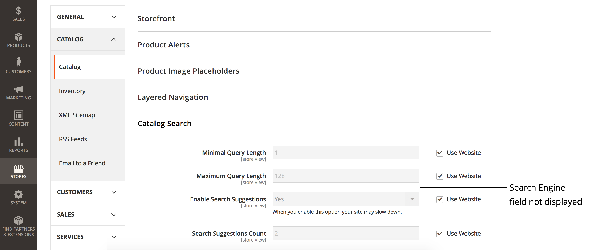
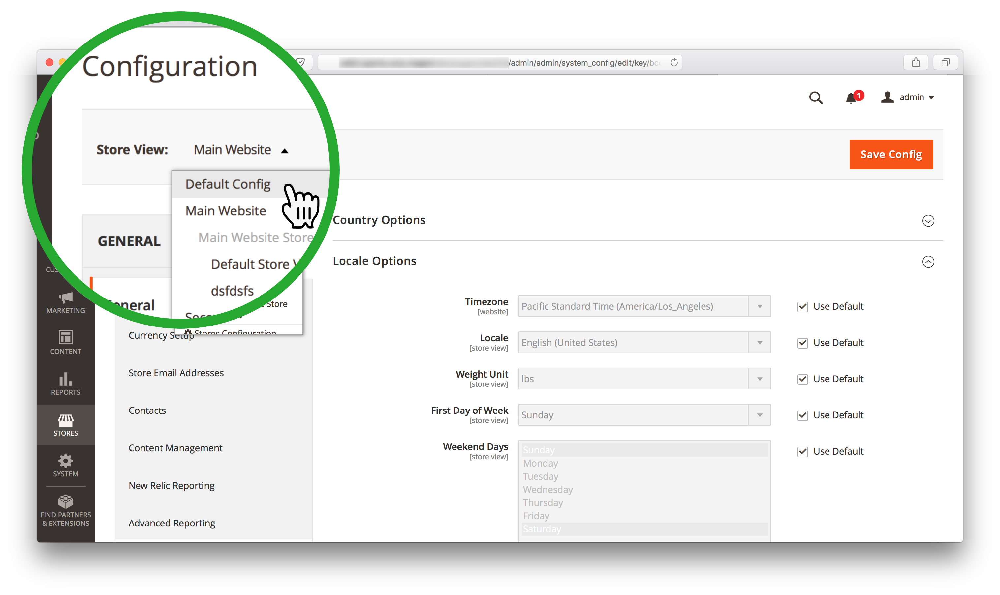

# Commerce 관리자를 사용하여 검색 엔진을 변경할 수 없음(검색 엔진 메뉴에 액세스할 수 없음)

>[!WARNING]
>
> [MySQL 카탈로그 검색 엔진이 Adobe Commerce 2.4.0에서 제거됩니다.](/help/announcements/adobe-commerce-announcements/mysql-catalog-search-engine-will-be-removed-in-magento-2-4-0.md). 버전 2.4.0을 설치하기 전에 Elasticsearch 호스트를 설정하고 를 구성해야 합니다.
> 
> 다음을 참조하십시오.
> [설치 및 구성 Elasticsearch](https://experienceleague.adobe.com/en/docs/commerce-cloud-service/user-guide/configure/service/elasticsearch).
> [Opensearch 설치 및 구성](https://experienceleague.adobe.com/en/docs/commerce-cloud-service/user-guide/configure/service/opensearch)
> [라이브 검색 설치 및 구성](https://experienceleague.adobe.com/en/docs/commerce-merchant-services/live-search/install)

이 문서에서는 다음과 같은 경우 Commerce 관리자를 사용하여 Adobe Commerce 검색 엔진을 변경하는 솔루션을 제공합니다. **검색 엔진** 필드가 표시되지 않거나 **시스템 값 사용** 확인란이 회색으로 표시되어 액세스할 수 없습니다.

이 문서에서:

* [영향을 받는 버전](#affected-versions)
* [Commerce 관리자를 사용하여 검색 엔진 변경(단계)](#change-search-engine-using-magento-admin-steps)
* [Adobe Commerce 온-프레미스 문제](#magento-commerce-on-premise)
* [클라우드 인프라의 Adobe Commerce](#magento-commerce-cloud)

## 영향을 받는 버전

* Adobe Commerce 온-프레미스: 2.4.X
* 클라우드 인프라의 Adobe Commerce:
   * 버전: 2.4.X
   * Starter 및 Pro 플랜 아키텍처
* MySQL, Elasticsearch, Opensearch, 라이브 검색: 지원되는 모든 버전

## 관리자를 사용하여 검색 엔진 변경(단계)

1. 관리자로 관리자에 로그인합니다.
1. 왼쪽 관리 사이드바에서 **스토어**. 그런 다음 아래에 **설정**, 선택 **구성**.
1. 왼쪽 아래에 있는 패널에서 **카탈로그,** 선택 **카탈로그**.
1. 확장 **카탈로그 검색** 섹션.    
1. 로 이동 **검색 엔진** 필드 및 선택 항목 제거 **시스템 값 사용** 확인란.
1. 다음을 클릭합니다. **검색 엔진** 을 클릭하고 사용 가능한 옵션 중 하나를 선택합니다.    
1. 클릭 **구성 저장** 을 클릭합니다.

## Adobe Commerce 온-프레미스 문제

### 문제 1: 검색 엔진 필드가 표시되지 않음

에 액세스할 때 **카탈로그 검색** 섹션, **검색 엔진** 메뉴가 전혀 표시되지 않습니다.



### 원인: 저장소 보기가 기본 구성이 아닙니다.

관리자에 대한 스토어 보기가 이외의 값으로 설정되었습니다. *기본 구성*.

검색 엔진은 저장소 범위가 아니라 애플리케이션 수준에서 설정된 전역 구성입니다. Adobe Commerce 애플리케이션 내의 스토어는 다른 검색 엔진을 사용할 수 없습니다.

### 해결 방법: 저장소 보기를 기본 구성으로 설정

1. 관리자로 관리자에 로그인합니다.
1. 왼쪽 관리 사이드바에서 **스토어**. 그런 다음 아래에 **설정**, 선택 **구성**.
1. 왼쪽 위 모서리에서 **스토어 뷰** 선택기 및 선택 *기본 구성*.
1. 클릭 **확인** 확인 대화 상자에서 스토어 보기 변경을 승인합니다.



**관련 설명서:** [범위 변경](https://experienceleague.adobe.com/docs/commerce-admin/config/scope-change.html#set-the-scope) 사용 안내서에서 참조하십시오.

### 문제 2: &quot;시스템 값 사용&quot;의 선택을 취소할 수 없음

에 액세스할 때 **카탈로그 검색** 관리자의 섹션, **시스템 값 사용** 확인란이 회색으로 표시되므로 확인란에서 선택 항목을 제거하여 나중에 검색 엔진을 변경할 수 없습니다.

### 원인

기본 검색 엔진이 의 애플리케이션 구성 수준에서 구성되었습니다. `app/etc/env.php` 또는 `app/etc/config.php` 따라서 관리자는 파일을 변경할 수 없습니다.

기본 검색 엔진 구성이 있는 섹션의 예:

```php
'system'=>
array (
'default'=>
array (
'catalog'=>
array (
'search'=>
array (
'engine'=>'mysql',
),
),
),
),
```

### 솔루션

기본 검색 엔진 구성이 있는 섹션을 `app/etc/env.php` 또는 `app/etc/config.php` 구성 파일입니다.

### 개발자 설명서의 관련 문서

[Adobe Commerce 구성 파일](https://experienceleague.adobe.com/docs/commerce-operations/configuration-guide/files/deployment-files.html) Adobe Commerce 구성 안내서에서

## 클라우드 인프라의 Adobe Commerce

클라우드 인프라가 구성된 방식으로 인해 클라우드 인프라의 Adobe Commerce에서는 관리를 사용하여 검색 엔진을 전환할 수 없습니다.

배포 프로세스 중에 Adobe Commerce on cloud infrastructure 배포 스크립트는 Elasticsearch이에 선언되었는지 확인합니다. `MAGENTO_CLOUD_RELATIONSHIPS` 변수를 채우는 방법에 따라 페이지를 순서대로 표시합니다. 선언하면 Elasticsearch 가 활성 검색 엔진으로 선택되고 자동으로 구성됩니다. [MySQL 검색 엔진](/help/announcements/adobe-commerce-announcements/mysql-catalog-search-engine-will-be-removed-in-magento-2-4-0.md) 관리자가 액세스할 수 없게 됩니다. Elasticsearch 관계가 선언되지 않은 경우 MySQL이 활성으로 설정되고 Elasticsearch에 액세스할 수 없게 됩니다.

를 편집하지 않는 것이 좋습니다. `app/etc/env.php` 또는 `app/etc/config.php` 클라우드 환경에서 직접 파일을 구성합니다. 따라서 이러한 파일을 변경하여 Elasticsearch 엔진이 관리자(이전 섹션에서 권장하는 솔루션)에 표시되도록 하는 것은 클라우드 프로젝트에 적용할 수 없습니다.

### 스테이징 및 프로덕션 환경에서 검색 엔진 변경

검색 엔진을 MySQL에서 스테이징 및 프로덕션 환경의 Elasticsearch으로 전환하기 전에 다음을 수행했는지 확인하십시오. [지원 티켓을 제출했습니다.](/help/help-center-guide/help-center/magento-help-center-user-guide.md#submit-ticket) 환경 및 티켓에 대한 Elasticsearch 활성화 요청이 정상적으로 해결되었습니다.

스테이징 및 프로덕션 환경에서 사용되는 검색 엔진을 변경하려면 `SEARCH_CONFIGURATION` 의 환경 변수 `.magento.env.yaml` 를 로컬 환경에 작성한 다음 변경 사항을 적용하려면 통합 및 스테이징/프로덕션 환경에 변경 사항을 푸시합니다.

Elasticsearch 7로 전환하면 결과에서 SEARCH\_CONFIGURATION 변수가 `.magento.env.yaml` 파일은 다음과 같을 수 있습니다.

```yaml
stage:
  deploy:
   SEARCH_CONFIGURATION:
     engine: elasticsearch7
     elasticsearch_server_hostname: hostname
     elasticsearch_server_port: '12345'
     elasticsearch_index_prefix: magento
     elasticsearch_server_timeout: '15'
```

로 전환하는 경우 [Opensearch(2.4.6 이상)](https://experienceleague.adobe.com/en/docs/commerce-knowledge-base/kb/troubleshooting/elasticsearch/search-engine-shown-elasticsearch-despite-open-search) 결과의 SEARCH\_CONFIGURATION 변수 `.magento.env.yaml` 파일은 다음과 같을 수 있습니다.

```yaml
stage:
  deploy:
   SEARCH_CONFIGURATION:
     engine: opensearch
     elasticsearch_server_hostname: hostname
     elasticsearch_server_port: '12345'
     elasticsearch_index_prefix: magento
     elasticsearch_server_timeout: '15'
```

다음과 같은 경우 [라이브 검색으로 전환](https://experienceleague.adobe.com/en/docs/commerce-knowledge-base/kb/troubleshooting/miscellaneous/error-opensearch-search-engine-doesnt-exist-falling-back-to-livesearch): 결과의 SEARCH\_CONFIGURATION 변수 `.magento.env.yaml` 파일은 다음과 같을 수 있습니다.

```yaml
stage:
  deploy:
   SEARCH_CONFIGURATION:
     engine: livesearch
```

### 관련 설명서

#### 지원 기술 자료

* [클라우드에서 Elasticsearch 활성화](/help/how-to/general/enable-elasticsearch-on-cloud.md)

#### 개발자 설명서

* [Elasticsearch 서비스 설정](https://experienceleague.adobe.com/docs/commerce-cloud-service/user-guide/configure/service/elasticsearch.html)
* [빌드 및 배포](https://experienceleague.adobe.com/docs/commerce-cloud-service/user-guide/configure/env/configure-env-yaml.html) (에 대한 설명서) `.magento.env.yaml` 구성 파일)
* [변수 배포](https://experienceleague.adobe.com/docs/commerce-cloud-service/user-guide/configure/env/stage/variables-deploy.html) ([SEARCH\_CONFIGURATION 섹션](https://experienceleague.adobe.com/docs/commerce-cloud-service/user-guide/configure/env/stage/variables-deploy.html#search_configuration))
* [서비스](https://experienceleague.adobe.com/docs/commerce-cloud-service/user-guide/configure/service/services-yaml.html) (에 대한 설명서) `.magento/services.yaml` 구성 파일)
* [라이브 검색](https://experienceleague.adobe.com/en/docs/commerce-merchant-services/live-search/overview)
