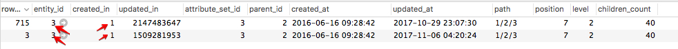
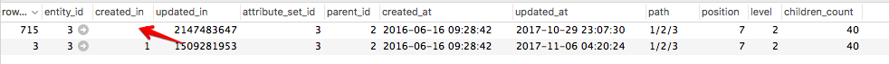

# 범주 변경 사항이 저장되지 않음

이 문서에서는 Commerce 관리자를 통해 제품 카테고리를 업데이트할 때 변경 사항이 관리자 및 상점 앞에 표시되지 않는 문제를 수정했습니다. 문제는 의 손상된 데이터로 인해 발생합니다. `catalog_category_entity` 테이블. 이 문제를 해결하려면 표에서 문제가 있는 범주 업데이트 레코드를 수정하거나 제거합니다. 그런 다음 관리자를 사용하여 제품 카테고리를 업데이트할 수 있습니다.

## 문제

관리에서 제품 카테고리를 변경하고 저장하면 새 업데이트가 관리자와 상점 첫 화면에 저장되지 않거나 표시되지 않습니다.

### 재현 단계

1. 다음으로 이동 **카탈로그** > **카테고리**.
1. 카테고리를 선택합니다.
1. 변경한 다음 **저장**.
1. 메시지가 표시됩니다. *범주를 저장했습니다.*.
1. 변경 사항이 저장되지 않았습니다.

## 가능한 원인: `catalog_category_entity` 표

이 문제는 의 동일한 값으로 인해 발생합니다. `created_in` 데이터베이스(DB)의 영향을 받는 범주 레코드의 열입니다.

세부 사항:

* 다음 `catalog_category_entity` DB 테이블에 영향을 받는 범주에 대한 레코드가 두 개 이상 있습니다(이러한 레코드에는 동일한 레코드가 있음). `entity_id` value).
* 이러한 범주 레코드에는 다음이 있습니다. **의 동일한 값 `created_in` 열**.

### 두 번째 DB 항목(및 그 다음 항목 모두)은 하나의 동일한 범주에 대한 DB에 어떻게 표시됩니까?

영향을 받는 범주에 대한 두 번째 DB 레코드(및 가능한 경우 다음 레코드)는 Magento\_스테이징 모듈을 사용하여 범주 업데이트가 예약되었음을 의미합니다. 모듈은 의 범주에 대한 추가 레코드를 만듭니다. `catalog_category_entity` 예상되는 응용 프로그램 동작입니다. 문제는 레코드에 대한 동일한 값이 있다는 것입니다. `created_in` 열.

### 동일한 값이 어떻게 표시됩니까?

우리는 데이터 손상의 이유를 확실하게 말할 수 없다. 가능한 원인은 다음과 같습니다.

* 사용자 지정(코드, 테마 등)
* 잘못된 데이터 마이그레이션
* 백업에서 잘못된 데이터 복원

우리가 아는 한, 이러한 데이터 손상은 &quot;클린&quot;(기본 제공) Adobe Commerce 인스턴스에 대해 전형적이지 않으며 사용자 지정 없이 Adobe Commerce 설치 시 재현할 수 없습니다.

### 이 문제가 내 문제인지 확인하는 방법

다음 `catalog_category_entity` 테이블에는 영향을 받는 범주에 대한 여러 레코드가 있어야 합니다(레코드에는 동일한 레코드가 있어야 함). `entity_id` value)를 지정해야 하며, 두 개 이상의 레코드가 같아야 합니다 `created_in` 값. 이렇게 하면 스테이징 예약 업데이트가 Commerce 관리자에 표시되지 않고 빈 예약 변경 사항 블록만 표시됩니다.

#### 확인 단계

1. 데이터베이스의 catalog\_category\_entity 테이블에 액세스합니다.
1. 영향을 받는 범주를 식별하는 entity\_id를 사용하여 entity\_id로 엔티티를 필터링합니다.
1. created\_in 열의 값이 entity\_id가 동일한 다른 항목에 대해 동일한 경우, 이 방법이 적용됩니다. 일반적으로 `created_in` 값은 모든 레코드에 대해 다릅니다.

## 솔루션

다음 솔루션 중 하나를 선택할 수 있습니다.

1. **삭제** 문제가 있는 범주 업데이트 레코드
1. **복구** 문제가 있는 범주 업데이트 레코드

### 문제가 있는 범주 업데이트 레코드 삭제

이 솔루션에서는 올바른 을 설정해야 합니다 `updated_in` 초기 카테고리 레코드 값 및 이 카테고리에 대한 다른 모든 레코드를 삭제합니다. 이렇게 하면 모든 예약된 범주 업데이트가 제거됩니다.

다음 단계를 수행합니다.

1. 를 사용하여 DB 레코드 찾기 `entity_id` 영향을 받는 범주.
1. 다음에서 정수가 가장 큰 레코드를 선택합니다. `updated_in` 열.
1. 다음을 복사합니다. `updated_in` 선택한 레코드의 값.
1. 다음을 포함한 레코드 선택 `row_id` = `entity_id` (초기 카테고리 레코드) 복사한 값을 `updated_in` 이 레코드의 열입니다.
1. 행 삭제 `row_id` 다음과 같지 않음 `entity_id` .

### 문제가 있는 범주 업데이트 레코드 복구

1. 동일한 범주 레코드 찾기 `entity_id` 및 동일 `created_in` 값.
1. 레코드 선택 위치 `row_id` = `entity_id` 및 복사 `updated_in` 값.
1. 레코드 선택 위치 `row_id` 다음과 같지 않음 `entity_id` 복사한 항목 붙여넣기 `updated_in` 값: `created_in` 값. 그림으로 아래 스크린샷을 참조하십시오.    
1. 범주 업데이트 레코드, `created_in` (3단계에서) 업데이트한 값이 `staging_update` 테이블. *예:* 복사한 경우 `created_in` 값이 1509281953 다음 이 있는 엔티티가 `row_id` = 1509281953에 있어야 합니다. `staging_update` 표
