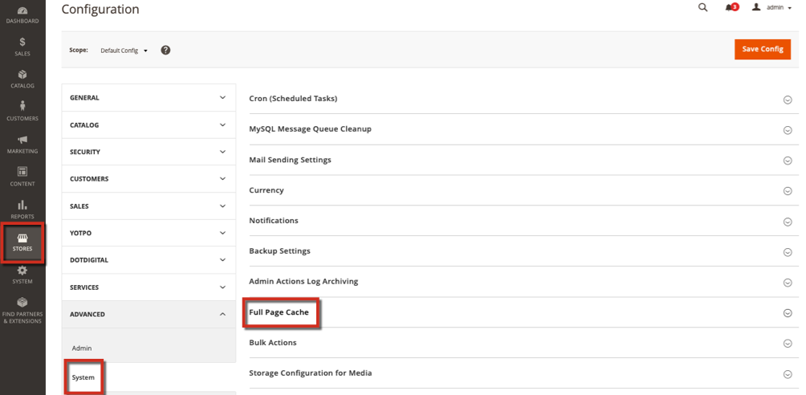

# 클라우드에서 Fastly 캐시를 제거하는 동안 오류가 발생했습니다(제거 요청이 성공적으로 처리되지 않음)

이 문서에서는 [즉시 제거] 옵션을 사용할 때 다음과 같은 오류가 발생하는 경우에 대한 수정 사항을 제공합니다. *제거 요청이 처리되지 않았습니다.*. Fastly는 클라우드 인프라 계획 및 구현에 대한 Adobe Commerce에 포함된 CDN 및 캐싱 서비스입니다. Fastly 제거 옵션을 사용하려고 하지만 처리되지 않는 경우 환경에 잘못된 Fastly 자격 증명이 있거나 문제가 발생했을 수 있습니다.

이 정보는 라이브 사이트 및 원본 서버에 대한 Fastly 헤더를 확인하고 테스트하는 데 도움이 됩니다.

## 영향을 받는 버전

* cloud infrastructure 2.1.X 이상 버전의 Adobe Commerce
* Fastly 1.2.27 이상

## 문제

캐싱이 작동하지만 제거하려고 하면 오류가 발생하거나 작동하지 않습니다. 오류 포함: &quot;제거 요청이 성공적으로 처리되지 않았습니다.&quot;

## 원인

환경에 잘못된 자격 증명이 설정되어 있거나 VCL 스니펫을 업로드해야 할 수 있습니다.

## 해결

### Fastly 자격 증명 확인

환경에 올바른 Fastly 서비스 ID 및 API 토큰이 있는지 확인하십시오. 프로덕션에 스테이징 자격 증명이 있는 경우 지우기가 처리되지 않거나 잘못 처리될 수 있습니다.

1. 로컬 Commerce 관리자에 관리자로 로그인합니다.
1. 클릭 **스토어** > 설정 > **구성** > **고급** > **시스템** 및 확장 **전체 페이지 캐시**.    
1. Fastly 구성을 확장하고 환경에 대한 Fastly 서비스 ID 및 API 토큰을 확인합니다.
1. 값을 수정하는 경우 자격 증명 테스트를 누릅니다.

### VCL 코드 조각 확인

자격 증명이 올바르면 VCL에 문제가 있을 수 있습니다. 서비스당 VCL을 나열하고 검토하려면 터미널에 다음 API 호출을 입력합니다.

```
curl -X GET -s https://api.fastly.com/service/<Service ID>/version/<Editable Version #>/snippet -H "Fastly-Key:FASTLY_API_TOKEN"
```

VCL 목록을 검토합니다. Fastly의 기본 VCL에 문제가 있는 경우 다시 업로드하거나 [Fastly 기본 VCL](https://github.com/fastly/fastly-magento2/tree/master/etc/vcl_snippets). 사용자 지정 VCL을 편집하려면 다음을 참조하십시오 [사용자 정의 Fastly VCL 스니펫](https://experienceleague.adobe.com/docs/commerce-cloud-service/user-guide/cdn/custom-vcl-snippets/fastly-vcl-custom-snippets.html) Commerce on Cloud Infrastructure Guide를 참조하십시오.

## 추가 정보

개발자 설명서에서:

* [Fastly 정보](https://experienceleague.adobe.com/docs/commerce-cloud-service/user-guide/cdn/fastly.html)
* [Fastly 설정](https://experienceleague.adobe.com/docs/commerce-cloud-service/user-guide/cdn/setup-fastly/fastly-configuration.html)
* [사용자 정의 Fastly VCL 스니펫](https://experienceleague.adobe.com/docs/commerce-cloud-service/user-guide/cdn/custom-vcl-snippets/fastly-vcl-custom-snippets.html)
