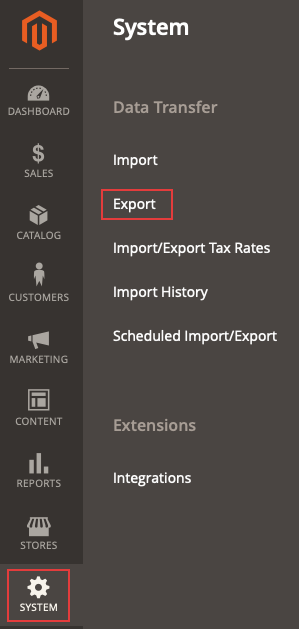

# 내보낸 제품 .csv 파일이 표시되지 않음

이 문서에서는 Commerce 관리자의 .csv 파일로 제품을 내보내려고 하지만 파일이 표시되지 않는 문제에 대한 수정 사항을 제공합니다.

## 영향을 받는 제품 및 버전

* 클라우드 인프라의 Adobe Commerce, 모두 [지원되는 버전](https://magento.com/sites/default/files/magento-software-lifecycle-policy.pdf).

## 문제

<u>재현 단계</u>

전제 조건: **URL에 비밀 키 추가** 옵션이 로 설정되어 있습니다. *예*. 옵션은 아래의 Commerce 관리자에서 구성됩니다. **스토어** > **구성** > **고급** > **관리자** > **보안**.

1. 관리자에서 다음 위치로 이동합니다. **시스템** > **데이터 전송** > **내보내기**.

   

1. 선택
   * **엔티티 유형**: *제품*
   * **파일 형식 내보내기**: *CSV*
   * **필드 엔클로저**: 선택하지 않은 상태로 둡니다.
1. 클릭 **계속**.
1. 다음 메시지가 표시됩니다. *&quot;메시지가 큐에 추가되었습니다. 파일을 곧 가져올 수 있을 때까지 기다리십시오.&quot;*.

<u>예상 결과</u>

내보낸 제품이 포함된 .csv 파일이 몇 분 후에 격자에 표시됩니다.

<u>실제 결과</u>

내보낸 제품이 포함된 .csv 파일이 10분 이상 그리드에 표시되지 않습니다.

## 원인

Adobe Commerce 애플리케이션 부품 버전 2.3.2의 내보내기 기능에 대해 알려진 문제입니다.

## 솔루션

이 문제에 대해 두 가지 가능한 솔루션이 있습니다.

* URL에 비밀 키 추가 옵션을 비활성화합니다.
* 실행 `bin/magento queue:consumers:start exportProcessor` 수동으로 명령하고 cron에서 실행되도록 선택적으로 구성합니다.

다음 단락에서 두 옵션에 대한 세부 사항을 참조하십시오.

### URL에 암호 키 추가 옵션 비활성화

1. 관리자에서 다음 위치로 이동합니다. **스토어** > **구성** > **고급** > **관리자** > **보안**.
1. 설정 **URL에 비밀 키 추가** 옵션 대상 *아니.*
1. 클릭 **구성 저장**.
1. 아래의 캐시 정리 **시스템** > **도구** > **캐시 관리** 또는 를 실행하여    ```bash    bin/magento cache:clean``` 또는 관리자

### 내보내기 명령을 수동으로 실행하고 필요에 따라 cron job으로 추가

내보내기 파일을 가져오려면 `bin/magento queue:consumers:start exportProcessor` 명령입니다. 이 작업을 실행한 후에는 파일이 격자에 표시되어야 합니다.


프로세스를 cron 작업으로 선택적으로 추가하려면 다음을 추가해야 합니다. `CRON_CONSUMERS` 변수에 대한 `.magento.env.yaml` 파일.

#### 프로세스를 cron 작업으로 추가(선택 사항)

1. cron 이 설정 및 구성되어 있는지 확인하십시오. 다음을 참조하십시오 [cron 작업 설정](/docs/commerce-cloud-service/user-guide/configure/app/properties/crons-property.html) 을 참조하십시오.
1. 다음 명령을 실행하여 메시지 대기열 소비자 목록을 반환합니다.     `./bin/magento queue:consumers:list`
1. 다음에 추가 `.magento.env.yaml` 을 루트 애플리케이션 디렉터리에 추가하고 추가하려는 소비자를 포함합니다. 예를 들어 내보내기 처리에 필요한 소비자는 다음과 같습니다.

   ```yaml
   stage:
       deploy:
           CRON_CONSUMERS_RUNNER:
               cron_run: true
               max_messages: 1000
               consumers:
                   - exportProcessor
   ```

   그런 다음 이 업데이트된 파일을 푸시하고 환경을 다시 배포합니다. 참조 [프로젝트에 사용자 정의 크론 작업 추가](/docs/commerce-cloud-service/user-guide/configure/app/properties/crons-property.html#add-custom-cron-jobs-to-your-project) 개발자 설명서에서 확인할 수 있습니다.

>[!NOTE]
>
>찾을 수 없는 경우 `.magento.env.yaml` 환경에 대한 파일이며 삭제되었다고 생각되는 경우 새 파일을 만들어야 합니다 `.magento.env.yaml`. 처음에는 비어 있을 수 있으므로 필요에 따라 정보를 추가할 수 있습니다. 다음 문서를 참조하십시오. [배포를 위한 환경 변수 구성](/docs/commerce-cloud-service/user-guide/configure/env/configure-env-yaml.html) 및 [환경 변수](/docs/commerce-cloud-service/user-guide/configure/env/stage/variables-intro.html) 개발자 설명서에서 확인할 수 있습니다.

>[!NOTE]
>
>Adobe Commerce on cloud infrastructure Pro 프로젝트에서 [auto-crons 기능](/docs/commerce-cloud-service/user-guide/configure/app/properties/crons-property.html?lang=en#crontab) 을 사용하여 사용자 지정 cron 작업을 스테이징 및 프로덕션 환경에 추가하려면 먼저 클라우드 인프라의 Adobe Commerce에서 활성화되어야 합니다. `.magento.app.yaml`. 이 기능이 활성화되지 않으면 [지원 티켓 만들기](/help/help-center-guide/help-center/magento-help-center-user-guide.md#submit-ticket)을 입력하여 작업을 자동으로 추가할 수 있습니다.
