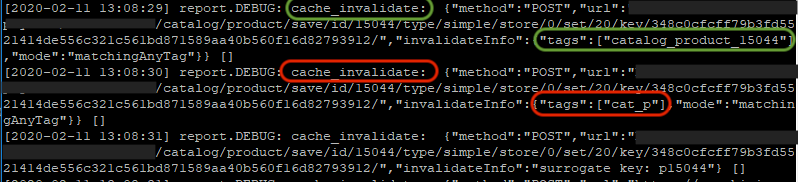

# 무효화된 캐시는 응답 시간 저하를 유발합니다.

이 문서에서는 Adobe Commerce 저장소의 성능 저하를 초래할 수 있는 캐시 무효화를 방지하는 방법에 대한 솔루션을 제공합니다.

영향을 받는 제품 및 버전:

* Adobe Commerce 온-프레미스 2.2.x, 2.3.x
* 클라우드 인프라의 Adobe Commerce 2.2.x, 2.3.x

## 문제

사이트 응답 속도가 느려집니다.

## 원인

캐시 무효화(플러시)로 인해 응답 시간이 길어질 수 있습니다.

캐시는 사이트 방문자의 요청에 대한 빠른 응답을 생성하는 데 사용됩니다. 사용 가능한 적절한 캐시 데이터가 없는 경우 Adobe Commerce 애플리케이션은 데이터베이스에서 데이터를 가져오고, 데이터를 계산 및 집계하여 캐시 저장소에 저장합니다. 캐시 생성 프로세스에는 총 응답 시간 저하를 유발하는 추가 시스템 리소스가 필요합니다.

Adobe Commerce에는 두 가지 유형의 캐시가 있습니다.

1. 내부:
   * 서버에 데이터 저장
   * 특정 데이터(구성, 제품 세부 사항, 범주 세부 사항 등)를 저장합니다.
1. 외부:
   * CDN 또는 Vannish(클라우드 인프라의 Adobe Commerce의 경우 - Fastly CDN)
   * 는 이미 생성된 전체 페이지를 저장합니다. 예를 들어 카탈로그/카테고리, 카탈로그/제품 페이지 등이 있습니다.

### 캐시를 무효화했는지 확인

무효화된 캐시 유형에 대한 정보는 `<install_directory>/var/log/debug.log` 파일.

방법은 다음과 같습니다.

1. 열기 `<install_directory>/var/log/debug.log`
1. 검색 대상 *cache\_invalidate* &quot; 메시지입니다.
1. 그런 다음 지정된 태그를 확인합니다. 플러시된 캐시를 나타냅니다. 특정 엔티티 ID가 지정되지 않은 태그가 표시되는 경우 무효화된 캐시로 인해 문제가 발생할 수 있습니다. 예:
   * `cat_p` - 는 카탈로그 제품 캐시를 나타냅니다.
   * `cat_c` - 카탈로그 범주 캐시.
   * `FPC` - 전체 페이지 캐시.
   * `CONFIG` - 구성 캐시.

   둘 중 하나라도 플러시하면 웹 사이트의 응답이 느려집니다. 태그에 엔티티 ID가 포함된 경우(예: ) `category_product_1258`, 특정 제품 또는 카테고리에 대한 캐시 등을 나타냅니다. 특정 제품 또는 범주에 대한 캐시를 플러시해도 응답 시간이 크게 줄어들지 않습니다.

다음은 `debug.log` 다음에 대한 레코드 포함 `cat_p` 및 `category_product_15044` 플러시된 캐시:

일반적으로 캐시는 다음 이유로 무효화됩니다.

* 전체 색인 재지정.
* 수동으로 또는 cron 을 사용하여 CLI에서 캐시를 플래싱합니다.

## 추천

1. Commerce CLI에서 캐시를 플러시하지 마십시오.
1. 인덱서 구성 **예약별 업데이트** 대신 **저장 모드에서 업데이트** 왜냐하면 후자는 전체 리인덱싱을 트리거하기 때문입니다. 참조하려면 다음을 참조하십시오. [인덱서 관리 > 인덱서 구성](https://devdocs.magento.com/guides/v2.3/config-guide/cli/config-cli-subcommands-index.html#configure-indexers) 개발자 설명서에서 확인할 수 있습니다.
