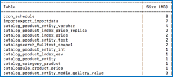

# Adobe Commerce 2.4.0 알려진 문제 - 수출 세율이 작동하지 않음

이 문서에서는 다음과 같은 Adobe Commerce 2.4.0 알려진 문제에 대한 솔루션을 제공합니다. **수출 세율** 버튼이 작동하지 않습니다.

## 영향을 받는 제품 및 버전

* 클라우드 인프라의 Adobe Commerce 2.4.0
* Adobe Commerce 온-프레미스 2.4.0

## 문제

<u>재현 단계:</u>

1. Commerce 관리 패널 로 이동 > **스토어** > **세금 규칙**.
1. 다음을 클릭합니다. **새 세금 규칙 추가** 단추를 클릭합니다.
1. 텍스트 클릭 **수출 세율** 단추를 클릭합니다.

   

<u>예상 결과</u>:

A `tax_rates.csv` 세율이 포함된 파일 다운로드.

<u>실제 결과</u>:

.csv 파일이 다운로드되지 않았습니다.

## 솔루션

해결 방법:

의 왼쪽 아래 가장자리를 클릭합니다. **수출 세율** 내보내기 단추 `tax_rates.csv` 파일.

이 문제는 2.4.1 패치에서 해결될 예정입니다.

## 관련 읽기

지원 기술 자료에서:

* [Adobe Commerce 2.4.0 알려진 문제: Braintree 결제 방법이 여러 주소 체크아웃에 표시되지 않음](/help/troubleshooting/payments/magento-2-4-0-braintree-not-in-multiple-addresses-checkout.md).
* [Adobe Commerce 2.4.0의 배송 라벨 작성 알려진 문제](/help/troubleshooting/known-issues-patches-attached/shipping-labels-creation-known-issue-in-magento-2-4-0.md).
* [Adobe Commerce 2.4.0 알려진 문제 - 고객 활동 새로 고침이 작동하지 않음](/help/troubleshooting/miscellaneous/magento-2-4-0-refresh-on-customer-activities-does-not-work.md).
* [Adobe Commerce 2.4.0 알려진 문제: storefront에 원시 메시지 데이터 표시](/help/troubleshooting/storefront/magento-2-4-0-issue-storefront-raw-message-data-display.md).
* [Adobe Commerce 2.4.0 알려진 문제: &quot;장바구니에 선택 항목 추가&quot; 버튼이 작동하지 않음](/help/troubleshooting/miscellaneous/magento-2-4-0-add-selections-to-my-cart-does-not-work.md).
