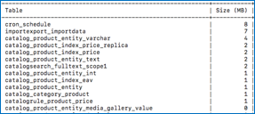

# Adobe Commerce 2.4.0: 고객 활동 새로 고침이 작동하지 않음

이 문서에서는 관리 사용자가 고객에 대한 주문을 만들 때 고객 활동 사이드 패널의 새로 고침 버튼이 작동하지 않는 알려진 문제인 Adobe Commerce 2.4.0에 대한 해결 방법을 제공합니다.

## 영향을 받는 제품 및 버전

* Adobe Commerce 온-프레미스 2.4.0
* 클라우드 인프라의 Adobe Commerce 2.4.0

## 문제

<u>재현 단계</u>:

1. 로 이동 **관리 패널** > **판매** > **주문 수**.
1. 다음을 클릭합니다. **새 주문 만들기** 단추를 클릭합니다.
1. 생성된 고객을 선택합니다.
1. 생성된 고객으로 상점 앞으로 이동합니다.
1. 로 이동 **제품** 페이지를 가리키도록 업데이트하는 중입니다. 다음을 클릭합니다. **새로 고침** 단추 **최근에 본 제품** 섹션 / **고객의 활동**.
1. 가게 앞쪽으로 돌아가
1. 생성된 제품을 사용하여 주문합니다.
1. 로 돌아가기 **관리 패널** 을(를) 클릭하고 **새로 고침** 의 단추 **마지막 주문 항목** 섹션 / **고객의 활동**.
1. 가게 앞쪽으로 돌아가 만든 제품을 **비교 목록**.
1. 로 돌아가기 **관리 패널**. 다음을 클릭합니다. **새로 고침** 의 단추 **비교 목록의 제품** 섹션 / **고객의 활동**.
1. 가게 앞쪽으로 돌아가
1. 에서 생성된 제품 제거 **비교 목록**.
1. 로 돌아가기 **관리 패널**.
1. 다음을 클릭합니다. **새로 고침** 의 단추 **최근에 비교한 제품** 섹션 / **고객의 활동**.
1. 가게 앞쪽으로 돌아가

<u>예상 결과</u>:

제품 이름은 **최근에 본 제품**, **마지막 주문 항목**, **비교 목록의 제품**, 및 **최근에 비교한 제품** 섹션.

<u>실제 결과</u>:

페이지는 다음 시간마다 스크롤됩니다. **새로 고침** 버튼을 클릭합니다. 제품 이름이 해당 섹션에 표시되지 않습니다.

## 솔루션

해결 방법은 관리자가 업데이트할 수 있는 것입니다 **고객의 활동** 을(를) 클릭하여 **변경 사항 업데이트** 사이드바 아래쪽에 있는 버튼. 이 문제는 Adobe Commerce 2.4.1 패치에서 해결될 예정입니다.

## 관련 읽기

* [Adobe Commerce 2.4.0 알려진 문제: Braintree 결제 방법이 여러 주소 체크아웃에 표시되지 않음](/help/troubleshooting/payments/magento-2-4-0-braintree-not-in-multiple-addresses-checkout.md)
* [Adobe Commerce 2.4.0의 배송 라벨 작성 알려진 문제](/help/troubleshooting/known-issues-patches-attached/shipping-labels-creation-known-issue-in-magento-2-4-0.md)
* [Adobe Commerce 2.4.0 알려진 문제: storefront에 원시 메시지 데이터 표시](/help/troubleshooting/storefront/magento-2-4-0-issue-storefront-raw-message-data-display.md)
* [Adobe Commerce 2.4.0 알려진 문제: 수출 세율이 작동하지 않음](/help/troubleshooting/miscellaneous/magento-2-4-0-known-issue-export-tax-rates-does-not-work.md)
* [Adobe Commerce 2.4.0 알려진 문제: &quot;장바구니에 선택 항목 추가&quot; 버튼이 작동하지 않음](/help/troubleshooting/miscellaneous/magento-2-4-0-add-selections-to-my-cart-does-not-work.md)
