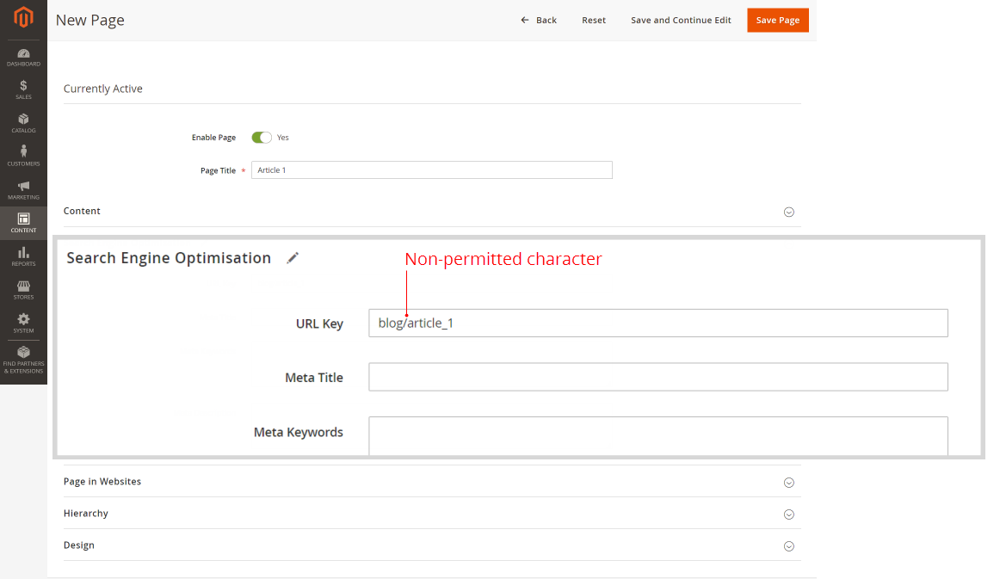
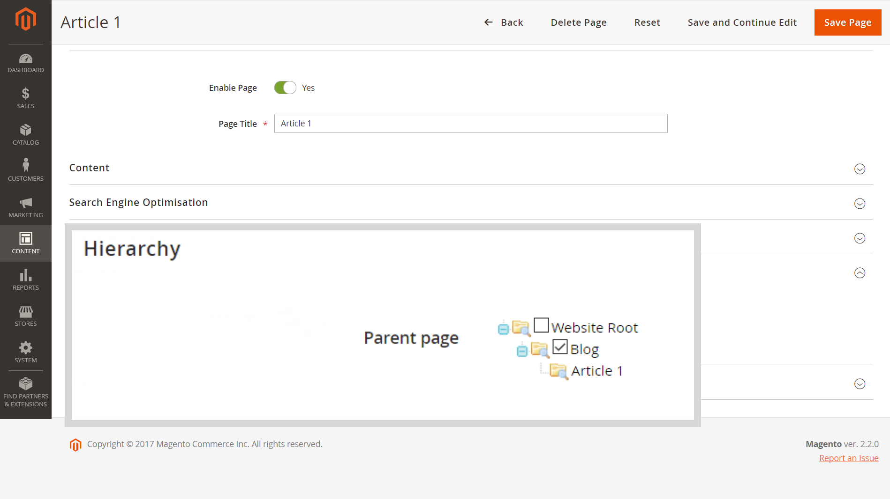

# Fastly가 활성화된 하위 페이지에 메인 메뉴(카테고리)가 표시되지 않음

이 문서에서는 Main Menu(또는 [범주 위쪽 탐색 메뉴](/docs/commerce-admin/catalog/catalog/navigation/navigation-top.html) 사용 안내서에서)는 하위 페이지(예: *블로그/페이지*) Fastly 또는 Varnish 가 활성화된 경우

**원인:** 허용되지 않는 항목 `/` 의 문자(슬래시) *URL 키* 페이지의 매개 변수(검색 엔진 최적화 설정). 이 문자는 일반적으로 다음과 같은 경우에 추가됩니다. *URL 경로* (전체 페이지 위치 포함)가 실수로 대신 지정되었습니다. *URL 키*: 예: *blog/page\_name* 대신 *page\_name*.

**해결 방법:** 제거 `/` 문자(슬래시), *URL 키* 매개 변수에서 페이지 이름만 지정합니다.

## 영향을 받는 버전

* Adobe Commerce 온-프레미스 2.X.X
* 클라우드 인프라의 Adobe Commerce 2.X.X
* fastly 또는 Vanish

## 문제

메인 메뉴(또는 [범주 위쪽 탐색 메뉴](/docs/commerce-admin/catalog/catalog/navigation/navigation-top.html) 사용 안내서에서)는 Fastly 또는 기타 Varnish 기반 서비스가 활성화된 경우 하위 페이지의 상점 첫 화면에 표시되지 않습니다.

## 원인

이 문제는 허용되지 않는 문제로 인해 발생합니다 `/` 문자(슬래시), *URL 키* 매개 변수(검색 엔진 최적화 설정).

이 문자는 일반적으로 다음과 같은 경우에 추가됩니다. *URL 경로* (페이지의 상위 리소스/디렉토리를 포함하여 전체 페이지 위치가 있는 경우) 대신 실수로 지정됩니다. *URL 키*: 예: *blog/page\_name* 대신 *page\_name*.

## 솔루션

제거 `/` 의 문자(슬래시) *URL 키* 저장소의 모든 페이지에 대한 매개 변수입니다.

즉, 다음을 사용합니다 *URL 키* 대신 *URL 경로*: 상위 리소스/디렉터리가 없는 페이지 이름만 언급하십시오.

### 페이지 계층 구조 및 SEO의 Recommendations

페이지 계층 구조를 설정하려면 **계층** 섹션 아래에 표시됩니다.

다음을 사용할 수도 있습니다 **콘텐츠** > **요소** > **계층** 메뉴 - 보다 복잡한 계층 구조 솔루션을 위한 옵션입니다.

제품 페이지에서 SEO 목적을 위해 URL 재작성(**마케팅** > **SEO 및 검색** > **URL 재작성**).

## 추가 정보는 사용 안내서를 참조하십시오

다음 *URL 키* seo용 매개 변수:

* [검색 엔진 최적화](/docs/commerce-admin/catalog/categories/create/categories-search-engine-optimization.html)
* [새 페이지 추가](/docs/commerce-admin/content-design/elements/pages/page-add.html)

페이지 계층 구조:

* [개요](/docs/commerce-admin/content-design/elements/pages/page-hierarchy.html)
* [노드 추가](/docs/commerce-admin/content-design/elements/pages/page-hierarchy.html#add-a-hierarchy-node)
