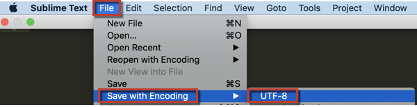

# CSV 파일 업로드에 대한 UTF-8 오류 해결

이 문서에서는 &quot;CSV 파일은 UTF-8 인코딩을 사용해야 합니다.&quot;라는 오류 메시지가 표시되는 경우에 대한 수정 사항을 제공합니다. 이 오류 메시지는 업로드하려는 파일에 잘못된 문자 또는 허용되지 않는 문자가 포함되어 있음을 의미합니다. 반면에 UTF-8 인코딩은 [대다수의 등장인물](https://www.fileformat.info/info/charset/UTF-8/list.htm), 일부 는 Magento BI와 호환되지 않습니다.

문제를 해결하려면 파일 인코딩을 변경해야 합니다. 파일을 적절한 인코딩으로 다시 저장하면 일반적으로 문제가 해결되지만, 이렇게 하면 일부 정보가 손실될 수 있습니다(예: 잘못된 문자가 삭제될 수 있음).

다음을 사용하는 것이 좋습니다. [숭고한 텍스트](https://www.sublimetext.com/2) 를 클릭하여 파일을 저장하고 인코딩합니다.

1. Microsoft Excel, Google 문서, Apple 번호 또는 선택한 프로그램으로 파일을 엽니다.
1. 클릭 &#x200B; &#x200B; **파일** > **다른 이름으로 저장** &#x200B; &#x200B; 및 을(를) 선택합니다&#x200B;&#x200B;. **쉼표로 구분된 값(.csv)** 형식을 지정하여 파일을 저장합니다.
1. Sublime Text에서 CSV 파일을 엽니다.
1. Sublime Text에서 &#x200B; 로 이동합니다&#x200B;. **파일** > **인코딩으로 저장** > **UTF-8\* &#x200B;** . 그러면 CSV 파일이 UTF-8 인코딩으로 저장됩니다.    
1. [데이터 업로드](https://docs.magento.com/mbi/data-analyst/importing-data/connecting-data/using-file-uploader.html) (사용 안내서에서) Magento BI의 새 테이블로 이동합니다.
