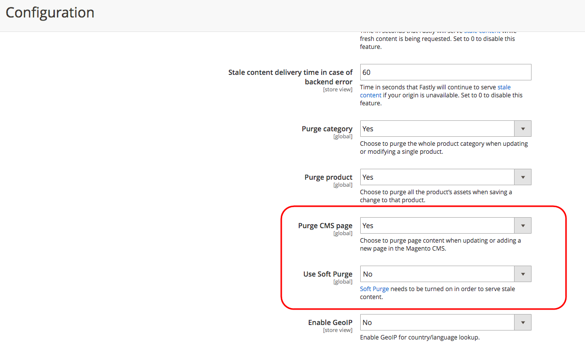

# 예약된 컨텐츠 스테이징 업데이트가 오래된 Fastly 캐시와 함께 표시되지 않음

이 문서에서는 컨텐츠 스테이징 및 Fastly를 사용할 때 Adobe Commerce 스토어에 예약된 업데이트가 표시되지 않는 경우에 대한 수정 사항을 제공합니다. 이 문제는 기본적으로 활성화된 Fastly Soft Purge 때문입니다. 이 기능은 애플리케이션 리소스 로드를 줄이고 두 번째 요청에 대해서만 새 캐시를 재생성합니다. 이 문제를 해결하려면 Commerce 관리를 통해 CMS 제거 페이지를 활성화하여 항상 새 콘텐츠를 재생성하고 제공할 수 있습니다.

## 문제

스토어 콘텐츠 에셋(페이지, 제품, 블록 등)에 대한 예약된 업데이트 은 업데이트 시작 시간 직후 storefront에 표시되지 않습니다. 이 문제는 을 사용하여 업데이트가 예약되었을 때 발생합니다. [컨텐츠 스테이징](https://experienceleague.adobe.com/docs/commerce-admin/content-design/staging/content-staging.html) 기능.

## 원인

Fastly의 소프트 삭제 기능(기본적으로 활성화됨)으로 인해, Adobe Commerce 상점 첫 페이지는 전송할 때 이전(오래된) 캐시된 콘텐츠를 계속 수신합니다 **첫 번째** Fastly에 업데이트된 에셋을 요청합니다. 사이트 데이터를 재생성하려면 두 번째 요청이 필요합니다.

그 결과, Fastly는 업데이트된 콘텐츠에 대한 제2 요청까지 오래된 콘텐츠를 제공할 수 있다.

**예상 캐싱:** 콘텐츠 스테이징을 사용하여 콘텐츠 에셋에 대한 업데이트를 예약한 후 Adobe Commerce에서 캐시를 Fastly로 업데이트하라는 요청을 보냅니다. 는 이전 캐시된 콘텐츠를 빠르게 무효화하고(콘텐츠를 삭제하지 않고) 업데이트된 콘텐츠를 제공하기 시작합니다.

**실제 캐싱:** Fastly가 수신 시 오래된 콘텐츠를 계속 제공하는 경우 **첫 번째** 업데이트된 콘텐츠를 요청하면 받은 후에만 다시 생성된 올바른 콘텐츠만 전송됩니다. **초** 요청. 이 동작은 전체 웹 사이트에 대한 캐시를 다시 생성하지 않고 트래픽이 입증된 영역에서만 캐시를 갱신하여 서버 로드를 줄이기 위해 구현되었습니다. 캐시를 점진적으로 빠르게 업데이트하여 애플리케이션 리소스를 절약합니다.

## 솔루션

첫 번째 요청에 대해서도 부실 콘텐츠를 제공하는 것이 허용되지 않는 경우 소프트 삭제를 비활성화하고 CMS 제거 페이지를 활성화할 수 있습니다.

1. 로컬 Commerce 관리자에 관리자로 로그인합니다.
1. 다음으로 이동 **스토어** > **구성** > **고급** > **시스템** > **전체 페이지 캐시**.
1. 확장 **Fastly 구성**, 다음 확장 **고급**.
1. 설정 **소프트 삭제 사용** 끝 *아니요*.
1. 설정 **CMS 제거 페이지** 끝 *예*.
1. 클릭 **구성 저장** 을 클릭합니다.

## 관련 설명서

* [제거 옵션 구성](https://experienceleague.adobe.com/docs/commerce-cloud-service/user-guide/cdn/setup-fastly/fastly-configuration.html) Commerce on Cloud Infrastructure Guide를 참조하십시오.
* [컨텐츠 스테이징](https://experienceleague.adobe.com/docs/commerce-admin/content-design/staging/content-staging.html) 를 참조하십시오.
* [오래된 콘텐츠 제공](https://docs.fastly.com/guides/performance-tuning/serving-stale-content) Fastly 설명서에서
