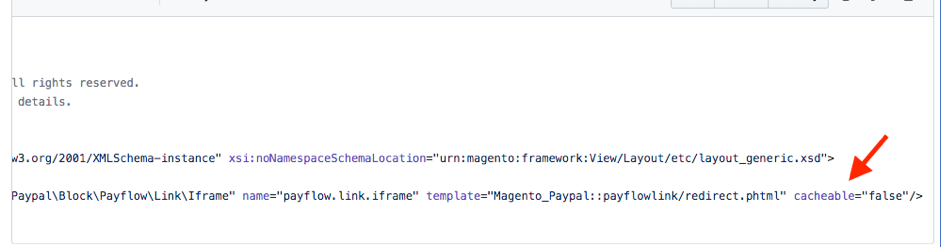

# 캐시 불가능 페이지로 인한 성능 저하

이 문서에서는 캐시해야 하는 모든 페이지의 모든 블록에 대해 전체 페이지 캐시(예: Fastly)가 비활성화되어 웹 사이트 로드 시간이 증가하거나 중단에 대한 솔루션을 제공합니다.

## 영향을 받는 제품 및 버전

* 클라우드 인프라의 Adobe Commerce 2.x.x
* Adobe Commerce 온-프레미스 2.x.x

### 문제

사이트에 캐시 가능해야 하지만 로 설정된 캐시 블록이 있으므로 성능이 느려집니다. `cacheable="false"` .

### 원인

Adobe Commerce에서 캐시해야 하는 페이지가 있습니다. 이러한 페이지의 처리량이 가장 큽니다. 캐시가 아닌 이러한 유형의 페이지를 요청할 때마다 Adobe Commerce의 성능이 느려집니다.

이 페이지는 다음과 같습니다.

* 카탈로그 범주(PLP)
* PDP(제품 세부 사항 페이지)
* 정적 콘텐츠 페이지 (홈 페이지, 연락처 등)

캐시 가능 및 캐시 불가능 은 페이지를 캐시해야 하는지 여부를 나타내는 데 사용되는 용어입니다. 기본적으로 모든 페이지를 캐시할 수 있습니다. 그러나 레이아웃에 있는 블록이 캐시 불가로 지정된 경우에는 전체 페이지를 캐시할 수 없습니다.

아래 스크린샷은 설정이 있는 블록을 보여 줍니다 `cacheable="false”`  ** 수 없는 페이지를 만드는 **.

캐시할 수 없는 페이지의 예로는 제품 비교, 장바구니 및 체크아웃 페이지가 있습니다.

다음 페이지 목록이 캐시되지 않습니다(Fastly, Block 및 Layout 캐시는 사용되지 않음). 이 문제는 레이아웃의 &quot;캐시 가능&quot; 구성 때문에 발생합니다.

### 솔루션

위에서 지정한 파일에 설정이 있는지 확인합니다. `cacheable="false”` . 옵션이 있으면 이 설정이 필요한지 또는 필요한지 확인하십시오.

* 필요한 경우 캐시 불가능 블록을 다음으로 이동하는 것이 좋습니다. [비공개 콘텐츠 메커니즘](https://devdocs.magento.com/guides/v2.3/extension-dev-guide/cache/page-caching/private-content.html?itm_source=devdocs&amp;itm_medium=quick_search&amp;itm_campaign=federated_search&amp;itm_term=private%20co) 대신,
* 필요하지 않으면 속성을 제거합니다. `cacheable="false”` 레이아웃 캐시를 플러시합니다.

>[!NOTE]
>
>클라우드 인프라 2.4.1 이상의 Adobe Commerce의 경우 다음을 사용할 수 있습니다. [사이트 전체 분석 도구](https://docs.magento.com/user-guide/reports/site-wide-analysis-tool.html) 전체 페이지 캐시가 올바르게 구성되지 않았는지 자동으로 확인합니다.

### 관련 읽기

[Adobe Commerce 캐시 개요](https://devdocs.magento.com/guides/v2.3/frontend-dev-guide/cache_for_frontdevs.html?itm_source=devdocs&amp;itm_medium=search_page&amp;itm_campaign=federated_search&amp;itm_term=cacheable%2) 개발자 설명서에서 확인할 수 있습니다.
