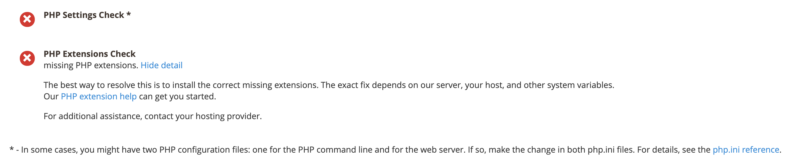

# cron 문제 해결

이 문서에서는 Adobe Commerce 온프레미스 제품에서 cron 관련 문제에 대한 문제 해결 솔루션을 제공합니다.

## 영향을 받는 제품 및 버전

* Adobe Commerce 온-프레미스 2.2.x, 2.3.x
* Magento Open Source 2.2.x, 2.3.x

## 문제

## 다음은 cron 문제의 증상입니다.

* 업데이트 또는 업그레이드는 실행되지 않습니다. `pending` 주.
* 에 대한 오류 메시지 [PHP](https://glossary.magento.com/php) 설정 `$HTTP_RAW_POST_DATA` 제대로 설정되었는데도 표시됩니다.
* cron 준비 검사에 실패했습니다. 가능한 오류에는 쓸 수 없는 경로와 cron이 설정되지 않았습니다. 예제는 다음과 같습니다.

  

* 다음 그림과 같이 PHP 준비 검사에는 PHP 버전이 표시되지 않습니다.

  

* Commerce 관리자에 다음 오류가 표시됩니다.

  

오류를 확인하려면 다음을 클릭해야 합니다. **시스템 메시지** 을 클릭합니다.

## 원인을 찾기 위해 조사 {#check-your-existing-crontab}

이 섹션에서는 cron이 현재 실행 중인지 확인하고 올바르게 설정되었는지 확인하는 방법에 대해 설명합니다.

crontab이 설정되었는지 확인하려면 다음 단계를 수행하십시오.

1. Magento 서버에 로 로그인하거나 로 전환합니다. [Magento 파일 시스템 소유자](https://devdocs.magento.com/guides/v2.3/install-gde/prereq/file-sys-perms-over.html).
1. 다음 파일이 있는지 확인합니다.    `bash    ls -al <magento_root>/var/.setup_cronjob_status`. 파일이 있는 경우 cron이 과거에 성공적으로 실행되었습니다. 파일 *다음이 아님* Magento을 아직 설치하지 않았거나 cron이 실행 중이 아닙니다. 두 경우 모두 다음 단계를 계속 진행합니다.
1. 크론에 대해 자세히 알아보십시오. 을 사용하는 사용자로서 `root` privileges에서 다음 명령을 입력합니다.    `bash    crontab -u <Magento file system owner name> -l`. 예: CentOS에서 `bash    crontab -u magento_user -l`.  사용자에 대해 crontab이 설정되지 않은 경우 다음 메시지가 표시됩니다.    `terminal    no crontab for magento_user`. crontab은 다음과 같은 정보를 제공합니다.

   * 사용 중인 PHP 바이너리(경우에 따라 두 개 이상 있음)
   * 실행 중인 Magento cron 스크립트(특히 해당 스크립트에 대한 경로)
   * cron 로그가 있는 위치

문제에 대한 해결 방법은 다음 섹션 중 하나를 참조하십시오.

## 솔루션

### crontab용 솔루션을 설정하지 않음 {#solution-crontab-not-set-up}

cron 작업이 제대로 설정되었는지 확인하려면 다음을 참조하십시오. [cron 작업 설정](https://devdocs.magento.com/guides/v2.3/install-gde/install/post-install-config.html#post-install-cron).

### 잘못된 PHP 바이너리에서 실행되는 cron에 대한 솔루션 {#solution-cron-running-from-incorrect-php-binary}

크론 작업에서 웹 서버 플러그인과 다른 PHP 바이너리를 사용하는 경우 PHP 설정 오류가 표시될 수 있습니다. 이 문제를 해결하려면 PHP 명령줄과 PHP 웹 서버 플러그인 모두에 대해 동일한 PHP 설정을 설정합니다.

PHP 설정에 대한 자세한 내용은 [필수 PHP 설정](https://devdocs.magento.com/guides/v2.3/install-gde/prereq/php-settings.html) 개발자 설명서에서 확인할 수 있습니다.

### 오류와 함께 실행 중인 cron 용 솔루션 {#solution-cron-running-with-errors}

명령에 유용한 오류 메시지가 표시될 수 있으므로 각 명령을 수동으로 실행해 보십시오. 다음을 참조하십시오 [cron 작업 설정](https://devdocs.magento.com/guides/v2.3/install-gde/install/post-install-config.html#post-install-cron).

>[!NOTE]
>
>적어도 cron은 실행해야 합니다. *두 번* 실행할 작업(작업을 처음 큐에 넣는 경우), 작업을 두 번째로 실행하는 경우).
