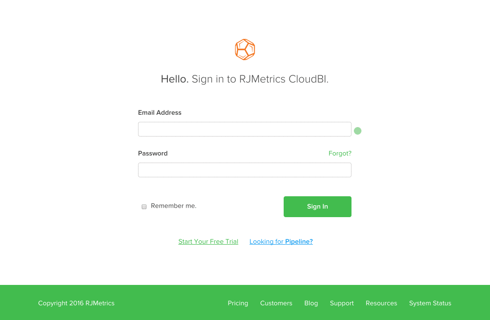

# Adobe Commerce Intelligence 계정 잠금 문제 해결

<!--
BOB: Is this in TOC?
-->

이 문서에서는 Commerce Intelligence 계정 잠금에 대한 솔루션을 제공합니다. 먼저 이것이 결함인지, 일시적인 결함인지 또는 다른 문제인지를 확인해야 합니다. 아래 단계를 수행하면 가능한 한 빨리 계정을 다시 시작하는 데 도움이 됩니다.

## 이메일 주소가 올바른지 확인합니다.

로그인에 사용하려는 이메일 주소가 기존 Commerce Intelligence 계정과 연결되어 있는지 이메일 주소를 다시 확인하십시오. 계정 관리자에게 이메일 주소에 오타가 없는지 확인해야 할 수 있습니다.

이메일 주소가 정확한지 확인한 후 다음을 사용하여 다시 로그인해 보십시오. [이 링크](https://dashboard.rjmetrics.com/v2/session/create#/).

## 암호 재설정 시도

올바른 이메일을 사용하고 있는지 확인한 경우 암호를 재설정해 보십시오. 다음을 사용할 수 있습니다. **잊었나?** 암호 재설정 이메일을 트리거하기 위해 이전 섹션의 로그인 페이지에 연결합니다.

이메일이 처음에 표시되지 않으면 정크 메일 폴더를 확인해야 합니다. 때때로 선의의 이메일조차도 정크 메일로 오인될 수 있습니다. **이러한 이메일의 임시 액세스 링크는 한 번만 만들면 됩니다!**

여전히 잠긴 경우 이메일 주소가 올바른지 확인하고 재설정 이메일의 올바른 링크를 사용하십시오. 다음을 시도해 보십시오. **다른 재설정을 요청하고 다시 로그인하기 전에:**

* 브라우저의 캐시, 쿠키 및 저장된 암호 지우기
* 광고 차단 소프트웨어를 일시적으로 끄기

## 모든 오류를 문서화하고 지원에 문의하십시오.

>[!NOTE]
>
>이 단계가 항상 필요한 것은 아니지만 사전 예방적으로 완료하면 지원 요청을 주고받는 데 드는 시간을 줄일 수 있습니다.

여전히 계정에 액세스할 수 없는 경우 오류를 확인하고 지원 팀에 티켓을 제출하는 것이 좋습니다. 어떻게 이럴 수 있어? 브라우저의 개발자 도구를 열고 콘솔 또는 사이트 로그 창에 표시되는 오류를 스크린샷합니다. 아래 GIF에서 Google Chrome용 개발자 도구를 열고 있습니다.

위의 예에서는 가장 일반적인 방법(**마우스 오른쪽 버튼 클릭** > **Inspect**)을 클릭하여 콘솔을 엽니다. 브라우저에 이 방법이 없거나 도움이 필요한 경우 사용 중인 웹 브라우저에 대해 아래 설명서 링크를 사용하십시오.

<table>
<tbody>
<tr>
<td><a href="https://www.technipages.com/mac-os-x-enable-web-inspector-in-safari">Safari</a></td>
<td><a href="https://developer.mozilla.org/en-US/docs/Tools/Web_Console/Opening_the_Web_Console">Firefox</a></td>
<td><a href="https://developers.google.com/web/tools/chrome-devtools/?hl=en">크롬</a></td>
<td><a href="https://www.opera.com/dragonfly/documentation/">Opera</a></td>
<td><a href="https://msdn.microsoft.com/en-us/library/gg589512(v=vs.85).aspx#OpeningTools">Internet Explorer</a></td>
</tr>
</tbody>
</table>

일부 브라우저에서 개발자 도구를 열면 콘솔이 자동으로 표시되지 않을 수 있습니다. 사이트 코드가 먼저 표시될 수 있습니다. 이런 일이 발생하면 개발자 창에서 콘솔 옵션을 클릭하고 표시되는 오류를 스크린샷합니다.

다음을 사용하여 지원 팀에 티켓 제출 **오류 스크린샷** 및 내 **Commerce Intelligence 계정 이메일 주소**.

## 오류가 안 보이거나 길을 잃으신 건가요?

걱정 마! 새 지원 티켓을 제출하면(Commerce Intelligence 계정의 이메일 주소를 포함해야 함) 가능한 한 빨리 계정이 다시 들어올 수 있습니다.

## 지원 기술 자료의 관련 항목:

* [새 사용자 추가 및 권한 설정](https://experienceleague.adobe.com/docs/commerce-business-intelligence/mbi/administrator/user-mgmt/user-management.html)
* [이메일 주소 또는 암호는 어떻게 업데이트합니까?](https://experienceleague.adobe.com/docs/commerce-business-intelligence/mbi/administrator/user-mgmt/create-user.html)
* [암호를 재설정하려면 어떻게 해야 합니까?](https://experienceleague.adobe.com/docs/commerce-business-intelligence/mbi/administrator/user-mgmt/reset-password.html)
