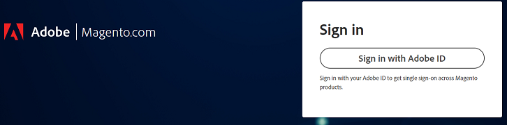
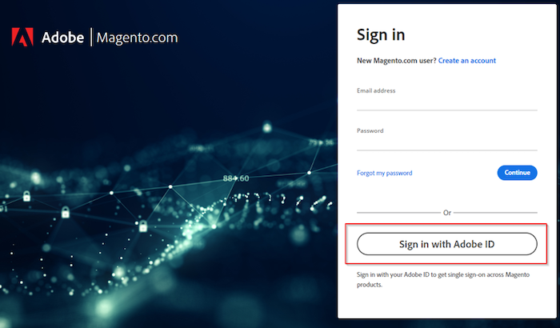

# Adobe Commerce 지원 또는 클라우드 계정에 로그인할 수 없음

이 문서에서는 Adobe Commerce 지원 또는 클라우드 프로젝트에 로그인하기 어려운 경우에 대한 솔루션을 제공합니다.

## 영향을 받는 제품 및 버전

Adobe Commerce(모든 배포 메서드) 모두 [지원되는 버전](https://www.adobe.com/content/dam/cc/en/legal/terms/enterprise/pdfs/Adobe-Commerce-Software-Lifecycle-Policy.pdf)

## 문제

다음으로 이동 시 [https://account.magento.com/customer/account/login/](https://account.magento.com/customer/account/login/) 또는 [https://accounts.magento.cloud/user](https://accounts.magento.cloud/user) 이제 통합 로그인 양식이 있으며 이전처럼 자격 증명을 더 이상 입력할 수 없습니다.

<u>재현 단계</u>:

Commerce 계정에 로그인하십시오.

<u>예상 결과</u>:

로그인 성공.

<u>실제 결과</u>:

Adobe 계정으로 로그인하기 위한 페이지로 리디렉션되고 자격 증명이 작동하지 않습니다.

## 원인

Adobe Commerce을 다른 Adobe 솔루션과 통합하는 프로세스의 일부로 모든 사용자가 MageID에 연결된 동일한 이메일 주소를 사용하여 Adobe 로그인을 만들어야 합니다(아직 로그인하지 않은 경우).

## 솔루션

다음 계정으로 로그인할 수 있습니다.

- 기존 Adobe 기업/개인 계정.
- Adobe 계정이 없는 경우 동일한 이메일 주소로 계정을 만드십시오.

단계는 를 참조하십시오. [Commerce Identity Manager](https://experienceleague.adobe.com/docs/commerce-admin/start/commerce-account/commerce-identity-manager.html) Adobe Experience League.

## 관련 읽기

- [Magento.com 및 accounts.magento.cloud 계정 로그인 연결](/help/faq/general/linking-magento-com-and-accounts-magento-cloud-account-logins.md)
