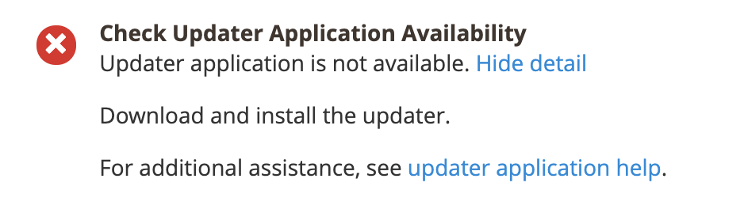

# &quot;Updater 응용 프로그램을 사용할 수 없습니다&quot; 오류

이 문서에서는 웹 설치 마법사를 사용하여 Adobe Commerce 온프레미스를 업데이트/설치하려고 할 때 발생할 수 있는 &quot;Updater 응용 프로그램을 사용할 수 없음&quot; 문제에 대한 해결 방법에 대해 설명합니다.

## 문제

준비 확인에는 다음 메시지가 표시됩니다.

## 영향을 받는 제품/버전

* Adobe Commerce 온-프레미스 2.2.x, 2.3.x
* Magento Open Source 2.2.x, 2.3.x

## 솔루션

이 문제를 해결하려면 다음을 확인하십시오. `<magento_root>/update` 파일 및 하위 디렉터리가 포함된 디렉터리입니다. 그렇지 않으면 다음을 참조하십시오. [업데이트 프로그램 설정](https://devdocs.magento.com/guides/v2.3/comp-mgr/updater/update-updater.html) 개발자 설명서에서 확인할 수 있습니다.
