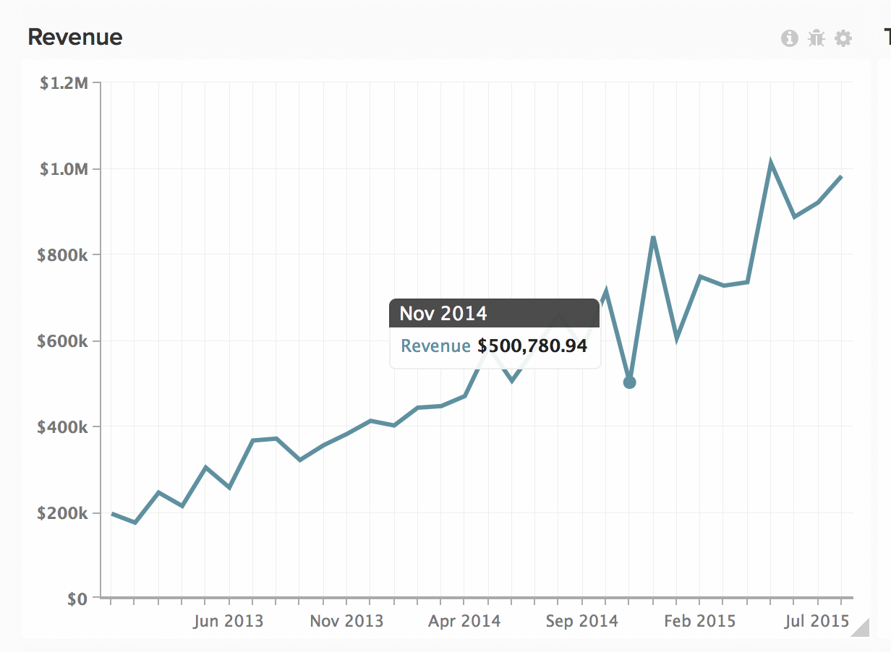
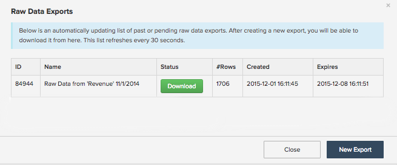
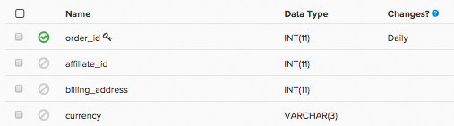

# 데이터 내보내기를 사용하여 불일치 항목 파악

이 문서에서는 Magento BI 데이터의 불일치 문제를 해결하는 솔루션을 제공합니다. 데이터 내보내기는 보고서에서 데이터 불일치를 찾아내기 위해 Magento BI 데이터를 소스 데이터와 비교하는 데 유용한 도구입니다. [데이터 불일치 진단 검사 목록](/help/troubleshooting/miscellaneous/diagnosing-a-data-discrepancy.md) 당신이 문제를 정확히 지적하는 데 도움이 되지 않았어요. 이 문서에서는 데이터 내보내기를 사용하여 데이터 불일치를 찾아내는 방법에 대한 실제 사례를 소개합니다.

이 분석을 예로 들 수 있습니다.

2014년 11월에 의심스러운 하락이 있었다. 매출 500,780.94달러 그건 옳지 않은 것 같네요 소스 데이터베이스에 2014년 11월 한 달 동안 표시되는 매출이 더 있는지 확인하고 다음을 다시 확인했습니다. **매출** 이 보고서에 사용된 지표가 올바르게 정의되었습니다. Magento BI Data Warehouse의 데이터는 데이터 내보내기를 사용하여 확인할 수 있는 불완전한 것으로 보입니다.

## 데이터 내보내기 {#export}

시작하려면 차트의 오른쪽 상단 모서리에 있는 톱니바퀴를 클릭한 다음 드롭다운 메뉴에서 원시 내보내기 옵션을 클릭합니다. 이렇게 하면 차트 뒤에 있는 데이터의 원시 내보내기를 제공합니다.

원시 데이터 내보내기 메뉴에서 내보내기에 포함할 열과 함께 내보낼 테이블을 선택할 수 있습니다. 필터를 결과 세트에 적용할 수도 있습니다.

이 예에서는 **매출** 이 보고서에 사용된 지표는 **order\_total** 에 정의된 필드 **주문 수** 표, 사용 **날짜** 을 타임스탬프로 사용합니다. 우리의 수출에 모든 것을 포함시키고 싶다 **order\_id** 2014년 11월 값 및 해당 값 **order\_total** . 다음 **매출** 지표는 필터를 사용하지 않지만 내보내기에 필터를 추가하여 결과 세트를 2014년 11월로 제한하겠습니다.

이 예제의 원시 데이터 내보내기 메뉴는 다음과 같습니다.

데이터 내보내기 를 클릭하여 내보내기를 시작합니다. 상태를 포함한 내보내기 세부 정보가 포함된 창이 표시됩니다. 내보내기를 준비하는 데 몇 분이 소요되므로 2014년 11월 소스 데이터의 유사 추출을 수행하는 데 좋은 시간이 됩니다. **date, order\_id** 및 **order\_total** . 이 파일은 Excel에서 열고 잠시 후에 다시 가져올 수 있도록 그대로 둡니다.

원시 데이터 내보내기 창에 다운로드 버튼이 나타나면 이를 클릭하여 CSV 파일이 포함된 zip 파일을 다운로드합니다.

이 시점에서 문제를 찾기 위해 모든 데이터를 한 장으로 만들어야 합니다. CSV 파일(Magento BI에서 내보내기)을 소스 데이터가 포함된 Excel 파일의 다른 시트로 가져옵니다.

## 문제 해결 {#pinpoint}

이제 모든 데이터가 한 곳에 있으므로, 우리는 불일치의 근원을 찾을 수 있다. 각 시트의 행 수를 비교하면 문제를 정확하게 파악할 수 있습니다. 각각의 상황을 자세히 살펴보겠습니다.

### 두 시트 모두 동일한 수의 행을 포함합니다

두 시스템의 행 수가 같고 **매출** 지표가 소스 데이터와 일치하지 않습니다. 그런 다음 **order\_total** 어딘가에서 떨어져 있을 거예요 다음과 같을 수 있습니다. **order\_total** 소스 데이터베이스에서 필드가 업데이트되었으며 Magento BI가 이러한 변경 사항을 선택하지 않습니다.

이를 확인하려면 다음을 수행할지 여부를 확인합니다. **order\_total** 열을 다시 확인하는 중입니다. Data Warehouse 관리자 로 이동하여 주문 테이블을 클릭합니다. 다음을 볼 수 있습니다. [빈도 재확인](https://experienceleague.adobe.com/docs/commerce-business-intelligence/mbi/analyze/warehouse-manager/cfg-data-rechecks.html) &#39;변경 사항&#39;에 나열되어 있습니까? 열. 다음 **order\_total** 필드는 변경될 것으로 예상되는 만큼 자주 다시 확인하도록 설정해야 합니다. 그렇지 않은 경우 계속 진행하여 원하는 다시 확인 빈도로 설정하십시오.

### 

재검사 빈도가 이미 올바르게 설정된 경우 다른 문제가 발생합니다. 다음을 참조하십시오. [지원 섹션에 연결 중](#support) 을 참조하십시오.

## 소스 데이터베이스에 Magento BI보다 많은 행이 있습니다. {#morerows}

소스 데이터베이스의 행이 Magento BI보다 많고 간격이 업데이트 주기 동안 발생할 것으로 예상되는 주문 수보다 큰 경우 연결 문제가 발생할 수 있습니다. 즉, Magento BI가 소스 데이터베이스에서 새 데이터를 가져올 수 없습니다. 이 작업은 몇 가지 이유로 인해 발생할 수 있습니다.

연결 페이지로 이동하여 주문 테이블이 포함된 데이터 소스의 상태를 확인합니다.

1. **상태가 재인증인 경우** 에서 연결에 올바른 자격 증명을 사용하고 있지 않습니다. 연결을 클릭하고 올바른 자격 증명을 입력한 다음 다시 시도하십시오.
1. **실패 상태인 경우** 이 경우 서버측에서 연결이 제대로 설정되지 않을 수 있습니다. 실패한 연결은 일반적으로 잘못된 호스트 이름 또는 대상 서버가 지정된 포트의 연결을 수락하지 않기 때문에 발생합니다.연결을 클릭하고 호스트 이름의 철자를 다시 확인한 후 올바른 포트가 입력되었는지 확인하십시오. 서버 측에서 포트가 연결을 허용할 수 있고 방화벽에 Magento BI IP 주소(54.88.76.97/32)가 허용되는지 확인하십시오. **연결에 계속 실패하는 경우** 을(를) 참조하십시오. [지원 섹션에 연결 중](#support) 을 참조하십시오.
1. **상태가 성공인 경우** 그러면 연결에 문제가 없으며 RJ 지원이 개입되어야 합니다. 다음을 참조하십시오. [지원 섹션에 연결 중](#support) 을 참조하십시오.

## 소스 데이터베이스의 행 수가 Magento BI보다 적습니다. {#lessrows}

소스 데이터베이스에 Magento BI보다 적은 행이 있는 경우 소스 데이터베이스에서 행이 삭제되고 Magento BI가 이러한 삭제를 선택하지 않을 수 있습니다. ** [데이터 삭제](https://experienceleague.adobe.com/docs/commerce-business-intelligence/mbi/best-practices/data/opt-db-analysis.html) 이 경우 불일치가 발생하고 업데이트 시간이 길어질 수 있으며 많은 물류 두통이 발생할 수 있으므로** 정말 필요한 경우가 아니면 데이터를 삭제하지 않는 것이 좋습니다.

그러나 테이블에서 행이 삭제되면 기본 키의 재확인 빈도를 확인합니다. 기본 키를 다시 확인하면 삭제된 행에 대해 테이블을 검사하게 됩니다.

Data Warehouse 관리자에서 기본 키 열은 키 기호로 표시됩니다. 이 예제에서 기본 키는 **order\_id** 열:

기본 키가 이미 다시 확인되도록 설정되어 있거나 이 표에서 행이 삭제되지 않은 경우 문제를 정확하게 파악하려면 RJ 지원이 필요합니다. 다음 단계는 다음 섹션을 참조하십시오.

## 지원 센터 문의 {#support}

문제의 원인을 정확하게 파악할 수 없는 경우 RJ 지원에서 반복해야 합니다. 티켓을 제출하기 전에 다음 작업을 수행하십시오.

* **소스 데이터베이스와 Magento BI의 행 수가 동일한 경우** 빈도가 올바르게 설정되어 있는지 확인하고 스프레드시트에서 VLOOKUP을 수행합니다 **Magento BI와 소스 데이터베이스 간에 order\_total 값이 다른 order\_id 값을 찾습니다.** 티켓을 제출할 때 이러한 값을 포함합니다.
* **소스 데이터베이스에 Magento BI보다 많은 행이 있는 경우** 그리고 연결이 성공으로 표시되거나 계속 실패하는 경우 연결 이름과 오류 메시지가 표시되면 이를 알아야 합니다.
* **소스 데이터베이스에 Magento BI보다 적은 행이 있는 경우** 행이 테이블에서 삭제되지 않고 빈도가 올바르게 설정되어 있는지 다시 확인하고 스프레드시트에서 VLOOKUP을 수행합니다 **Magento BI에 있는 order\_id 값을 찾으려면** 소스 데이터베이스에는 없습니다. 티켓을 제출할 때 이러한 값을 포함합니다.

## 관련 항목

* [데이터 불일치 진단 검사 목록](/help/troubleshooting/miscellaneous/diagnosing-a-data-discrepancy.md)
* [데이터 불일치 티켓 제출](https://support.magento.com/hc/en-us/articles/360016506472-Submitting-a-data-discrepancy-ticket)
