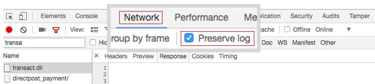
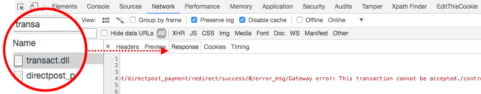

# Authorize.net Sandbox 계정으로 주문 도중 오류 발생(서버에서 오류 발생)

이 문서에서는에 대한 수정 사항을 제공합니다.*서버에서 오류가 발생했습니다.*&quot;Authorize.Net Direct Post를 사용하여 주문할 때 오류 메시지가 표시됩니다.

>[!WARNING]
>
>**사용 중지 알림**
>
>결제 서비스 지침으로 인해 [PSD2](https://docs.magento.com/user-guide/v2.3/stores/compliance-payment-services-directive.html) 또한 많은 API의 지속적인 발전으로 인해 Authorize.Net은 오래되어 향후 더 이상 보안을 준수하지 않을 위험이 있습니다. 따라서 이제 더 이상 사용되지 않으며, Adobe Commerce 구성에서 비활성화하고 해당 구성으로 전환하는 것이 좋습니다 [Commerce Marketplace 확장](https://marketplace.magento.com/extensions.html).
>
>**이 통합은 Adobe Commerce 2.4.0 릴리스에서 제거되었으며 현재 버전의 2.3에서 더 이상 사용되지 않습니다.**
>
>더 이상 사용되지 않는 결제 통합에서 보안 전환하는 방법에 대한 자세한 내용은 [개발 블로그](https://community.magento.com/t5/Magento-DevBlog/Deprecation-of-Magento-core-payment-integrations/ba-p/426445).

## 문제

다음을 사용하여 주문 [Authorize.Net Direct Post](https://docs.magento.com/user-guide/v2.3/payment/authorize-net-direct-post.html) 샌드박스 계정으로 인해 오류 메시지:

>>
&quot;서버에서 오류가 발생했습니다. 다시 주문해 보십시오.&quot;

## 원인 1: 테스트 모드가 활성화되었습니다.

분명해 보이진 않지만 Authorize.net은 **테스트 모드** 설정을 로 설정해야 합니다. **아니요** 샌드박스 계정으로 테스트하는 경우에도 마찬가지입니다.

## 해결 방법 1: 테스트 모드 비활성화

1. 다음으로 이동 **스토어** > **구성** > **판매** > **결제 방법** > **기타 결제 방법** > **Authorize.net 다이렉트 포스트**.
1. 설정 **테스트 모드** &quot;아니요&quot;로 변환(선택 취소) **시스템 값 사용**&#x200B;을 클릭한 다음 메뉴에서 &quot;아니요&quot;를 선택합니다.
1. 클릭 **구성 저장**.

## 원인 2: 잘못된 URL

Authorize.net 설정에 중요한 Authorize.Net 리소스에 대한 잘못된 URL 주소가 포함될 수 있습니다.

## 해결 방법 2: 올바른 URL 제공

* **게이트웨이 URL:**   `https://test.authorize.net/gateway/transact.dll`
* **거래 세부 정보 URL:**   `https://apitest.authorize.net/xml/v1/request.api`
* **API 참조:**   `https://developer.authorize.net/api/reference/`

## 도움이 되지 않는 경우: 디버그 정보 가져오기

Authorize.net으로 주문하면 잘못된 정보로 실패합니다. *&quot;문제가 발생했습니다.&quot;* 오류, Adobe Commerce 확인 `debug.log`.

### Transact.dll

만일의 경우에 `debug.log` 은(는) 비어 있습니다. **transact.dll** 웹 브라우저의 콘솔에서 응답:

1. 콘솔을 엽니다.
1. 주문하기 전에 **네트워크** 탭하고 선택 **로그 유지**.    
1. 응답 필터링 기준 **transact.dll** 가능한 오류가 있는 응답 메시지를 봅니다.    
