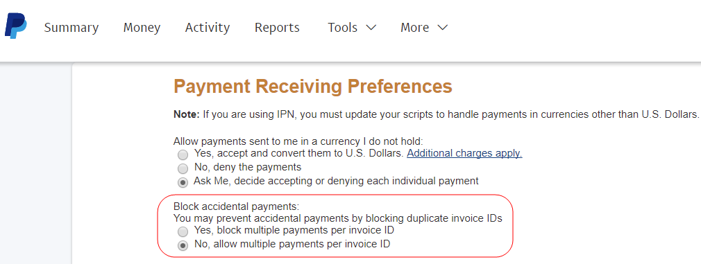

# PayPal 게이트웨이 거부 요청 - 중복 송장 문제

이 문서에서는 PayPal 게이트웨이의 거부된 요청 - 중복 송장 문제에 대한 수정 사항을 제공합니다.

지급을 실행할 때 고객은 중복 송장에 대한 오류를 볼 수 있습니다.

>PayPal 게이트웨이가 요청을 거부했습니다. 이 InvoiceID에 대한 지불이 이미 완료되었습니다(\#10412: 중복 송장).

이 문제는 동일한 ID의 송장이 PayPal로 여러 번 전송될 때 발생합니다.

이 문제를 해결하려면 PayPal의 지급 입고 환경설정에서 송장 ID당 복수 지급을 허용합니다. 변경 시 PayPal은 중복 ID가 있는 송장의 경우에도 오류 메시지가 없는 결제를 수락합니다.

## 영향을 받는 버전

* Adobe Commerce 온-프레미스, 모든 버전
* 클라우드 인프라의 Adobe Commerce, 모든 버전

## 문제

결제를 실행하면 다음과 같은 오류 메시지가 표시됩니다.

```
... main.CRITICAL: Exception message: PayPal gateway has rejected request. Payment has already been made for this InvoiceID (#10412: Duplicate invoice).
```

PayPal은 결제를 처리하고 주문을 완료할 수 없습니다.

## 원인

동일한 ID의 송장이 PayPal에 여러 번 제출되면 오류 메시지가 표시됩니다.

여러 Adobe Commerce 사이트(로컬 및 스테이징 환경에서도)에서 동일한 자격 증명을 사용할 때 이러한 문제가 발생할 수 있습니다. 특정 시나리오는 다음과 같습니다.

* 여러 상점이 PayPal에 송장을 제출하고 동일한 송장 ID를 사용합니다.
* 새 스토어는 이전 스토어에서 이전에 제출한 ID가 있는 송장을 보냅니다

기본적으로 PayPal은 동일한 청구서에 대한 처리를 두 번 허용하지 않습니다.

## 솔루션

송장 ID당 복수 지급을 허용하도록 PayPal 프로필을 변경합니다. 이러한 변경은 PayPal을 통해 수행해야 합니다.

1. 다음 위치에서 계정에 로그인합니다. [https://www.paypal.com](https://www.paypal.com/).
1. 클릭 **프로필** > **프로필 및 설정** (오른쪽 상단)
1. 다음으로 이동 **내 판매 도구**.
1. 다음으로 이동 **지불 및 위험 관리** > **결제 차단** 및 클릭 **업데이트**.
1. **판매 환경 설정**, 클릭 **지급 입고 환경설정**.
1. 아래 **우발적 결제 차단**, 선택 **아니요, 송장 ID당 복수 지급을 허용합니다.**.    
1. 아래로 스크롤하고 를 클릭합니다. **저장**.

## 추가 정보

* [우발적 결제 차단](https://developer.paypal.com/docs/admin/setup-account/#block-accidental-payments) PayPal 개발자 문서에서
* 사용 안내서의 PayPal 결제:
   * [PayPal Express 체크아웃](/docs/commerce-admin/stores-sales/payments/paypal/paypal-express-checkout.html)
   * [기타 PayPal 솔루션](/docs/commerce-admin/stores-sales/payments/paypal/paypal.html)
* 개발자 설명서에서:
   * [클라우드 인프라에서 Adobe Commerce에 대한 PayPal 결제 방법 설정](/docs/commerce-cloud-service/user-guide/configure-store/paypal.html)
   * [결제 통합](https://developer.adobe.com/commerce/php/development/payments-integrations/)
