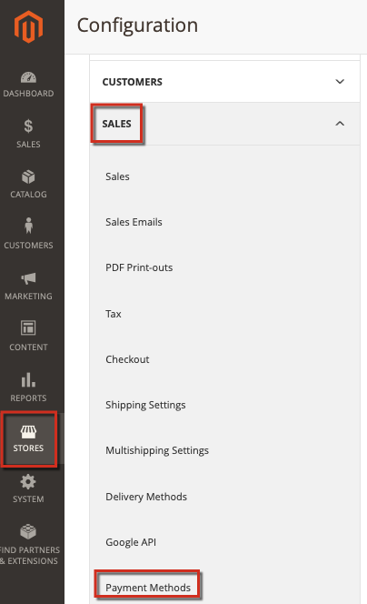

# Adobe Commerce에서 PayPal 문제 해결

이 문서에서는 PayPal을 통한 결제 처리, 특히 PayFlow Pro 솔루션과 관련된 문제에 대한 솔루션을 제공합니다. 이 문서의 일부 권장 사항은 명확해 보일 수 있습니다. 이 기술 자료에 나열된 문제 해결 옵션을 시도하고 입력한 티켓에 모든 정보를 포함하시기 바랍니다. Adobe Commerce 또는 PayPal 지원 엔지니어는 문제를 진단할 때 이러한 단계를 수행하도록 요청합니다.

## 일반적인 문제

페이팔 결제와 관련된 대부분의 문제들은 비슷한 증상들을 가지고 있다: 결제 카드 세부 사항을 지정하고 체크아웃을 계속한 후, 결제가 처리되지 않고 있다. 대신 오류 메시지, 결제 처리 실패 또는 빈 페이지가 있을 수 있습니다.

## 자격 증명, 암호 키 및 라이선스 확인

가능한 문제: 계정 세부 정보(사용자 이름, 암호), 잘못된 계정, 만료되었거나 지정되지 않은 라이선스, 잘못된 공개 및 개인 키 및 기타 여러 측면. 이러한 문제를 찾으려면 결제 구성 설정을 확인해야 할 수도 있습니다.

## Adobe Commerce 및 PayPal에서 일관된 설정 적용

Commerce 관리 및 PayPal 계정 설정에서 동일한 설정을 적용하고 동일한 기능을 활성화했는지 확인하십시오.

### 예제 설정 문제

PayPal Express 체크아웃 솔루션을 적용할 때 AVS/CSC 응답을 기반으로 하는 트랜잭션은에서 거절해야 합니다. **PayPal 관리자** (서비스 설정 > 설정 > 보안 옵션) 및 **Commerce 관리자** ( **스토어** > 구성 > **판매** > **결제 방법** ...)

자세한 내용은 다음 설명서를 참조하십시오. [PayPal](https://www.paypalobjects.com/en_US/vhelp/paypalmanager_help/setup.htm) 및 [Adobe Commerce](/docs/commerce-admin/stores-sales/payments/paypal/paypal-express-checkout.html) 사용 안내서에서 참조하십시오.

## 참조 트랜잭션 허용

PayPal 결제 방법에 청구 계약 및 참조 트랜잭션과 함께 API가 포함된 경우, 설정에서 이러한 API가 올바로 활성화 및 구성되어 있는지 확인하십시오.

### 추가 문제 해결

다음 문서를 참조하십시오.

* [PayPal 게이트웨이 거부 요청 - 중복 송장 문제](/help/troubleshooting/payments/paypal-gateway-rejected-request-duplicate-invoice-issue.md) 을 참조하십시오.
* [새 스토어 엔티티의 증분 ID 변경](/help/how-to/general/change-increment-id-for-a-db-entity-order-invoice-credit-memo-etc-on-particular-store.md) 을 참조하십시오.

## 고급 결제 로그를 수집하려면 지원 팀에 문의하십시오

복잡한 결제 문제를 해결하기 위해 Adobe Commerce 지원 팀은 고급 결제 로깅을 활성화하기 위해 전용 패치를 적용하도록 요청할 수 있습니다. 이 경우 단계는 다음과 같아야 합니다.

[지원 티켓 제출](/help/help-center-guide/help-center/magento-help-center-user-guide.md#submit-ticket) (다음 세부 정보 포함)

* 가능한 한 많은 세부 정보로 문제를 지정합니다.
* 이 문서에서 시도한 단계, 기술 자료 및 기타 리소스를 나열합니다. 모든 결과를 포함합니다.
* Advanced Payment Logging 패치(참조 번호 MDVA-4352) 및 패치 적용 지침 요청.

Advanced Payment Logging 패치를 받은 경우:

* 패치를 적용합니다.
* 로그를 수집하여 다음에 첨부합니다 [지원 티켓](/help/help-center-guide/help-center/magento-help-center-user-guide.md#submit-ticket).
* Adobe Commerce 지원 팀의 추가 권장 사항을 기다립니다.
