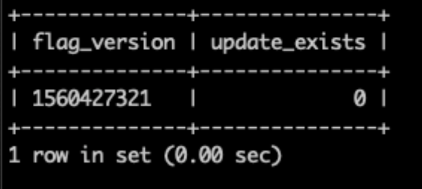

# 콘텐츠 스테이징 문제로 인한 모든 페이지 오류 404

이 문서에서는 상점 전면 페이지 또는 Commerce 관리자에 액세스할 때 404 오류가 발생하는 Adobe Commerce 온-프레미스 및 Adobe Commerce 온-클라우드 인프라 문제에 대한 수정 사항을 제공합니다.

## 영향을 받는 제품 및 버전

* Adobe Commerce 온-프레미스 2.2.x, 2.3.x
* 클라우드 인프라의 Adobe Commerce 2.2.x, 2.3.x

## 문제

>[!NOTE]
>
>이 문서는 을 시도할 때 404 오류가 발생하는 상황에는 적용되지 않습니다 [스테이징 업데이트 미리 보기](https://docs.magento.com/user-guide/cms/content-staging-scheduled-update.html#preview-the-scheduled-change). 해당 문제가 발생하는 경우 [지원 티켓](/help/help-center-guide/help-center/magento-help-center-user-guide.md#submit-ticket).

상점 첫 페이지나 관리자에 액세스하면 다음을 사용하여 저장소 콘텐츠 에셋에 대해 예약된 업데이트로 작업을 수행한 후 404 오류(&quot;죄송합니다, 잘못된 항목...&quot; 페이지)가 발생합니다. [컨텐츠 스테이징](https://experienceleague.adobe.com/docs/commerce-admin/content-design/staging/content-staging.html) (저장소 콘텐츠 자산에 대한 업데이트가 [Magento\_스태이징 모듈](https://developer.adobe.com/commerce/php/module-reference/)). 예를 들어 예약된 업데이트가 있는 제품을 삭제하거나 예약된 업데이트의 종료 날짜를 제거했을 수 있습니다.

저장소 콘텐츠 자산에는 다음이 포함됩니다.

* 제품
* 범주
* 카탈로그 가격 규칙
* 장바구니 가격 규칙
* CMS 페이지
* CMS 차단
* 위젯

몇 가지 시나리오는 아래의 원인 섹션에 설명되어 있습니다.

## 원인

다음 `flag` 데이터베이스(DB)의 테이블에 `staging_update` 테이블.

문제는 콘텐츠 스테이징과 관련되어 있습니다. 다음은 두 가지 특정 시나리오입니다. 문제를 유발하는 상황이 더 있을 수 있습니다.

**시나리오 1:** 다음과 같은 스토어 콘텐츠 에셋 삭제:

* 이(가) 콘텐츠 스테이징으로 업데이트를 예약했습니다.
* 업데이트에는 종료 일자(업데이트된 에셋이 이전 버전으로 되돌리는 만료 일자를 의미함)가 있습니다
* 업데이트 종료 날짜는 과거입니다.

동시에 삭제된 에셋에 예약된 업데이트에 대한 종료 날짜가 없는 경우 문제가 발생하지 않을 수 있습니다.

**시나리오 2:** 예약된 업데이트의 종료 날짜/시간을 제거하는 중입니다.

### 문제가 관련이 있는지 확인

발생한 문제가 이 문서에 설명된 문제인지 식별하려면 다음 DB 쿼리를 실행합니다.

```sql
   SELECT f.flag_data >'$.current_version' as flag_version, (su.id IS NOT NULL) as update_exists
   -> FROM flag f
   -> LEFT JOIN staging_update su
   -> ON su.id = f.flag_data >'$.current_version'
   -> WHERE flag_code = 'staging';
```

쿼리가 테이블을 반환하는 경우 `update_exists` 값이 &quot;0&quot;이면 `staging_update` 테이블이 데이터베이스에 있고 [솔루션 섹션](#solution) 이(가) 문제를 해결하는 데 도움이 됩니다. 다음은 쿼리 결과의 예입니다. `update_exists` &quot;0&quot;과 같은 값:



쿼리가 테이블을 반환하는 경우 `update_exists` 값이 &quot;1&quot;이거나 결과가 비어 있는 경우 이 문제는 스테이징 업데이트와 관련이 없음을 의미합니다. 다음은 쿼리 결과의 예입니다. `update_exists` &quot;1&quot;과 같은 값:


이 경우 다음을 의미할 수 있습니다. [사이트 작동 중지 문제 해결사](/help/troubleshooting/site-down-or-unresponsive/magento-site-down-troubleshooter.md) 를 참조하십시오.

## 솔루션

1. 다음 쿼리를 실행하여 의 잘못된 링크를 삭제합니다. `staging_update` 표:

   ```sql
   DELETE FROM flag WHERE flag_code = 'staging';
   ```

1. cron 작업이 실행될 때까지 기다리거나(올바르게 설정된 경우 최대 5분 이내 실행) cron이 설정되지 않은 경우 수동으로 실행합니다.

잘못된 링크를 고친 후 문제를 바로 해결해야 한다. 문제가 지속되면, [지원 티켓 제출](/help/help-center-guide/help-center/magento-help-center-user-guide.md#submit-ticket).
