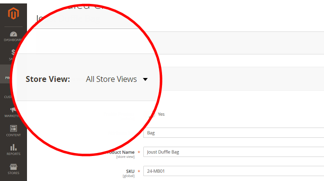
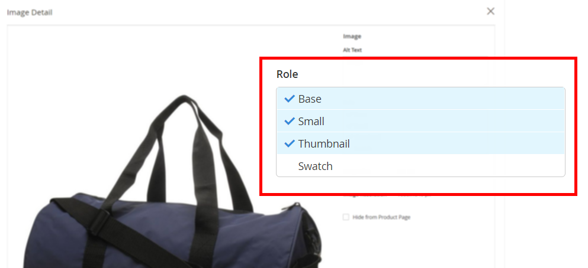
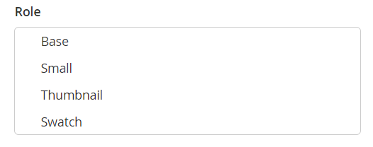

# 제품 편집 이미지 역할에도 불구하고 제품 이미지가 표시되지 않음

이 문서에서는 제품 편집 페이지에 설정된 이미지 역할에도 불구하고 제품 이미지가 상점 앞에 표시되지 않는 경우에 대한 수정 사항을 제공합니다.

**원인:** 스토어가 두 개 이상인 Adobe Commerce 인스턴스에서는 일부 제품 이미지에 `no_selection` 이미지 역할 속성에 대한 값 `image`, `small_image`, `thumbnail`, `swatch`. 다음과 같음 `no_selection` 제품 이미지 역할이 특정 저장소의 범위(즉, **모든 스토어 조회수** 특정대신에 **스토어 뷰**). 해당 경우에 대해 이해하려면 **원인** 아래 섹션.

**해결 방법:** 이 있는 행 삭제 `no_selection` 아래 솔루션 섹션의 SQL 스크립트를 사용하여 이러한 이미지에 대한 값을 제공합니다.

## 영향을 받는 버전

* Adobe Commerce 온-프레미스 2.X.X
* 클라우드 인프라의 Adobe Commerce 2.X.X

## 문제

이미지 역할(기본, 작은, 썸네일, 견본)이 관리 패널의 제품 페이지에서 올바르게 설정되었더라도 제품 이미지가 상점 앞에 표시되지 않을 수 있습니다.

다음을 사용하여 제품 페이지를 확인하는 경우 **스토어 뷰** 을 로 설정 **모든 스토어 보기**&#x200B;그림에 설정된 역할이 있는 경우 **이미지 세부 사항** 화면.





그러나 상점 첫 화면에서 이미지가 표시되지 않습니다. 특정 상점 수준에서 제품 페이지를 확인할 때(를 전환함) **스토어 뷰**), 이미지는 있지만 역할은 설정되지 않습니다.



## 원인

다중 스토어 Adobe Commerce 인스턴스(둘 이상의 스토어 포함)에서 일부 제품 이미지는 `no_selection` 속성 값 `image`, `small_image`, `thumbnail`, `swatch` (이러한 속성은 이미지 역할에 해당합니다.) 다음과 같음 `no_selection` 제품 이미지 역할이 특정 저장소의 범위(즉, **모든 스토어 조회수** 특정대신에 **스토어 뷰**).

기술적으로 말하자면 , `store_id=0` (Adobe Commerce 인스턴스의 모든 스토어에 대한 전역 설정을 보유함) 제품 이미지 역할을 설정할 수 있습니다. 즉, 속성이 `image`, `small_image`, `thumbnail`, `swatch` 에는 유효한 값(이미지 경로)이 있습니다. 동시에, `store_id=1` (특정 저장소 표현임), 이러한 속성의 값은 다음과 같습니다 `no_selection`.

### 문제가 있는지 확인하는 방법

다음 SQL 쿼리를 실행합니다.

```sql
SELECT `cpev_s`.*, `cpev_0`.`value` AS `store_value` FROM `catalog_product_entity_varchar` `cpev_s` JOIN `eav_attribute` `ea` ON `cpev_s`.`attribute_id` = `ea`.`attribute_id` LEFT JOIN `catalog_product_entity_varchar` `cpev_0` ON `cpev_0`.`row_id` = `cpev_s`.`row_id` AND `cpev_0`.`attribute_id` = `cpev_s`.`attribute_id` AND `cpev_0`.`store_id` = 0 WHERE `cpev_s`.`value` = 'no_selection' AND `ea`.`attribute_code` IN ('image', 'small_image', 'thumbnail') AND `cpev_s`.`store_id` > 0 AND `cpev_s`.`value` != `cpev_0`.`value` AND `cpev_s`.`value` = 'no_selection';
```

쿼리가 아래와 같은 결과를 반환하는 경우 이 문서에 설명된 문제를 처리하고 있습니다.

```sql
+----------+--------------+----------+--------+--------------+----------------------------+
| value_id | attribute_id | store_id | row_id | value        | store_value                |
+----------+--------------+----------+--------+--------------+----------------------------+
|    67722 |           87 |        1 |    481 | no_selection | /3/5/355sss1_main.jpg      |
|    67723 |           88 |        1 |    481 | no_selection | /3/5/355sss1_main.jpg      |
|    67724 |           89 |        1 |    481 | no_selection | /3/5/355sss1_main.jpg      |
|    67814 |           87 |        1 |    503 | no_selection | /s/k/skb2031_main.jpg      |
|     6769 |           87 |        2 |    503 | no_selection | /s/k/skb2031_main.jpg      |
|    67815 |           88 |        1 |    503 | no_selection | /s/k/skb2031_main.jpg      |
|     6770 |           88 |        2 |    503 | no_selection | /s/k/skb2031_main.jpg      |
|    67816 |           89 |        1 |    503 | no_selection | /s/k/skb2031_main.jpg      |
|     6771 |           89 |        2 |    503 | no_selection | /s/k/skb2031_main.jpg      |
+----------+--------------+----------+--------+--------------+----------------------------+
9 rows in set (0.06 sec)
```

### 왜 이런 일이 발생합니까?

Adobe Commerce 응용 프로그램에 둘 이상의 저장소가 있는 경우 특정 저장소와 전역 저장소 설정 간에 데이터를 동기화하지 못할 수 있습니다.

값 `store_id=1` 기본(전역) 저장소보다 우선 순위가 높습니다(`store_id=0`). 따라서 응용 프로그램은 전역 이미지 설정을 무시하고 저장소 범위 구성(`no_selection` 이미지 역할 속성의 경우) 이미지를 표시할 때 사용됩니다.

## 솔루션 {#solution}

다음을 사용하여 속성 삭제 `no_selection` 이 SQL 스크립트를 사용하는 값:

```
DELETE `cpev_s`.* FROM `catalog_product_entity_varchar` `cpev_s` JOIN `eav_attribute` `ea` ON `cpev_s`.`attribute_id` = `ea`.`attribute_id` LEFT JOIN `catalog_product_entity_varchar` `cpev_0` ON `cpev_0`.`row_id` = `cpev_s`.`row_id` AND `cpev_0`.`attribute_id` = `cpev_s`.`attribute_id` AND `cpev_0`.`store_id` = 0 WHERE `cpev_s`.`value` = 'no_selection' AND `ea`.`attribute_code` IN ('image', 'small_image', 'thumbnail') AND `cpev_s`.`store_id` > 0 AND `cpev_s`.`value` != `cpev_0`.`value` AND `cpev_s`.`value` = 'no_selection';
```

이러한 속성이 제거되면 특정 스토어에 대한 역할이 설정되고 이미지가 상점 앞에 표시됩니다.

## 추가 세부 정보

Adobe Commerce 인스턴스에서 전체 페이지 캐시가 활성화된 경우 수정 결과를 즉시 확인할 수 없습니다.

변경 사항을 표시하려면 를 사용하여 페이지 캐시를 새로 고칩니다. **캐시 관리** 관리 패널의 메뉴

## 추가 정보

### 저장소 및 범위

[저장 및 저장 범위](/docs/commerce-admin/stores-sales/site-store/stores.html) 사용 안내서에서

### 이미지

[제품 이미지 업로드](/docs/commerce-admin/catalog/products/digital-assets/product-image.html#upload-an-image) 사용 안내서에서

### 캐시

* [캐시 관리](/docs/commerce-admin/systems/tools/cache-management.html) 사용자 관리 시스템 안내서에서 확인할 수 있습니다.
* [캐시 관리](/docs/commerce-operations/configuration-guide/cli/manage-cache.html) 개발자 설명서에서