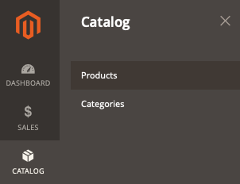

# 제품이 상점 앞에 표시되지 않음

이 문서에서는 제품이 상점 앞에 표시되지 않는 경우에 대한 해결 방법을 제공합니다.

## 영향을 받는 제품 및 버전

* Adobe Commerce 온-프레미스 X.X.X
* 클라우드 인프라의 Adobe Commerce X.X.X

## 문제

<u>재현 단계</u>:

1. Commerce 관리자에 로그인합니다.
1. 다음으로 이동 **카탈로그** > **제품**.

   

1. 클릭 **제품 추가** 제품 제작 프로세스를 살펴봅니다. 또는 CSV 파일에서 제품을 가져옵니다.

<u>예상 결과</u>:

상품은 매장에 진열되어 있습니다.

<u>실제 결과</u>:

제품이 표시되지 않습니다.

## 원인

이는 여러 가지 이유로 인해 발생할 수 있습니다. 아래 단계에 따라 문제를 식별하고 해결하는 데 도움이 될 수 있는 주요 사항을 확인하십시오.

## 솔루션

다음 각 사항에서 이 문제를 해결할 수 있습니다.

* 관리에서 제품 설정을 확인하십시오. 다음으로 이동 **카탈로그** > **제품**&#x200B;제품 페이지를 열고 다음 필드가 올바르게 구성되었는지 확인합니다.
   * **제품 활성화** = *예.*
   * **재고 상태**: *재고 있음*. 또는 *품절* 은(는) 올바른 값입니다. **품절 제품 표시** (**스토어** > **설정** > **구성** > **카탈로그** > **인벤토리** > **스톡 옵션** > **품절 제품 표시**)가 로 설정되어 있습니다. *예* (전역 수준에서 구성됨).
   * **카테고리**: 카테고리 페이지에서 제품을 찾으려고 하는 경우 제품이 카테고리에 할당되었는지 확인하십시오. 문제 해결을 단순화하려면 현재 페이지에서 새 카테고리를 만들고 제품을 할당합니다.
   * **가시성** = *카탈로그, 검색*
   * 다음에서 **웹 사이트의 제품** 섹션에서 제품이 올바른 웹 사이트에 할당되었는지 확인합니다.
   * 범위 선택기를 상점 전면에서 제품을 찾으려는 상점 보기로 전환한 다음 동일한 설정을 확인합니다.
* 를 실행하여 전체 색인 재지정 수행 `bin/magento indexer:reindex` 콘솔에서 의 모든 캐시를 플러시하고 **시스템** > **도구** > **캐시 관리**&#x200B;또는 를 실행하여 콘솔에서 `bin/magento cache:clean`.
* 위의 사항이 도움이 되지 않는다면 의 로그를 확인하여 추가 조사를 시작할 수 있습니다. `var/log` 디렉토리.

## 지원 기술 자료의 관련 읽기

* [Pro 아키텍처용 로그 위치(디렉토리)](/help/how-to/general/log-locations-directories-for-pro-plan-integration-staging-production.md)
* [스타터 아키텍처용 로그 위치(디렉토리)](/help/how-to/general/log-locations-directories-for-starter-plan.md)
